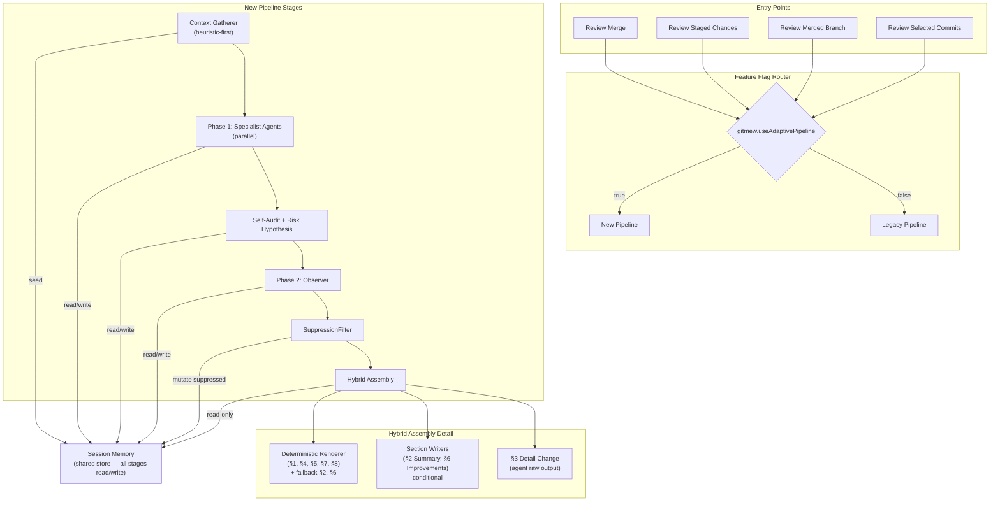
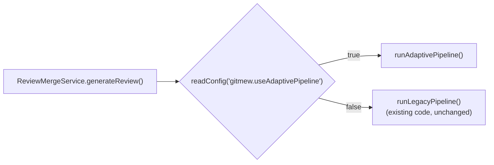
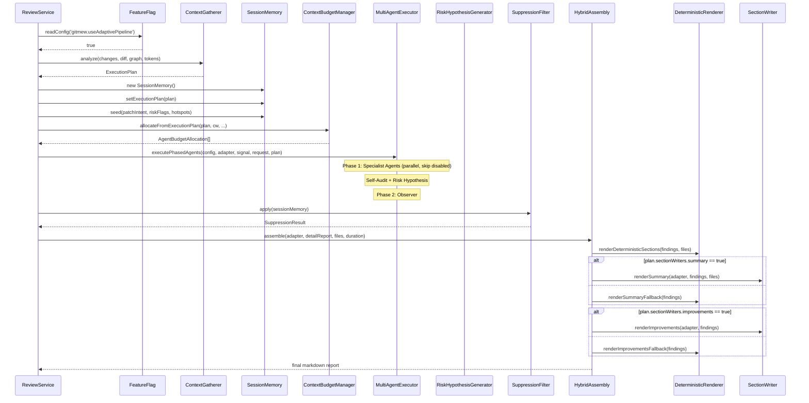

# Design Document — Adaptive Review Pipeline

## Tổng quan (Overview)

Tài liệu này mô tả thiết kế chi tiết cho việc tái cấu trúc pipeline review đa agent trong Git Mew VS Code extension. Kiến trúc mới chuyển từ mô hình **Phase 1 → Phase 2 → Phase 3 Synthesis → Deterministic Merge** sang mô hình **Context Gatherer → Session Memory bootstrap → Specialist Agents → SuppressionFilter → Hybrid Assembly**.

### Mục tiêu chính

1. Loại bỏ 4 Phase 3 synthesis agents (giảm 4 LLM calls/review)
2. Thêm Context Gatherer heuristic-first để phân loại patch và sinh ExecutionPlan
3. Nâng cấp SharedContextStore thành Session Memory với Finding lifecycle
4. Xây dựng Hybrid Assembly kết hợp Deterministic Renderer + conditional Section Writers

### Nguyên tắc thiết kế

- **Incremental migration**: 3 phases độc lập, mỗi phase ship riêng qua feature flag
- **Evolve, not rewrite**: Tận dụng code hiện có (SynthesisMerger fallbacks, SharedContextStoreImpl, ContextBudgetManager)
- **Deterministic-first**: Ưu tiên rendering deterministic, chỉ gọi LLM khi patch đủ phức tạp
- **Single source of truth**: ExecutionPlan là authority cho budget allocation và agent selection

---

## Kiến trúc (Architecture)

### Pipeline mới — High-level Flow



### So sánh Legacy vs New Pipeline

| Aspect | Legacy Pipeline | New Pipeline |
|---|---|---|
| Budget allocation | Static ratios (DEFAULT_BUDGET_CONFIG) | ExecutionPlan-driven adaptive ratios |
| Phase 3 | 4 synthesis agents (4 LLM calls) | Eliminated — Deterministic Renderer + conditional Section Writers (0–2 LLM calls) |
| Context store | SharedContextStoreImpl (flat findings) | Session Memory (Finding lifecycle + Evidence_Ref) |
| Patch classification | None | Context Gatherer heuristic (patchIntent + riskFlags) |
| Suppression | Inline trong SynthesisMerger | Dedicated SuppressionFilter step |
| Report assembly | SynthesisMerger.mergeSynthesisOutputs() | Hybrid Assembly (deterministic + conditional LLM) |

### Feature Flag Wiring

```typescript
// VS Code configuration
"gitmew.useAdaptivePipeline": {
  "type": "boolean",
  "default": false,
  "description": "Enable adaptive review pipeline (Phase 1+)"
}
```

Feature flag được đọc tại service layer (ReviewMergeService, ReviewStagedChangesService, etc.) trước khi khởi tạo pipeline. Khi flag = false, toàn bộ legacy code path chạy không thay đổi.



---

## Components và Interfaces

### 1. Context Gatherer

Chạy trước tất cả agents. Phân loại patch bằng heuristic (không gọi LLM), sinh ExecutionPlan.

```typescript
// src/services/llm/orchestrator/ContextGatherer.ts

interface ContextGathererInput {
  changes: UnifiedDiffFile[];
  diffText: string;
  dependencyGraph?: DependencyGraphData;  // optional precomputed; if absent, Gatherer runs degraded (no hotspot/crossModule)
  diffTokens: number;
  contextWindow: number;
}

// Dependency Graph ownership note:
// - dependencyGraph là optional precomputed input — caller (ReviewService) build graph trước khi gọi Gatherer
// - Nếu graph build fail, Gatherer vẫn chạy nhưng thiếu hotspot detection và crossModule flag
// - Benchmark 500ms chỉ áp cho heuristic analysis, không bao gồm graph build time

class ContextGatherer {
  constructor(
    private readonly tokenEstimator: TokenEstimatorService,
    private readonly defaultBudgetRatios: Record<string, number>,
  ) {}

  /** Phân loại patch và sinh ExecutionPlan — pure heuristic, no LLM */
  analyze(input: ContextGathererInput): ExecutionPlan;

  /** Classify patchIntent từ diff content */
  private classifyPatchIntent(changes: UnifiedDiffFile[], diffText: string): PatchIntent;

  /** Detect riskFlags từ changes + dependency graph */
  private detectRiskFlags(
    changes: UnifiedDiffFile[],
    diffText: string,
    graph?: DependencyGraphData,
  ): RiskFlags;

  /** Classify patch size (small/medium/large) */
  private classifyPatchSize(
    fileCount: number,
    diffTokens: number,
  ): 'small' | 'medium' | 'large';

  /** Compute adaptive agent budgets */
  private computeAgentBudgets(
    patchIntent: PatchIntent,
    riskFlags: RiskFlags,
    defaultRatios: Record<string, number>,
  ): Record<string, number>;

  /** Identify hotspot files from dependency graph */
  private identifyHotspots(
    changes: UnifiedDiffFile[],
    graph?: DependencyGraphData,
  ): string[];
}
```

#### Heuristic Classification Logic

**patchIntent classification:**

| Signal | Heuristic Rule |
|---|---|
| `feature` | Majority of changes are additions (>60% `+` lines), new files created |
| `refactor` | High rename/move ratio, similar add/delete counts, no new exports |
| `bugfix` | Small patch, changes in existing functions, test file changes accompany source changes |
| `mixed` | None of the above dominate (no single intent >50%) |

**riskFlags detection:**

| Flag | Heuristic Rule |
|---|---|
| `securitySensitive` | Files match patterns: `auth`, `crypto`, `token`, `secret`, `password`, `session`, `permission`, `.env`; hoặc diff chứa keywords: `apiKey`, `jwt`, `hash`, `encrypt` |
| `crossModule` | Changes span ≥3 distinct top-level directories; hoặc dependency graph shows ≥2 critical paths with changedFileCount ≥2 |
| `highChurn` | ≥5 files with >100 changed lines each |
| `apiContractChange` | Diff contains changes to exported interfaces/types/function signatures (regex detect `export` + structural changes) |

### 2. Session Memory

Nâng cấp từ `SharedContextStoreImpl`. Thêm Finding lifecycle, Evidence_Ref, Hypothesis, và ownership enforcement.

```typescript
// src/services/llm/orchestrator/SessionMemory.ts

class SessionMemory implements ISharedContextStore {
  // ── Inherited from SharedContextStoreImpl ──
  // Tool cache, dependency graph, risk hypotheses (unchanged API)

  // ── New: Finding Store ──
  addFinding(finding: Finding, actor: ActorRole): void;
  getFindings(filter?: FindingFilter): Finding[];
  transitionFindingStatus(
    findingId: string,
    newStatus: FindingStatus,
    actor: ActorRole,
  ): void;

  // ── New: Hypothesis Store ──
  addHypothesis(hypothesis: Hypothesis, actor: ActorRole): void;
  getHypotheses(filter?: HypothesisFilter): Hypothesis[];
  transitionHypothesisStatus(
    hypothesisId: string,
    newStatus: HypothesisStatus,
    actor: ActorRole,
  ): void;

  // ── New: ExecutionPlan context ──
  setExecutionPlan(plan: ExecutionPlan): void;
  getExecutionPlan(): ExecutionPlan | undefined;

  // ── Backward compat: legacy AgentFinding bridge ──
  // addAgentFindings/getAgentFindings tồn tại như backward-compat adapter cho migration phases 1–2.
  // New code phải ưu tiên addFinding/addHypothesis/transitionFindingStatus.
  // Bridge planned for deprecation after phase 3 stabilization.
  addAgentFindings(agentRole: string, findings: AgentFinding[]): void;
  getAgentFindings(agentRole?: string): AgentFinding[];
}

type ActorRole =
  | 'specialist_agent'
  | 'self_audit'
  | 'observer'
  | 'suppression_filter'
  | 'section_writer'
  | 'deterministic_renderer'
  | 'hybrid_assembly';

type FindingStatus = 'proposed' | 'verified' | 'rejected' | 'suppressed';
type HypothesisStatus = 'proposed' | 'verified' | 'rejected';

interface FindingFilter {
  agentRole?: string;
  status?: FindingStatus[];
  category?: string;
  minSeverity?: string;
}
```

#### Ownership Enforcement — Transition Matrix

```typescript
const ALLOWED_TRANSITIONS: Record<ActorRole, Record<string, FindingStatus[]>> = {
  specialist_agent:       { create: ['proposed'] },
  self_audit:             { proposed: ['verified', 'rejected'] },
  observer:               { proposed: ['verified', 'rejected'] },
  suppression_filter:     { verified: ['suppressed'] },
  section_writer:         {},  // read-only
  deterministic_renderer: {},  // read-only
  hybrid_assembly:        {},  // read-only for findings
};
```

### 3. SuppressionFilter

Bước riêng biệt chạy sau Phase 2, trước Hybrid Assembly. Sử dụng suppression rules từ ReviewMemoryService.

```typescript
// src/services/llm/orchestrator/SuppressionFilter.ts

class SuppressionFilter {
  constructor(
    private readonly suppressedFindings: SuppressedFinding[],
  ) {}

  /** Apply suppression rules to Session Memory findings */
  apply(sessionMemory: SessionMemory): SuppressionResult;
}

interface SuppressionResult {
  suppressedCount: number;
  suppressedFindingIds: string[];
}
```

### 4. Hybrid Assembly

Lớp lắp ráp report cuối cùng. Kết hợp Deterministic Renderer + conditional Section Writers.

```typescript
// src/services/llm/orchestrator/HybridAssembly.ts

class HybridAssembly {
  constructor(
    private readonly sessionMemory: SessionMemory,
    private readonly executionPlan: ExecutionPlan,
    private readonly language: string,
  ) {}

  /** Assemble final markdown report */
  async assemble(
    adapter: ILLMAdapter,
    detailChangeReport: string | undefined,
    changedFiles: UnifiedDiffFile[],
    reviewDurationMs: number,
    signal?: AbortSignal,
    request?: ContextGenerationRequest,
  ): Promise<string>;

  /** §1, §4, §5, §7, §8 — deterministic, no LLM */
  private renderDeterministicSections(
    findings: Finding[],
    changedFiles: UnifiedDiffFile[],
  ): DeterministicSections;

  /** §2 Summary — conditional LLM call */
  private async renderSummary(
    adapter: ILLMAdapter,
    findings: Finding[],
    changedFiles: UnifiedDiffFile[],
    signal?: AbortSignal,
  ): Promise<string>;

  /** §6 Improvements — conditional LLM call */
  private async renderImprovements(
    adapter: ILLMAdapter,
    findings: Finding[],
    signal?: AbortSignal,
  ): Promise<string>;

  /** Provenance tagging + severity sorting */
  private tagAndSort(findings: Finding[]): Finding[];

  /** Metadata footer */
  private buildMetadataFooter(
    findings: Finding[],
    reviewDurationMs: number,
  ): string;
}
```

### 5. ContextBudgetManager — Adaptive Extension

Mở rộng ContextBudgetManager hiện có để accept ExecutionPlan overrides.

```typescript
// Extension to existing ContextBudgetManager

class ContextBudgetManager {
  // Existing methods unchanged...

  /** New: Allocate budgets from ExecutionPlan instead of static ratios */
  allocateFromExecutionPlan(
    executionPlan: ExecutionPlan,
    contextWindow: number,
    maxOutputTokens: number,
    systemMessageTokens: number,
    diffTokens: number,
  ): AgentBudgetAllocation[];

  /** New: Allocate Section Writer budgets from freed Phase 3 pool */
  allocateSectionWriterBudgets(
    executionPlan: ExecutionPlan,
    contextWindow: number,
    maxOutputTokens: number,
    systemMessageTokens: number,
  ): AgentBudgetAllocation[];
}
```

### 6. MultiAgentExecutor — Skip Disabled Agents

Mở rộng `executePhasedAgents` để skip agents không có trong `ExecutionPlan.enabledAgents`.

```typescript
// Extension to existing MultiAgentExecutor

async executePhasedAgents(
  config: PhasedAgentConfig,
  adapter: ILLMAdapter,
  signal?: AbortSignal,
  request?: ContextGenerationRequest,
  executionPlan?: ExecutionPlan,  // new optional param
): Promise<string[]>;
```

Khi `executionPlan` được cung cấp, executor sẽ filter `config.phase1` agents theo `executionPlan.enabledAgents` trước khi chạy.

### 7. AdapterCalibrationService — Telemetry Extension

Thêm telemetry emission khi runtime truncation xảy ra.

```typescript
// Extension to existing AdapterCalibrationService

interface TruncationTelemetry {
  agentRole: string;
  tokensTruncated: number;
  contextWindowActual: number;
  budgetAllocated: number;
}

// safeTruncatePrompt() sẽ emit telemetry khi truncation xảy ra
```

---

## Component Interaction — Sequence Diagram



---

## Data Models

### ExecutionPlan (đã định nghĩa trong requirements)

```typescript
interface ExecutionPlan {
  patchIntent: 'feature' | 'refactor' | 'bugfix' | 'mixed';
  riskFlags: {
    securitySensitive: boolean;
    crossModule: boolean;
    highChurn: boolean;
    apiContractChange: boolean;
  };
  enabledAgents: string[];
  disabledAgents: Array<{ role: string; reason: string }>;
  agentBudgets: Record<string, number>;
  sectionWriterBudgets?: {                    // separate pool from agentBudgets, allocated from freed Phase 3 budget
    summary?: number;                         // absolute token budget cho Summary_Writer (not ratio)
    improvements?: number;                    // absolute token budget cho Improvement_Writer (not ratio)
  };                                          // if writer disabled, budget returns to unallocated pool
  sectionWriters: {
    summary: boolean;
    improvements: boolean;
  };
  focusAreas: string[];
  priorityFiles: string[];
  fallbackPolicy: 'static-budget' | 'skip-agent' | 'abort';
}
```

### Finding (đã định nghĩa trong requirements)

```typescript
interface Finding {
  id: string;
  agentRole: string;
  category: 'correctness' | 'security' | 'performance' | 'maintainability' | 'testing' | 'integration';
  severity: 'critical' | 'major' | 'minor' | 'suggestion';
  confidence: number;
  status: 'proposed' | 'verified' | 'rejected' | 'suppressed';
  file: string;
  lineRange: { start: number; end: number };
  description: string;
  suggestion: string;
  evidenceRefs: Evidence_Ref[];
  linkedFindingIds: string[];
}
```

### Evidence_Ref (đã định nghĩa trong requirements)

```typescript
interface Evidence_Ref {
  file: string;
  lineRange: { start: number; end: number };
  toolResultId: string | null;
  diffLineRef: boolean;
}
```

### Hypothesis (đã định nghĩa trong requirements)

```typescript
interface Hypothesis {
  id: string;
  sourceAgentRole: string;
  category: 'security' | 'integration' | 'correctness' | 'performance';
  description: string;
  affectedFiles: string[];
  confidence: number;
  status: 'proposed' | 'verified' | 'rejected';
  evidenceRefs: Evidence_Ref[];
  linkedFindingIds: string[];
}
```

### Telemetry Events

```typescript
interface PipelineTelemetry {
  pipelineMode: 'legacy' | 'adaptive';
  patchIntent?: PatchIntent;
  riskFlags?: RiskFlags;
  enabledAgents: string[];
  disabledAgents: string[];
  sectionWritersEnabled: { summary: boolean; improvements: boolean };
  phaseLatencies: {
    contextGatherer: number;
    phase1Agents: number;
    phase2Observer: number;
    assembly: number;
  };
  tokenUsage: {
    totalInput: number;
    perAgent: Record<string, { allocated: number; actual: number }>;
    truncationEvents: TruncationTelemetry[];
  };
  outputCompleteness: {
    sectionsRendered: number;
    sectionWriterUsed: string[];
    deterministicRendered: string[];
    totalFindings: number;
  };
}
```

### Migration Phase Mapping

| Phase | Components Shipped | Feature Flag State |
|---|---|---|
| Phase 1 (immediate) | Deterministic Renderer primary, Phase 3 agents removed, Hybrid Assembly, SuppressionFilter | `gitmew.useAdaptivePipeline = true` enables new path |
| Phase 2 (medium) | Context Gatherer, ExecutionPlan, adaptive budgeting, Session Memory Finding lifecycle | Same flag, Context Gatherer auto-activates |
| Phase 3 (long-term) | Full Session Memory with Hypothesis, linked findings, conditional Section Writers | Same flag, Section Writers auto-activate based on ExecutionPlan |


---

## Correctness Properties

*A property is a characteristic or behavior that should hold true across all valid executions of a system — essentially, a formal statement about what the system should do. Properties serve as the bridge between human-readable specifications and machine-verifiable correctness guarantees.*

### Property 1: Finding/Hypothesis round-trip preservation

*For any* valid Finding (with Evidence_Refs and linkedFindingIds) or Hypothesis, storing it in Session Memory and then retrieving it should produce an object with all fields identical to the original.

**Validates: Requirements 4.1, 4.5, 4.8, 4.11**

### Property 2: Ownership enforcement — valid transitions accepted, invalid transitions rejected

*For any* combination of (actor, currentStatus, targetStatus) for both Finding and Hypothesis entities, the transition should succeed if and only if it is listed in the ownership transition matrix. Invalid transitions should throw an error. Additionally, *for any* Finding created by a specialist_agent actor, the initial status must always be `proposed`.

**Validates: Requirements 4.2, 4.3, 4.4, 4.9, 4.11**

### Property 3: Rendering filter excludes rejected findings

*For any* set of Findings with mixed statuses (proposed, verified, rejected, suppressed), querying Session Memory for renderable findings should return only those with status `verified` or `proposed`, never `rejected` or `suppressed`.

**Validates: Requirements 4.7**

### Property 4: Report structure invariant

*For any* set of Findings and any language setting, the assembled report should always contain exactly 8 section headings in order (§1 Changed Files, §2 Summary, §3 Detail Change, §4 Flow Diagram, §5 Code Quality, §6 Improvements, §7 TODO, §8 Risks) followed by a metadata footer HTML comment containing findings count, severity breakdown, cross-validated count, suppressed count, and duration.

**Validates: Requirements 1.4, 7.1, 7.4**

### Property 5: Deterministic rendering idempotence

*For any* set of Findings and UnifiedDiffFile[], calling Deterministic Renderer twice with the same input should produce identical output. The output should contain data from all input findings without any LLM call.

**Validates: Requirements 1.2**

### Property 6: Detail Change pass-through

*For any* non-empty Detail Change agent output string (≥50 characters), the assembled report's §3 section should contain the original content with only whitespace trimming and heading normalization applied (no semantic content modification).

**Validates: Requirements 1.5**

### Property 7: Section Writer activation rules

*For any* ExecutionPlan and Session Memory state: (a) Summary_Writer is enabled if and only if patch size is medium or large; (b) Improvement_Writer is enabled if and only if the number of renderable findings ≥ 3 OR at least one finding has severity major or critical.

**Validates: Requirements 2.1, 2.2, 2.3, 2.4**

### Property 8: ExecutionPlan schema compliance

*For any* valid ContextGathererInput (UnifiedDiffFile[], diffText, optional DependencyGraphData), the Context Gatherer should produce an ExecutionPlan where: patchIntent is one of {feature, refactor, bugfix, mixed}; all riskFlags are booleans; enabledAgents is non-empty; agentBudgets values sum to ≤ 1.0; and fallbackPolicy is one of {static-budget, skip-agent, abort}.

**Validates: Requirements 3.1, 3.3**

### Property 9: Adaptive budget boost

*For any* ContextGathererInput where riskFlags.securitySensitive is true, the Security Analyst budget ratio in the resulting ExecutionPlan should be ≥ 1.2× the default ratio. *For any* input where patchIntent is refactor, the Flow Diagram budget ratio should be ≥ 1.15× the default ratio.

**Validates: Requirements 3.4, 3.5**

### Property 10: Hotspot file ordering

*For any* DependencyGraphData and set of changed files, the priorityFiles in the ExecutionPlan should be ordered by descending importedBy reference count from the dependency graph.

**Validates: Requirements 3.2**

### Property 11: Budget safety threshold

*For any* context window size and any ExecutionPlan, the total budget allocation from ContextBudgetManager (sum of all agent budgets + section writer budgets + safety margin) should not exceed 90% of the context window.

**Validates: Requirements 5.7**

### Property 12: Provenance tagging correctness

*For any* Finding in the assembled report, the provenance tag should match the finding's agentRole: Code Reviewer → [CR], Security Analyst → [SA], Observer → [OB]. *For any* Finding that appears in both Code Reviewer and Security Analyst outputs with word overlap > 0.4, the tag should include [XV] (cross-validated).

**Validates: Requirements 7.3**

### Property 13: Suppression filtering correctness

*For any* set of verified Findings and SuppressedFinding rules, the SuppressionFilter should transition to `suppressed` exactly those findings where the file matches the glob pattern AND (the description hash matches OR word overlap ratio ≥ 0.7). No other findings should be affected.

**Validates: Requirements 7.5**

### Property 14: Severity sorting within sections

*For any* set of Findings rendered in a report section, findings should be ordered by severity weight: critical (4) > major (3) > minor (2) > suggestion (1). Within the same severity, original order is preserved.

**Validates: Requirements 7.6**

---

## Error Handling

### Context Gatherer Errors

| Error Type | Handling | Fallback |
|---|---|---|
| Dependency graph build failure | Log warning, continue | ExecutionPlan uses empty graph, no hotspots |
| Heuristic classification exception | Log error, fallback | `fallbackPolicy = 'static-budget'`, use DEFAULT_BUDGET_CONFIG |
| Timeout (>500ms for <50 files) | Log warning, use partial result | Return partial ExecutionPlan with defaults for missing analysis (enabledAgents must be non-empty, agentBudgets fall back to default ratios, riskFlags default to false) |

### Session Memory Errors

| Error Type | Handling |
|---|---|
| Invalid status transition | Throw `InvalidTransitionError` with actor, current status, target status |
| Duplicate finding ID | Throw `DuplicateFindingError` |
| Finding not found for transition | Throw `FindingNotFoundError` |

### Section Writer Errors

| Error Type | Handling | Fallback |
|---|---|---|
| LLM API error | Log error, fallback | Deterministic Renderer for that section |
| Timeout | Log timeout, fallback | Deterministic Renderer for that section |
| Schema parse failure | Log parse error, fallback | Deterministic Renderer for that section |
| Output quality below threshold (<50 chars) | Log quality warning, fallback | Deterministic Renderer for that section |

### Pipeline-level Error Handling

- **Cancellation**: `GenerationCancelledError` propagates up, silent return (unchanged behavior)
- **Adapter initialization failure**: Return `{ success: false, error: ... }` (unchanged behavior)
- **Feature flag read failure**: Default to legacy pipeline (safe fallback)

---

## Testing Strategy

### Property-Based Testing

PBT is appropriate for this feature because:
- Core components (Session Memory, Context Gatherer, Deterministic Renderer, Hybrid Assembly) are pure functions or have clear input/output behavior
- Universal properties hold across wide input spaces (any combination of findings, any patch characteristics)
- Input space is large (arbitrary findings, file paths, severities, statuses, actor roles)

**Library**: `fast-check` (already available in Node.js/TypeScript ecosystem)

**Configuration**:
- Minimum 100 iterations per property test
- Each test tagged with: `Feature: adaptive-review-pipeline, Property {N}: {title}`

### Unit Tests (Example-Based)

| Component | Test Focus |
|---|---|
| ContextGatherer | Golden tests: known diffs → expected patchIntent/riskFlags |
| DeterministicRenderer | Golden tests: known findings → expected markdown output per section |
| HybridAssembly | Fallback paths: Section Writer failure → deterministic fallback |
| SuppressionFilter | SHA-256 matching + glob matching with known suppression rules |
| SessionMemory | Edge cases: empty findings, null Evidence_Refs, concurrent access |

### Integration Tests

| Test Scenario | Coverage |
|---|---|
| Feature flag toggle | Legacy vs new pipeline with same input → same ReviewResult interface |
| Review Merge end-to-end | Full pipeline with mock adapter → valid markdown report |
| Review Staged Changes end-to-end | Full pipeline with mock adapter → valid markdown report |
| Review Merged Branch end-to-end | Full pipeline with mock adapter → valid result |
| Review Selected Commits end-to-end | Full pipeline with mock adapter → valid result |
| MR Description unchanged | Description flow unaffected by pipeline changes |
| PlantUML repair unchanged | Repair flow unaffected by pipeline changes |
| ReviewMemoryService compatibility | Data format unchanged across migration phases |
| Telemetry emission | Correct telemetry events at each pipeline stage |

### Golden Tests (Deterministic Renderer)

Mỗi deterministic section (§1, §4, §5, §7, §8) có golden test file:
- Input: JSON fixture với structured findings
- Expected: Exact markdown output
- Assertion: Byte-for-byte match

### Performance Benchmarks

| Metric | Target | Measurement |
|---|---|---|
| Deterministic Renderer latency | < 50ms | `performance.now()` around render calls |
| End-to-end latency (small/medium patch) | ≤ 115% of legacy | Benchmark suite with fixed test fixtures, same execution environment as legacy baseline |
| Total input tokens | ≥ 20% reduction vs legacy | Token counting with same test fixtures, same execution environment as legacy baseline |
