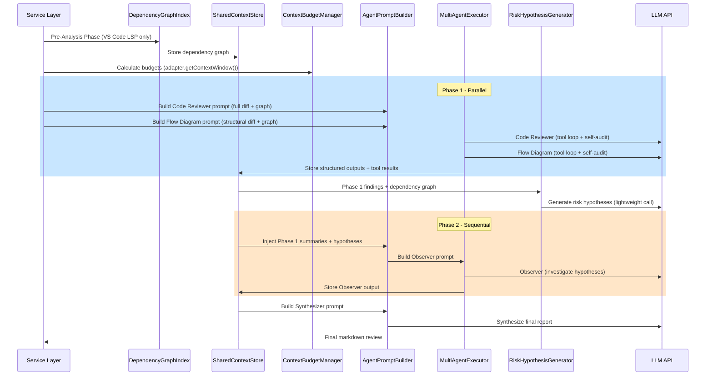

# Design Document: Multi-Agent Context Optimization

## Tổng quan (Overview)

Thiết kế lại pipeline multi-agent review để giải quyết 3 vấn đề cốt lõi:

1. **Lãng phí token**: Cả 3 agent hiện nhận cùng một prompt đầy đủ (system message + full diff + reference context), dẫn đến ~3x token usage không cần thiết.
2. **Mất context**: Hard-cap 4500 tokens cho reference context và giới hạn 24 symbols / 8 files khiến review codebase lớn thiếu bối cảnh quan trọng.
3. **Observer thiếu input**: Observer Agent chạy song song với 2 agent kia, không nhận được structured findings, phải tự khám phá lại mọi thứ.

### Giải pháp kiến trúc

Áp dụng **Blackboard Pattern** với 6 thành phần mới tích hợp vào pipeline hiện tại:

- **SharedContextStore**: Bộ nhớ chia sẻ mutable giữa các agent (tool result cache + structured findings)
- **ContextBudgetManager**: Phân bổ token budget động dựa trên model capabilities thực tế
- **AgentPromptBuilder**: Xây dựng prompt riêng biệt cho từng agent role
- **DependencyGraphIndex**: Pre-analysis bằng VS Code LSP APIs (zero LLM cost)
- **Phased MultiAgentExecutor**: Phase 1 (Code Reviewer ∥ Flow Diagram) → Phase 2 (Observer)
- **Risk Hypothesis Generator**: Sinh risk hypotheses từ Phase 1 findings (Socratic Questioning)
- **query_context tool**: Cho phép agent pull thêm context từ SharedContextStore runtime

### Nguyên tắc thiết kế

- **Backward compatible**: Mở rộng bằng optional fields, không breaking changes
- **Graceful degradation**: Mọi component mới đều có fallback về hành vi hiện tại
- **Pull over Push**: Agent tự request context khi cần thay vì nhận hết lúc khởi tạo

## Kiến trúc (Architecture)

### Tổng quan luồng thực thi mới



### Vị trí trong codebase hiện tại

```
src/services/llm/orchestrator/
├── orchestratorTypes.ts          ← Mở rộng AgentPrompt, thêm types mới
├── MultiAgentExecutor.ts         ← Thêm phased execution logic
├── SharedContextStore.ts         ← MỚI: Blackboard shared memory
├── ContextBudgetManager.ts       ← MỚI: Dynamic token budget
├── AgentPromptBuilder.ts         ← MỚI: Role-specific prompt construction
├── DependencyGraphIndex.ts       ← MỚI: Pre-analysis với VS Code LSP
├── RiskHypothesisGenerator.ts    ← MỚI: Socratic questioning
├── AdapterCalibrationService.ts  ← Không thay đổi
├── ChunkAnalysisReducer.ts       ← Không thay đổi
└── DiffChunkBuilder.ts           ← Không thay đổi

src/llm-tools/tools/
├── queryContext.ts               ← MỚI: query_context tool
├── index.ts                      ← Export thêm queryContext
└── ... (6 tools hiện tại giữ nguyên)
```

## Components và Interfaces

### 1. SharedContextStore

Blackboard pattern — bộ nhớ chia sẻ mutable cho một phiên review. Tất cả agents đọc/ghi qua instance duy nhất.

**Quyết định thiết kế**: Sử dụng append-only log cho concurrent writes vì Node.js single-threaded event loop đảm bảo không có race condition thực sự giữa các microtask. Phase 1 agents chạy song song nhưng mỗi write operation là atomic trong event loop.

```typescript
// src/services/llm/orchestrator/SharedContextStore.ts

export interface ToolResultCacheEntry {
  toolName: string;
  normalizedArgs: string;  // JSON.stringify(sorted args)
  result: ToolExecuteResponse;
  timestamp: number;
}

export interface AgentFinding {
  agentRole: string;
  type: 'issue' | 'flow' | 'risk' | 'todo';
  data: unknown;  // CodeReviewerOutput | FlowDiagramOutput | ObserverOutput
  timestamp: number;
}

export interface SharedContextStore {
  // Tool result cache
  getToolResult(toolName: string, args: Record<string, unknown>): ToolExecuteResponse | undefined;
  setToolResult(toolName: string, args: Record<string, unknown>, result: ToolExecuteResponse): void;

  // Agent findings (append-only)
  addAgentFindings(agentRole: string, findings: AgentFinding[]): void;
  getAgentFindings(agentRole?: string): AgentFinding[];

  // Dependency graph
  getDependencyGraph(): DependencyGraphData | undefined;
  setDependencyGraph(graph: DependencyGraphData): void;
  updateDependencyGraph(patch: Partial<DependencyGraphData>): void;

  // Risk hypotheses
  setRiskHypotheses(hypotheses: RiskHypothesis[]): void;
  getRiskHypotheses(): RiskHypothesis[];

  // Serialization for prompt injection
  serializeForAgent(agentRole: string, tokenBudget: number): string;

  // Metrics
  getStats(): { toolCacheHits: number; toolCacheMisses: number; totalFindings: number };
}
```

### 2. ContextBudgetManager

Tính toán và phân bổ token budget dựa trên context window thực tế của model.

**Quyết định thiết kế**: Thay thế hard-cap 4500 tokens bằng công thức động. Minimum 80k tokens cho reference context đảm bảo model lớn (200k) được tận dụng tối đa. Ratio 0.40 mặc định có thể override qua config.

```typescript
// src/services/llm/orchestrator/ContextBudgetManager.ts

export interface AgentBudgetAllocation {
  agentRole: string;
  totalBudget: number;         // tokens cho agent này
  diffBudget: number;          // tokens cho diff content
  referenceBudget: number;     // tokens cho reference context
  sharedContextBudget: number; // tokens cho shared context injection
  reservedForOutput: number;   // tokens reserved cho model output
}

export interface BudgetManagerConfig {
  referenceContextRatio: number;    // default 0.40
  minReferenceTokens: number;       // default 80_000
  maxSymbolsFormula: (cw: number) => number;  // min(floor(cw/2500), 120)
  maxFilesFormula: (cw: number) => number;    // min(floor(cw/5000), 40)
  agentBudgetRatios: Record<string, number>;  // Code Reviewer: 0.40, Flow: 0.35, Observer: 0.25
  safetyThreshold: number;          // default 0.85 (85% context window)
}

export class ContextBudgetManager {
  constructor(
    private readonly config: BudgetManagerConfig,
    private readonly tokenEstimator: TokenEstimatorService
  ) {}

  /** Tính reference context budget dựa trên context window thực tế */
  computeReferenceContextBudget(contextWindow: number): number {
    // Công thức: max(minReferenceTokens, floor(contextWindow * referenceContextRatio))
    // Nếu contextWindow quá nhỏ → log warning, dùng tối đa khả dụng
    const computed = Math.floor(contextWindow * this.config.referenceContextRatio);
    const minimum = this.config.minReferenceTokens; // 80_000

    if (computed >= minimum) {
      return computed; // 200k * 0.40 = 80k ✓
    }

    // Context window nhỏ: kiểm tra có đủ chỗ cho minimum không
    // Giả sử system + diff chiếm ~20% context window
    const estimatedFixedCosts = Math.floor(contextWindow * 0.20);
    const maxAvailable = contextWindow - estimatedFixedCosts;

    if (maxAvailable >= minimum) {
      return minimum; // Đủ chỗ cho 80k
    }

    // Không đủ chỗ cho 80k → dùng tối đa khả dụng, log warning
    console.warn(
      `[ContextBudgetManager] Context window ${contextWindow} too small for ` +
      `minimum reference budget ${minimum}. Using ${maxAvailable} tokens.`
    );
    return Math.max(4500, maxAvailable); // Fallback tối thiểu 4500 (legacy)
  }

  /** Tính dynamic MAX_SYMBOLS_TOTAL */
  computeMaxSymbols(contextWindow: number): number {
    return this.config.maxSymbolsFormula(contextWindow);
    // Default: min(floor(contextWindow / 2500), 120)
    // 200k → 80, 128k → 51, 32k → 12
  }

  /** Tính dynamic MAX_EXPANDED_REFERENCE_FILES */
  computeMaxReferenceFiles(contextWindow: number): number {
    return this.config.maxFilesFormula(contextWindow);
    // Default: min(floor(contextWindow / 5000), 40)
    // 200k → 40, 128k → 25, 32k → 6
  }

  /** Phân bổ budget cho từng agent */
  allocateAgentBudgets(
    contextWindow: number,
    maxOutputTokens: number,
    systemMessageTokens: number,
    diffTokens: number
  ): AgentBudgetAllocation[];

  /** Kiểm tra và giảm proportionally nếu vượt safety threshold */
  enforceGlobalBudget(
    allocations: AgentBudgetAllocation[],
    contextWindow: number
  ): AgentBudgetAllocation[];
}
```

### 3. AgentPromptBuilder

Xây dựng prompt riêng biệt cho từng agent role. Thay thế pattern hiện tại (cùng prompt cho tất cả agent).

**Quyết định thiết kế**: Loại bỏ REVIEW_OUTPUT_CONTRACT khỏi agent prompts (chỉ Synthesizer cần). Flow Diagram nhận filtered diff (chỉ structural changes). Observer nhận diff summary + structured findings thay vì full diff.

```typescript
// src/services/llm/orchestrator/AgentPromptBuilder.ts

export interface AgentPromptBuildContext {
  fullDiff: string;
  changedFiles: UnifiedDiffFile[];
  referenceContext?: string;
  dependencyGraph?: DependencyGraphData;
  sharedContextStore?: SharedContextStore;
  riskHypotheses?: RiskHypothesis[];
  language: string;
  taskInfo?: string;
  customSystemPrompt?: string;
  customRules?: string;
  customAgentInstructions?: string;
}

export class AgentPromptBuilder {
  constructor(
    private readonly budgetManager: ContextBudgetManager,
    private readonly tokenEstimator: TokenEstimatorService
  ) {}

  /** Build prompt cho Code Reviewer: full diff + full reference + dependency graph */
  buildCodeReviewerPrompt(ctx: AgentPromptBuildContext, budget: AgentBudgetAllocation): AgentPrompt;

  /** Build prompt cho Flow Diagram: structural diff only + call graphs + critical paths */
  buildFlowDiagramPrompt(ctx: AgentPromptBuildContext, budget: AgentBudgetAllocation): AgentPrompt;

  /** Build prompt cho Observer: diff summary + Phase 1 findings + risk hypotheses */
  buildObserverPrompt(ctx: AgentPromptBuildContext, budget: AgentBudgetAllocation): AgentPrompt;

  /** Build prompt cho Synthesizer: OUTPUT_CONTRACT + structured reports + diff summary */
  buildSynthesizerPrompt(agentReports: StructuredAgentReport[], diffSummary: string): string;

  /** Extract structural changes only (function sigs, class defs, imports) */
  private filterStructuralDiff(diff: string, changedFiles: UnifiedDiffFile[]): string;

  /** Tạo diff summary ngắn gọn */
  private buildDiffSummary(changedFiles: UnifiedDiffFile[]): string;

  /** Truncate shared context theo priority: tool results trước, summaries sau */
  private truncateSharedContext(
    serialized: string,
    maxTokens: number
  ): string;
}
```

### 4. DependencyGraphIndex

Pre-analysis phase sử dụng VS Code LSP APIs để build dependency graph trước khi agents chạy. Zero LLM cost.

**Quyết định thiết kế**: Giới hạn 100 files, 200 symbol lookups, 15s timeout để đảm bảo performance. Fallback về `extractCandidateSymbolsFromDiff` + `buildLegacyReferenceContext` nếu thất bại.

```typescript
// src/services/llm/orchestrator/DependencyGraphIndex.ts

export interface DependencyGraphData {
  fileDependencies: Map<string, {
    imports: string[];
    importedBy: string[];
  }>;
  symbolMap: Map<string, {
    definedIn: string;
    referencedBy: string[];
    type: 'function' | 'class' | 'interface' | 'type' | 'constant' | 'enum';
  }>;
  criticalPaths: Array<{
    files: string[];
    changedFileCount: number;
    description: string;
  }>;
}

export interface DependencyGraphConfig {
  maxFiles: number;           // default 100
  maxSymbolLookups: number;   // default 200
  timeoutMs: number;          // default 15_000
  criticalPathThreshold: number; // default 3 changed files
}

export class DependencyGraphIndex {
  constructor(private readonly config: DependencyGraphConfig) {}

  /** Build dependency graph từ changed files sử dụng VS Code APIs */
  async build(changedFiles: UnifiedDiffFile[]): Promise<DependencyGraphData>;

  /** Scan imports qua vscode.executeLinkProvider */
  private async scanImports(filePath: string): Promise<string[]>;

  /** Extract exported symbols qua vscode.executeDocumentSymbolProvider */
  private async extractSymbols(filePath: string): Promise<Array<{
    name: string;
    type: string;
    range: vscode.Range;
  }>>;

  /** Find references qua vscode.executeReferenceProvider */
  private async findSymbolReferences(
    uri: vscode.Uri,
    position: vscode.Position
  ): Promise<string[]>;

  /** Tính critical paths: dependency chains có >= threshold changed files */
  private computeCriticalPaths(
    fileDeps: Map<string, { imports: string[]; importedBy: string[] }>,
    changedFilePaths: Set<string>
  ): DependencyGraphData['criticalPaths'];

  /** Serialize cho prompt injection */
  serializeForPrompt(
    data: DependencyGraphData,
    filter: 'full' | 'critical-paths' | 'summary'
  ): string;
}
```

### 5. Phased MultiAgentExecutor

Mở rộng `MultiAgentExecutor` hiện tại để hỗ trợ phased execution. Phase 1 chạy song song Code Reviewer + Flow Diagram, Phase 2 chạy Observer với injected context.

**Quyết định thiết kế**: Giữ nguyên `executeAgents()` signature cho backward compatibility. Thêm `executePhasedAgents()` method mới. Nếu `SharedContextStore` không được cung cấp, fallback về `executeAgents()` hiện tại.

```typescript
// Mở rộng trong MultiAgentExecutor.ts

export interface PhasedAgentConfig {
  phase1: AgentPrompt[];      // Code Reviewer + Flow Diagram
  phase2: AgentPrompt[];      // Observer
  sharedStore: SharedContextStore;
  promptBuilder: AgentPromptBuilder;
  buildContext: AgentPromptBuildContext;
  budgetAllocations: AgentBudgetAllocation[];
}

// Thêm vào class MultiAgentExecutor:
async executePhasedAgents(
  config: PhasedAgentConfig,
  adapter: ILLMAdapter,
  signal?: AbortSignal,
  request?: ContextGenerationRequest
): Promise<string[]>;
```

### 6. RiskHypothesisGenerator

Sinh risk hypotheses từ Phase 1 findings + dependency graph. Kết hợp heuristic rules và một LLM call nhẹ (max 2000 output tokens).

**Quyết định thiết kế**: Heuristic rules chạy trước (zero cost), LLM call chỉ bổ sung. Giới hạn 8 hypotheses để kiểm soát Observer token budget.

```typescript
// src/services/llm/orchestrator/RiskHypothesisGenerator.ts

export interface RiskHypothesis {
  question: string;
  affectedFiles: string[];
  evidenceNeeded: string;
  severityEstimate: 'high' | 'medium' | 'low';
  source: 'heuristic' | 'llm';
}

export class RiskHypothesisGenerator {
  constructor(private readonly tokenEstimator: TokenEstimatorService) {}

  /** Sinh hypotheses từ heuristic rules + LLM call */
  async generate(
    codeReviewerOutput: CodeReviewerOutput,
    flowDiagramOutput: FlowDiagramOutput,
    dependencyGraph: DependencyGraphData,
    adapter: ILLMAdapter,
    signal?: AbortSignal
  ): Promise<RiskHypothesis[]>;

  /** Heuristic rules: API schema change → check consumers, etc. */
  private generateHeuristicHypotheses(
    findings: AgentFinding[],
    graph: DependencyGraphData
  ): RiskHypothesis[];

  /** LLM call nhẹ để bổ sung hypotheses */
  private async generateLLMHypotheses(
    heuristicResults: RiskHypothesis[],
    summaries: string,
    adapter: ILLMAdapter,
    signal?: AbortSignal
  ): Promise<RiskHypothesis[]>;
}
```

### 7. query_context Tool

Tool nội bộ cho phép agent pull thêm context từ SharedContextStore theo nhu cầu runtime.

**Quyết định thiết kế**: Mỗi query trả về tối đa 2000 tokens. Agent có thể gọi tối đa 5 lần per iteration. Nếu data chưa có trong store, thực thi VS Code API call rồi cache.

```typescript
// src/llm-tools/tools/queryContext.ts

export const queryContextTool: FunctionCall = {
  id: 'query_context',
  functionCalling: {
    type: 'function',
    function: {
      name: 'query_context',
      description: 'Query the shared context store for dependency information. ' +
        'Use this to find files that import a symbol, get the dependency chain of a file, ' +
        'or retrieve cached tool results from other agents.',
      parameters: {
        type: 'object',
        properties: {
          query_type: {
            type: 'string',
            description: 'Type of query: "imports_of" (files importing symbol X), ' +
              '"dependency_chain" (dependency chain of file Y), ' +
              '"references_of" (all references to symbol X), ' +
              '"cached_result" (get cached tool result)',
          },
          target: {
            type: 'string',
            description: 'The symbol name or file path to query about',
          },
        },
        required: ['query_type', 'target'],
        additionalProperties: false,
      },
    },
  },
  // execute function receives SharedContextStore via ToolOptional extension
};
```

### 8. Structured Agent Output Schemas

Mỗi agent output kết quả dưới dạng JSON schema thay vì raw text.

**Quyết định thiết kế**: Fallback sang raw text nếu JSON parse thất bại. Structured output cho phép Synthesizer deduplicate issues và map risks chính xác.

```typescript
// Thêm vào orchestratorTypes.ts

export interface CodeReviewerOutput {
  issues: Array<{
    file: string;
    location: string;
    severity: 'critical' | 'major' | 'minor' | 'suggestion';
    category: 'correctness' | 'security' | 'performance' | 'maintainability' | 'testing';
    description: string;
    suggestion: string;
  }>;
  affectedSymbols: string[];
  qualityVerdict: 'Critical' | 'Not Bad' | 'Safe' | 'Good' | 'Perfect';
}

export interface FlowDiagramOutput {
  diagrams: Array<{
    name: string;
    type: 'activity' | 'sequence' | 'class' | 'ie';
    plantumlCode: string;
    description: string;
  }>;
  affectedFlows: string[];
}

export interface ObserverOutput {
  risks: Array<{
    description: string;
    severity: 'high' | 'medium' | 'low';
    affectedArea: string;
  }>;
  todoItems: Array<{
    action: string;
    parallelizable: boolean;
  }>;
  integrationConcerns: string[];
  hypothesisVerdicts?: Array<{
    hypothesisIndex: number;
    verdict: 'confirmed' | 'refuted' | 'inconclusive';
    evidence: string;
  }>;
}

export type StructuredAgentReport =
  | { role: 'Code Reviewer'; structured: CodeReviewerOutput; raw: string }
  | { role: 'Flow Diagram'; structured: FlowDiagramOutput; raw: string }
  | { role: 'Observer'; structured: ObserverOutput; raw: string };
```

### 9. Tích hợp với kiến trúc hiện tại (Backward Compatibility)

#### Mở rộng AgentPrompt type

```typescript
// orchestratorTypes.ts — thêm optional fields
export type AgentPrompt = {
  role: string;
  systemMessage: string;
  prompt: string;
  tools?: FunctionCall[];
  maxIterations?: number;
  selfAudit?: boolean;
  // MỚI — optional fields cho phased execution
  phase?: number;                    // 1 hoặc 2
  outputSchema?: 'code-reviewer' | 'flow-diagram' | 'observer';
  sharedStore?: SharedContextStore;  // injected at runtime
};
```

#### Mở rộng generateMultiAgentFinalText()

```typescript
// ContextOrchestratorService.ts — giữ nguyên signature, thêm optional param
public async generateMultiAgentFinalText(
  adapter: ILLMAdapter,
  agents: AgentPrompt[],
  synthesisSystemMessage: string,
  buildSynthesisPrompt: (agentReports: string[]) => string,
  signal?: AbortSignal,
  request?: ContextGenerationRequest,
  // MỚI — optional phased config
  phasedConfig?: {
    sharedStore: SharedContextStore;
    promptBuilder: AgentPromptBuilder;
    buildContext: AgentPromptBuildContext;
    budgetAllocations: AgentBudgetAllocation[];
  }
): Promise<string>;
```

Khi `phasedConfig` được cung cấp, method sẽ sử dụng `executePhasedAgents()`. Khi không có, fallback về `executeAgents()` hiện tại.

#### Tool result caching trong functionCallExecute

```typescript
// llm-tools/utils.ts — wrap execute với cache check
// Thêm optional SharedContextStore parameter
export const functionCallExecute = async ({
  functionCalls,
  llmAdapter,
  toolCalls,
  onStream = () => {},
  sharedStore,  // MỚI — optional
}: {
  functionCalls: FunctionCall[];
  onStream?: (content: string, isDone: boolean, state?: any) => void;
  toolCalls: Array<ToolCallResult>;
  llmAdapter: ILLMAdapter;
  sharedStore?: SharedContextStore;  // MỚI
}): Promise<...> => {
  // Nếu sharedStore có, check cache trước khi execute
  // Nếu cache hit, return cached result
  // Nếu cache miss, execute rồi cache result
};
```

### 10. Integration Flow — Toàn bộ pipeline từ Service Layer đến Final Output

Pseudocode cho flow mới trong `reviewMergeService.generateReview()` và `reviewStagedChangesService.generateReview()`:

```typescript
// Pseudocode — flow mới trong generateReview()
async generateReview(...) {
  return this.withAbortController(async (abortController) => {
    // === STEP 1: Prepare adapter (giữ nguyên) ===
    const { adapter } = await this.prepareAdapter(provider, model, ...);
    const branchDiff = await this.getBranchDiffPreview(baseBranch, compareBranch);

    // === STEP 2: Initialize new components ===
    const sharedStore = new SharedContextStoreImpl();
    const budgetManager = new ContextBudgetManager(DEFAULT_BUDGET_CONFIG, this.tokenEstimator);
    const promptBuilder = new AgentPromptBuilder(budgetManager, this.tokenEstimator);

    // === STEP 3: Pre-Analysis Phase (zero LLM cost) ===
    onProgress?.("Building dependency graph from VS Code index...");
    const graphIndex = new DependencyGraphIndex(DEFAULT_GRAPH_CONFIG);
    let dependencyGraph: DependencyGraphData | undefined;
    try {
      dependencyGraph = await graphIndex.build(branchDiff.changes);
      sharedStore.setDependencyGraph(dependencyGraph);
      onLog?.(`[pre-analysis] graph built: ${dependencyGraph.fileDependencies.size} files, ` +
              `${dependencyGraph.symbolMap.size} symbols, ${dependencyGraph.criticalPaths.length} critical paths`);
    } catch (error) {
      onLog?.(`[pre-analysis] failed, falling back to legacy: ${error}`);
      // Fallback: build legacy reference context (current behavior)
    }

    // === STEP 4: Calculate budgets ===
    const contextWindow = adapter.getContextWindow();
    const maxOutputTokens = adapter.getMaxOutputTokens();
    const systemTokens = this.tokenEstimator.estimateTextTokens(systemMessage, adapter.getModel());
    const diffTokens = this.tokenEstimator.estimateTextTokens(branchDiff.diff, adapter.getModel());
    const budgetAllocations = budgetManager.allocateAgentBudgets(
      contextWindow, maxOutputTokens, systemTokens, diffTokens
    );
    const safeBudgets = budgetManager.enforceGlobalBudget(budgetAllocations, contextWindow);

    // === STEP 5: Build reference context (with dynamic budget) ===
    const refBudget = budgetManager.computeReferenceContextBudget(contextWindow);
    const maxSymbols = budgetManager.computeMaxSymbols(contextWindow);
    const maxFiles = budgetManager.computeMaxReferenceFiles(contextWindow);
    const referenceContextResult = await this.gitService.buildReviewReferenceContext(
      branchDiff.changes,
      { strategy, model: adapter.getModel(), contextWindow,
        mode: 'auto', systemMessage, directPrompt: basePrompt,
        // NEW: pass dynamic limits
        maxSymbols, maxFiles, tokenBudget: refBudget }
    );

    // === STEP 6: Build agent-specific prompts ===
    const buildContext: AgentPromptBuildContext = {
      fullDiff: branchDiff.diff,
      changedFiles: branchDiff.changes,
      referenceContext: referenceContextResult.context,
      dependencyGraph,
      sharedContextStore: sharedStore,
      language, taskInfo,
      customSystemPrompt, customRules, customAgentInstructions,
    };

    const codeReviewerAgent = promptBuilder.buildCodeReviewerPrompt(buildContext, safeBudgets[0]);
    const flowDiagramAgent = promptBuilder.buildFlowDiagramPrompt(buildContext, safeBudgets[1]);
    // Observer prompt built AFTER Phase 1 completes (in executePhasedAgents)

    // === STEP 7: Execute phased multi-agent pipeline ===
    const review = await this.contextOrchestrator.generateMultiAgentFinalText(
      adapter,
      [codeReviewerAgent, flowDiagramAgent], // Phase 1 agents
      systemMessage,
      (reports) => promptBuilder.buildSynthesizerPrompt(
        parseStructuredReports(reports),
        promptBuilder.buildDiffSummary(branchDiff.changes)
      ),
      abortController.signal,
      { adapter, strategy, changes: branchDiff.changes, signal: abortController.signal,
        onProgress, onLog, task: this.buildMergeReviewTaskSpec(...) },
      // NEW: phased config
      {
        sharedStore,
        promptBuilder,
        buildContext,
        budgetAllocations: safeBudgets,
      }
    );

    return { success: true, review, diff: branchDiff.diff, changes: branchDiff.changes };
  });
}
```

### 11. Phased MultiAgentExecutor — Chi tiết implementation

```typescript
// Pseudocode cho executePhasedAgents()
async executePhasedAgents(
  config: PhasedAgentConfig,
  adapter: ILLMAdapter,
  signal?: AbortSignal,
  request?: ContextGenerationRequest
): Promise<string[]> {
  const { phase1, phase2, sharedStore, promptBuilder, buildContext, budgetAllocations } = config;

  // ── Phase 1: Parallel execution ──
  this.reportProgress(request, "Executing Code Reviewer and Flow Diagram agents...");
  const phase1Results: (string | Error)[] = new Array(phase1.length);

  // Reuse existing parallel worker pool pattern
  let nextIndex = 0;
  const runPhase1 = async () => {
    while (true) {
      this.throwIfCancelled(signal);
      const idx = nextIndex++;
      if (idx >= phase1.length) return;
      try {
        // runAgent() already handles tool loop + self-audit
        // Tool calls go through functionCallExecute with sharedStore for caching
        phase1Results[idx] = await this.runAgent(phase1[idx], adapter, signal, request);
      } catch (error) {
        phase1Results[idx] = error instanceof Error ? error : new Error(String(error));
        this.reportLog(request, `[phase1] agent ${phase1[idx].role} failed: ${error}`);
      }
    }
  };
  await Promise.all(Array.from(
    { length: Math.min(this.config.concurrency, phase1.length) },
    () => runPhase1()
  ));

  // ── Parse Phase 1 structured outputs → store in SharedContextStore ──
  const structuredReports: StructuredAgentReport[] = [];
  for (let i = 0; i < phase1.length; i++) {
    const result = phase1Results[i];
    if (typeof result !== 'string') continue; // skip failed agents

    const rawText = result;
    const parsed = this.parseStructuredOutput(rawText, phase1[i].outputSchema);
    if (parsed) {
      structuredReports.push(parsed);
      sharedStore.addAgentFindings(phase1[i].role, [{
        agentRole: phase1[i].role,
        type: phase1[i].role === 'Code Reviewer' ? 'issue' : 'flow',
        data: parsed.structured,
        timestamp: Date.now(),
      }]);
    }
  }

  // ── Risk Hypothesis Generation (between phases) ──
  this.reportProgress(request, "Generating risk hypotheses...");
  const hypothesisGenerator = new RiskHypothesisGenerator(this.tokenEstimator);
  let hypotheses: RiskHypothesis[] = [];
  try {
    hypotheses = await hypothesisGenerator.generate(
      structuredReports.find(r => r.role === 'Code Reviewer')?.structured as CodeReviewerOutput,
      structuredReports.find(r => r.role === 'Flow Diagram')?.structured as FlowDiagramOutput,
      sharedStore.getDependencyGraph()!,
      adapter, signal
    );
    sharedStore.setRiskHypotheses(hypotheses);
  } catch (error) {
    this.reportLog(request, `[hypothesis] generation failed, Observer runs without hypotheses: ${error}`);
  }

  // ── Phase 2: Observer with injected context ──
  this.reportProgress(request, "Observer analyzing with context from other agents...");
  const observerBudget = budgetAllocations.find(b => b.agentRole === 'Observer')!;
  const observerAgent = promptBuilder.buildObserverPrompt(
    { ...buildContext, sharedContextStore: sharedStore, riskHypotheses: hypotheses },
    observerBudget
  );

  let observerResult: string;
  try {
    observerResult = await this.runAgent(observerAgent, adapter, signal, request);
  } catch (error) {
    this.reportLog(request, `[phase2] Observer failed: ${error}`);
    observerResult = `### Agent: Observer\n\nObserver analysis unavailable due to error.`;
  }

  // ── Combine all results ──
  const allResults = [
    ...phase1Results.filter((r): r is string => typeof r === 'string'),
    observerResult,
  ];
  return allResults;
}

// Parse structured output from agent response
private parseStructuredOutput(rawText: string, schema?: string): StructuredAgentReport | null {
  // Extract text after "### Agent: {role}\n\n"
  const bodyMatch = rawText.match(/### Agent: .+?\n\n([\s\S]*)/);
  const body = bodyMatch?.[1]?.trim() ?? rawText;

  // Try to extract JSON from the body
  const jsonMatch = body.match(/```json\s*([\s\S]*?)```/) || body.match(/(\{[\s\S]*\})/);
  if (!jsonMatch) return null;

  try {
    const parsed = JSON.parse(jsonMatch[1].trim());
    // Validate against expected schema
    switch (schema) {
      case 'code-reviewer':
        if (Array.isArray(parsed.issues)) return { role: 'Code Reviewer', structured: parsed, raw: body };
        break;
      case 'flow-diagram':
        if (Array.isArray(parsed.diagrams)) return { role: 'Flow Diagram', structured: parsed, raw: body };
        break;
      case 'observer':
        if (Array.isArray(parsed.risks)) return { role: 'Observer', structured: parsed, raw: body };
        break;
    }
  } catch { /* fallback to raw text */ }
  return null;
}
```

### 12. SharedContextStore Implementation Detail

```typescript
// src/services/llm/orchestrator/SharedContextStore.ts — implementation

export class SharedContextStoreImpl implements SharedContextStore {
  private toolCache = new Map<string, ToolResultCacheEntry>();
  private findings: AgentFinding[] = [];  // append-only
  private graph: DependencyGraphData | undefined;
  private hypotheses: RiskHypothesis[] = [];
  private stats = { toolCacheHits: 0, toolCacheMisses: 0 };

  // ── Tool Result Cache ──

  /** Normalize args: sort keys alphabetically, stringify */
  private normalizeKey(toolName: string, args: Record<string, unknown>): string {
    const sortedArgs: Record<string, unknown> = {};
    for (const key of Object.keys(args).sort()) {
      sortedArgs[key] = args[key];
    }
    return `${toolName}::${JSON.stringify(sortedArgs)}`;
  }

  getToolResult(toolName: string, args: Record<string, unknown>): ToolExecuteResponse | undefined {
    const key = this.normalizeKey(toolName, args);
    const entry = this.toolCache.get(key);
    if (entry) { this.stats.toolCacheHits++; return entry.result; }
    this.stats.toolCacheMisses++;
    return undefined;
  }

  setToolResult(toolName: string, args: Record<string, unknown>, result: ToolExecuteResponse): void {
    const key = this.normalizeKey(toolName, args);
    this.toolCache.set(key, { toolName, normalizedArgs: key, result, timestamp: Date.now() });
  }

  // ── Dependency Graph ──

  updateDependencyGraph(patch: Partial<DependencyGraphData>): void {
    if (!this.graph) return;
    // Merge fileDependencies: add new entries, merge imports/importedBy arrays
    if (patch.fileDependencies) {
      for (const [path, deps] of patch.fileDependencies) {
        const existing = this.graph.fileDependencies.get(path);
        if (existing) {
          existing.imports = [...new Set([...existing.imports, ...deps.imports])];
          existing.importedBy = [...new Set([...existing.importedBy, ...deps.importedBy])];
        } else {
          this.graph.fileDependencies.set(path, deps);
        }
      }
    }
    // Merge symbolMap: add new entries, merge referencedBy arrays
    if (patch.symbolMap) {
      for (const [name, info] of patch.symbolMap) {
        const existing = this.graph.symbolMap.get(name);
        if (existing) {
          existing.referencedBy = [...new Set([...existing.referencedBy, ...info.referencedBy])];
        } else {
          this.graph.symbolMap.set(name, info);
        }
      }
    }
    // Append new critical paths
    if (patch.criticalPaths) {
      this.graph.criticalPaths.push(...patch.criticalPaths);
    }
  }

  // ── Serialization for prompt injection ──

  serializeForAgent(agentRole: string, tokenBudget: number): string {
    const sections: Array<{ priority: number; label: string; content: string }> = [];

    // Priority 1 (highest): Structured agent summaries
    const agentFindings = this.findings.filter(f => f.agentRole !== agentRole);
    if (agentFindings.length > 0) {
      sections.push({
        priority: 1,
        label: 'Agent Findings',
        content: this.serializeFindings(agentFindings),
      });
    }

    // Priority 2: Risk hypotheses
    if (this.hypotheses.length > 0 && agentRole === 'Observer') {
      sections.push({
        priority: 2,
        label: 'Risk Hypotheses',
        content: this.serializeHypotheses(),
      });
    }

    // Priority 3: Dependency graph summary
    if (this.graph) {
      const filter = agentRole === 'Code Reviewer' ? 'full'
                   : agentRole === 'Flow Diagram' ? 'critical-paths'
                   : 'summary';
      sections.push({
        priority: 3,
        label: 'Dependency Graph',
        content: DependencyGraphIndex.serializeForPrompt(this.graph, filter),
      });
    }

    // Priority 4 (lowest): Cached tool results summary
    if (this.toolCache.size > 0) {
      sections.push({
        priority: 4,
        label: 'Cached Tool Results',
        content: this.serializeToolCache(),
      });
    }

    // Assemble within budget, truncating lowest priority first
    return this.assembleWithinBudget(sections, tokenBudget);
  }

  private assembleWithinBudget(
    sections: Array<{ priority: number; label: string; content: string }>,
    tokenBudget: number
  ): string {
    // Sort by priority DESCENDING (4 = lowest priority first, 1 = highest last)
    // Iterate from lowest priority → highest
    // If budget exceeded, skip remaining LOW priority sections
    // This ensures highest priority sections (1) are always included
    const sorted = [...sections].sort((a, b) => b.priority - a.priority); // 4, 3, 2, 1
    const included: string[] = [];
    let usedTokens = 0;

    // First pass: calculate total tokens needed
    const sectionTexts = sorted.map(s => `## ${s.label}\n${s.content}\n\n`);
    const sectionTokens = sectionTexts.map(t => this.estimateTokens(t));
    const totalNeeded = sectionTokens.reduce((a, b) => a + b, 0);

    if (totalNeeded <= tokenBudget) {
      // Everything fits — return in priority order (highest first)
      return [...sections]
        .sort((a, b) => a.priority - b.priority)
        .map(s => `## ${s.label}\n${s.content}\n\n`)
        .join('');
    }

    // Second pass: include from highest priority, skip lowest when over budget
    const byHighestFirst = [...sections].sort((a, b) => a.priority - b.priority); // 1, 2, 3, 4
    for (const section of byHighestFirst) {
      const text = `## ${section.label}\n${section.content}\n\n`;
      const tokens = this.estimateTokens(text);
      if (usedTokens + tokens <= tokenBudget) {
        included.push(text);
        usedTokens += tokens;
      } else {
        // Try to fit truncated version
        const remaining = tokenBudget - usedTokens;
        if (remaining > 200) {
          const truncated = text.slice(0, remaining * 4);
          included.push(truncated + '\n...[truncated]\n\n');
        }
        break; // No more budget for lower priority sections
      }
    }
    return included.join('');
  }

  private serializeFindings(findings: AgentFinding[]): string {
    return findings.map(f => {
      if (f.type === 'issue') {
        const data = f.data as CodeReviewerOutput;
        return `### From ${f.agentRole}\n` +
          `Issues: ${data.issues.length}\n` +
          data.issues.map(i => `- [${i.severity}] ${i.file}:${i.location} — ${i.description}`).join('\n') +
          `\nAffected symbols: ${data.affectedSymbols.join(', ')}\n` +
          `Quality: ${data.qualityVerdict}`;
      }
      if (f.type === 'flow') {
        const data = f.data as FlowDiagramOutput;
        return `### From ${f.agentRole}\n` +
          `Diagrams: ${data.diagrams.length}\n` +
          data.diagrams.map(d => `- ${d.name} (${d.type}): ${d.description}`).join('\n') +
          `\nAffected flows: ${data.affectedFlows.join(', ')}`;
      }
      return `### From ${f.agentRole}\n${JSON.stringify(f.data, null, 2)}`;
    }).join('\n\n');
  }
}
```

### 13. AgentPromptBuilder — Algorithm Details

```typescript
// filterStructuralDiff algorithm:
private filterStructuralDiff(diff: string, changedFiles: UnifiedDiffFile[]): string {
  // Cho mỗi file trong diff:
  // 1. Parse diff thành hunks
  // 2. Cho mỗi hunk, giữ lại dòng nếu:
  //    a. Dòng match pattern: /^[+-]\s*(export |import |class |interface |type |enum |function |async function |const \w+ = \(|public |private |protected |abstract |static )/
  //    b. Dòng là @@ hunk header
  //    c. Dòng context (không + hoặc -) nằm trong 2 dòng của structural change
  // 3. Nếu hunk không có structural change nào → bỏ hunk đó
  // 4. Giữ diff header (--- a/file, +++ b/file)
  //
  // Kết quả: diff chỉ chứa thay đổi cấu trúc, giảm ~60-80% tokens so với full diff
  // cho files có nhiều logic changes nhưng ít structural changes
}

// buildDiffSummary algorithm:
private buildDiffSummary(changedFiles: UnifiedDiffFile[]): string {
  // Cho mỗi file:
  // 1. Đếm số dòng added (+) và removed (-)
  // 2. Extract function/class names bị thay đổi (từ @@ hunk headers)
  // 3. Format: "- {relativePath} ({status}): +{added}/-{removed} lines, affects: {symbols}"
  //
  // Ví dụ output:
  // ## Changed Files Summary
  // - src/services/llm/orchestrator/MultiAgentExecutor.ts (modified): +45/-12 lines, affects: executeAgents, runAgent
  // - src/llm-tools/tools/queryContext.ts (added): +89 lines, new file
  // - src/commands/reviewMerge/reviewMergeService.ts (modified): +23/-8 lines, affects: generateReview
}
```

### 14. DependencyGraphIndex — Critical Path Algorithm

```typescript
// computeCriticalPaths algorithm:
private computeCriticalPaths(
  fileDeps: Map<string, { imports: string[]; importedBy: string[] }>,
  changedFilePaths: Set<string>
): DependencyGraphData['criticalPaths'] {
  // Algorithm: BFS từ mỗi changed file, theo cả 2 hướng (imports + importedBy)
  //
  // 1. Cho mỗi changed file F:
  //    a. BFS forward: F → files that F imports → files that those import → ...
  //       Chỉ follow edges nếu target file cũng là changed file
  //       Dừng khi không còn changed file nào trong frontier
  //    b. BFS backward: F → files that import F → files that import those → ...
  //       Tương tự, chỉ follow edges tới changed files
  //    c. Merge forward + backward chains thành 1 connected component
  //
  // 2. Deduplicate: nếu 2 chains overlap (share files), merge thành 1
  //
  // 3. Filter: chỉ giữ chains có changedFileCount >= threshold (default 3)
  //
  // 4. Sort: theo changedFileCount giảm dần
  //
  // 5. Generate description: "Chain: A → B → C (3 changed files in dependency chain)"
  //
  // Complexity: O(V + E) per BFS, tổng O(changedFiles * (V + E))
  // Với giới hạn 100 files, worst case ~10k operations — rất nhanh
}
```

### 15. RiskHypothesisGenerator — Heuristic Rules

```typescript
// Danh sách heuristic rules:
private generateHeuristicHypotheses(
  findings: AgentFinding[],
  graph: DependencyGraphData
): RiskHypothesis[] {
  const hypotheses: RiskHypothesis[] = [];

  // Rule 1: API/Interface change → consumer impact
  // Nếu changed file export interface/type/class mà có >= 2 importedBy files
  // → "Interface X changed in file A. Are all consumers (B, C, D) updated?"

  // Rule 2: Cross-file dependency chain
  // Nếu critical path có >= 3 changed files
  // → "Files A, B, C form a dependency chain and all changed. Is the data flow consistent?"

  // Rule 3: Deleted export
  // Nếu diff có dòng xóa export (- export function/class/const)
  // → "Export X was removed from file A. Are all 5 consumers handling this?"

  // Rule 4: New dependency introduced
  // Nếu diff có dòng thêm import (+ import ... from ...)
  // → "New dependency on module X. Does this create circular dependency?"

  // Rule 5: Error handling change
  // Nếu diff thay đổi try/catch/throw/Error patterns
  // → "Error handling changed in file A. Are callers prepared for new error types?"

  // Rule 6: Config/env change
  // Nếu changed file là config (*.config.*, .env*, package.json)
  // → "Configuration changed. Are all environments (dev/staging/prod) compatible?"

  // Rule 7: Test coverage gap
  // Nếu changed file không có corresponding test file trong changed files
  // → "File A changed but its test file was not updated. Is test coverage adequate?"

  // Rule 8: Database/schema change
  // Nếu diff chứa migration, schema, model changes
  // → "Schema changed. Are all queries and DTOs updated?"

  return hypotheses.slice(0, 8); // Max 8
}
```

### 16. query_context Tool — Execute Implementation

Xem Section 22 cho implementation chính xác với per-agent call counter.

```typescript
// src/llm-tools/tools/queryContext.ts — execute function
// NOTE: Call count tracking dùng ToolOptional.queryContextCallCount (Section 22)
// KHÔNG dùng module-level variable

const MAX_CALLS_PER_ITERATION = 5;
const MAX_RESULT_TOKENS = 2000;

execute: async (
  args: { query_type: string; target: string },
  optional?: ToolOptional
): Promise<ToolExecuteResponse> => {
  const store = optional?.sharedStore;
  if (!store) {
    return { description: 'Shared context store not available.', contentType: 'text' };
  }

  // Per-agent call counter (Section 22)
  const counter = optional?.queryContextCallCount;
  if (counter) {
    counter.value++;
    if (counter.value > MAX_CALLS_PER_ITERATION) {
      return {
        error: 'Call limit reached',
        description: `Maximum ${MAX_CALLS_PER_ITERATION} query_context calls per iteration.`,
        contentType: 'text',
      };
    }
  }

  const graph = store.getDependencyGraph();
  let result: string;

  switch (args.query_type) {
    case 'imports_of': {
      const symbolInfo = graph?.symbolMap.get(args.target);
      if (symbolInfo) {
        result = `Symbol "${args.target}" defined in ${symbolInfo.definedIn}\n` +
          `Referenced by:\n${symbolInfo.referencedBy.map(f => `- ${f}`).join('\n')}`;
      } else {
        const fileDeps = graph?.fileDependencies.get(args.target);
        if (fileDeps) {
          result = `File "${args.target}"\n` +
            `Imported by:\n${fileDeps.importedBy.map(f => `- ${f}`).join('\n')}`;
        } else {
          result = await this.fetchAndCacheReferences(args.target, store);
        }
      }
      break;
    }
    case 'dependency_chain': {
      result = this.buildDependencyChain(args.target, graph);
      break;
    }
    case 'references_of': {
      const cached = store.getToolResult('find_references', { symbol: args.target });
      result = cached ? cached.description
        : await this.fetchAndCacheReferences(args.target, store);
      break;
    }
    case 'cached_result': {
      const cached = store.getToolResult('read_file', { filename: args.target });
      result = cached?.description ?? `No cached result for "${args.target}"`;
      break;
    }
    default:
      return {
        error: 'Invalid query_type',
        description: 'Valid types: imports_of, dependency_chain, references_of, cached_result',
        contentType: 'text',
      };
  }

  // Truncate to token limit
  const tokenEstimator = new TokenEstimatorService();
  const tokens = tokenEstimator.estimateTextTokens(result);
  if (tokens > MAX_RESULT_TOKENS) {
    const charLimit = MAX_RESULT_TOKENS * 4;
    result = result.slice(0, charLimit) + '\n...[truncated to 2000 token limit]';
  }

  return { description: `[query_context] ${result}`, contentType: 'text' };
}
```

### 17. ContextBudgetManager — allocateAgentBudgets() Implementation

```typescript
allocateAgentBudgets(
  contextWindow: number,
  maxOutputTokens: number,
  systemMessageTokens: number,
  diffTokens: number
): AgentBudgetAllocation[] {
  // Step 1: Tính tổng input budget khả dụng
  // Modern APIs (OpenAI Responses, Claude, Gemini) tách input/output budget
  // → KHÔNG trừ maxOutputTokens khỏi context window
  const safetyMargin = contextWindow > 128000 ? 8192 : contextWindow > 32000 ? 4096 : 2048;
  const totalInputBudget = contextWindow - safetyMargin;

  // Step 2: Trừ fixed costs
  const fixedCosts = systemMessageTokens; // system message là shared, tính 1 lần
  const availableForAgents = totalInputBudget - fixedCosts;

  // Step 3: Tính reference context budget (shared across agents, built 1 lần)
  const referenceBudget = this.computeReferenceContextBudget(contextWindow);

  // Step 4: Tính budget còn lại cho diff + shared context + agent-specific content
  const remainingAfterReference = availableForAgents - referenceBudget;

  // Step 5: Phân bổ theo ratio cho từng agent
  const roles = Object.entries(this.config.agentBudgetRatios);
  // Default: { 'Code Reviewer': 0.40, 'Flow Diagram': 0.35, 'Observer': 0.25 }

  return roles.map(([role, ratio]) => {
    const agentTotal = Math.floor(remainingAfterReference * ratio);

    // Code Reviewer: nhận full diff
    // Flow Diagram: nhận structural diff (~30-40% of full diff)
    // Observer: nhận diff summary (~10-15% of full diff)
    const diffRatio = role === 'Code Reviewer' ? 1.0
                    : role === 'Flow Diagram' ? 0.35
                    : 0.15;
    const agentDiffBudget = Math.floor(diffTokens * diffRatio);

    // Reference context: Code Reviewer nhận full, others nhận portion
    const refRatio = role === 'Code Reviewer' ? 0.50
                   : role === 'Flow Diagram' ? 0.30
                   : 0.20;
    const agentRefBudget = Math.floor(referenceBudget * refRatio);

    // Shared context (from SharedContextStore): max 30% of agent's total
    const sharedBudget = Math.floor(agentTotal * 0.30);

    return {
      agentRole: role,
      totalBudget: agentTotal,
      diffBudget: agentDiffBudget,
      referenceBudget: agentRefBudget,
      sharedContextBudget: sharedBudget,
      reservedForOutput: maxOutputTokens, // output budget is separate in modern APIs
    };
  });
}

enforceGlobalBudget(
  allocations: AgentBudgetAllocation[],
  contextWindow: number
): AgentBudgetAllocation[] {
  const safetyLimit = Math.floor(contextWindow * this.config.safetyThreshold); // 85%
  const totalEstimated = allocations.reduce((sum, a) =>
    sum + a.diffBudget + a.referenceBudget + a.sharedContextBudget, 0
  );

  if (totalEstimated <= safetyLimit) return allocations;

  // Giảm proportionally: reference context giảm trước, diff giữ nguyên
  const overageRatio = safetyLimit / totalEstimated;
  return allocations.map(a => ({
    ...a,
    referenceBudget: Math.floor(a.referenceBudget * overageRatio),
    sharedContextBudget: Math.floor(a.sharedContextBudget * overageRatio),
    // diffBudget giữ nguyên — diff là input cốt lõi không nên cắt
  }));
}
```

### 18. Observer Self-Audit với Checklist (Fix cho Req 6)

Hiện tại `runSelfAudit()` trong `MultiAgentExecutor` chỉ gửi `previousAnalysis`. Cần override cho Observer:

```typescript
// Trong executePhasedAgents(), khi chạy Observer self-audit:
// Override runSelfAudit behavior cho Observer

private async runObserverSelfAudit(
  agent: AgentPrompt,
  adapter: ILLMAdapter,
  lastResponse: any,
  sharedStore: SharedContextStore,
  signal?: AbortSignal,
  request?: ContextGenerationRequest
): Promise<any> {
  this.reportLog(request, `[agent:Observer] performing checklist-based self-audit`);

  // Build checklist từ Code Reviewer issues
  const codeReviewerFindings = sharedStore.getAgentFindings('Code Reviewer');
  const flowDiagramFindings = sharedStore.getAgentFindings('Flow Diagram');

  let checklist = '';
  if (codeReviewerFindings.length > 0) {
    const crData = codeReviewerFindings[0].data as CodeReviewerOutput;
    checklist += '## Code Reviewer Issues Checklist\n';
    checklist += crData.issues.map((issue, i) =>
      `${i + 1}. [${issue.severity}] ${issue.file}:${issue.location} — ${issue.description}\n` +
      `   → Have you assessed hidden risks for this issue?`
    ).join('\n');
  }

  if (flowDiagramFindings.length > 0) {
    const fdData = flowDiagramFindings[0].data as FlowDiagramOutput;
    checklist += '\n\n## Flow Diagram Flows Checklist\n';
    checklist += fdData.affectedFlows.map((flow, i) =>
      `${i + 1}. Flow: ${flow}\n   → Any integration concerns for this flow?`
    ).join('\n');
  }

  const previousAnalysis = lastResponse?.text?.trim() ?? '';

  // KHÔNG gửi full diff hoặc reference context
  const auditPrompt =
    `Here is your previous analysis:\n\n${previousAnalysis}\n\n---\n\n` +
    `${checklist}\n\n---\n\n` +
    `Self-audit using the checklists above:\n` +
    `1. For each Code Reviewer issue: have you assessed hidden risks? If not, add them.\n` +
    `2. For each Flow Diagram flow: any integration concerns? If not, confirm safe.\n` +
    `3. Are your todo items actionable and testable?\n` +
    `4. ONLY add new findings as additions. Do NOT rewrite your entire analysis.\n\n` +
    `Output your additions in the same JSON schema (risks[], todoItems[], integrationConcerns[]).`;

  const auditOptions = this.buildGenerateOptions(adapter, {
    systemMessage: agent.systemMessage,
    maxTokens: adapter.getMaxOutputTokens(),
    // NO tools — self-audit is reflection only
  });

  const safeAuditPrompt = this.calibration.safeTruncatePrompt(
    auditPrompt, agent.systemMessage, adapter, request, 'Observer:self-audit'
  );

  return await this.calibration.generateTextWithAutoRetry(
    safeAuditPrompt, agent.systemMessage, auditOptions, adapter, request, 'Observer:self-audit'
  );
}
```

Trong `executePhasedAgents()`, thay thế self-audit call cho Observer:

```typescript
// Trong runAgent(), detect Observer role:
if (agent.selfAudit) {
  if (agent.role === 'Observer' && agent.sharedStore) {
    lastResponse = await this.runObserverSelfAudit(
      agent, adapter, lastResponse, agent.sharedStore, signal, request
    );
  } else {
    lastResponse = await this.runSelfAudit(agent, adapter, lastResponse, signal, request);
  }
}
```

### 19. ReviewReferenceContextOptions Extension (Fix cho referenceContextProvider integration)

```typescript
// Mở rộng ReviewReferenceContextOptions trong referenceContextProvider.ts

export interface ReviewReferenceContextOptions {
  strategy: ContextStrategy;
  model: string;
  contextWindow: number;
  mode?: ReferenceContextMode;
  systemMessage?: string;
  directPrompt?: string;
  effectiveStrategy?: ContextStrategy;
  // MỚI — dynamic limits từ ContextBudgetManager
  maxSymbols?: number;           // override MAX_SYMBOLS_TOTAL (default 24 → dynamic)
  maxReferenceFiles?: number;    // override MAX_EXPANDED_REFERENCE_FILES (default 8 → dynamic)
  tokenBudget?: number;          // override computeReferenceExpansionTokenCap (default 4500 → dynamic)
}

// Trong ReviewReferenceContextProvider.buildReferenceContext():
async buildReferenceContext(
  changedFiles: UnifiedDiffFile[],
  options?: ReviewReferenceContextOptions
): Promise<ReviewReferenceContextResult> {
  // Sử dụng dynamic limits nếu có, fallback về constants hiện tại
  const maxSymbols = options?.maxSymbols ?? MAX_SYMBOLS_TOTAL;           // 24 → dynamic
  const maxFiles = options?.maxReferenceFiles ?? MAX_EXPANDED_REFERENCE_FILES; // 8 → dynamic
  const expansionTokenCap = options?.tokenBudget
    ?? computeReferenceExpansionTokenCap(options?.contextWindow || 32768); // 4500 → dynamic

  // ... rest of logic uses maxSymbols, maxFiles, expansionTokenCap
  const candidates = decision.triggered
    ? extractCandidateSymbolsFromDiff(changedFiles, maxSymbols, MAX_SYMBOLS_PER_FILE)
    : [];
  // ...
}
```

### 20. Synthesizer Deduplication Logic (Fix cho Req 4.4)

```typescript
// Trong AgentPromptBuilder.buildSynthesizerPrompt():

buildSynthesizerPrompt(agentReports: StructuredAgentReport[], diffSummary: string): string {
  // Step 1: Extract structured data
  const crReport = agentReports.find(r => r.role === 'Code Reviewer');
  const fdReport = agentReports.find(r => r.role === 'Flow Diagram');
  const obReport = agentReports.find(r => r.role === 'Observer');

  // Step 2: Deduplicate issues between Code Reviewer and Observer
  let deduplicatedIssues: string = '';
  if (crReport?.structured && obReport?.structured) {
    const crIssues = (crReport.structured as CodeReviewerOutput).issues;
    const obRisks = (obReport.structured as ObserverOutput).risks;

    // Dedup: nếu Observer risk.affectedArea match Code Reviewer issue.file
    // VÀ description có overlap > 60% (simple word overlap), merge thành 1
    const mergedItems: string[] = [];
    const matchedObserverIndices = new Set<number>();

    for (const issue of crIssues) {
      const matchingRiskIdx = obRisks.findIndex((risk, idx) =>
        !matchedObserverIndices.has(idx) &&
        risk.affectedArea.includes(issue.file) &&
        this.wordOverlapRatio(issue.description, risk.description) > 0.4
      );

      if (matchingRiskIdx >= 0) {
        matchedObserverIndices.add(matchingRiskIdx);
        const risk = obRisks[matchingRiskIdx];
        mergedItems.push(
          `- [${issue.severity}/${risk.severity}] ${issue.file}:${issue.location}\n` +
          `  Issue: ${issue.description}\n` +
          `  Hidden risk: ${risk.description}\n` +
          `  Suggestion: ${issue.suggestion}`
        );
      } else {
        mergedItems.push(
          `- [${issue.severity}] ${issue.file}:${issue.location} — ${issue.description}\n` +
          `  Suggestion: ${issue.suggestion}`
        );
      }
    }

    // Remaining unmatched Observer risks
    obRisks.forEach((risk, idx) => {
      if (!matchedObserverIndices.has(idx)) {
        mergedItems.push(`- [${risk.severity}] ${risk.affectedArea} — ${risk.description}`);
      }
    });

    deduplicatedIssues = mergedItems.join('\n\n');
  }

  // Step 3: Map risks to specific issues
  let riskMapping = '';
  if (obReport?.structured) {
    const ob = obReport.structured as ObserverOutput;
    if (ob.hypothesisVerdicts?.length) {
      riskMapping = '## Hypothesis Investigation Results\n' +
        ob.hypothesisVerdicts.map(v =>
          `- Hypothesis #${v.hypothesisIndex}: **${v.verdict}**\n  Evidence: ${v.evidence}`
        ).join('\n');
    }
  }

  // Step 4: Embed PlantUML diagrams
  let diagrams = '';
  if (fdReport?.structured) {
    const fd = fdReport.structured as FlowDiagramOutput;
    diagrams = fd.diagrams.map(d =>
      `### ${d.name}\n${d.description}\n\`\`\`plantuml\n${d.plantumlCode}\n\`\`\``
    ).join('\n\n');
  }

  // Step 5: Assemble final prompt
  return `${REVIEW_OUTPUT_CONTRACT}\n\n` +
    `## Diff Summary\n${diffSummary}\n\n` +
    `## Deduplicated Issues & Risks\n${deduplicatedIssues}\n\n` +
    `## Flow Diagrams\n${diagrams}\n\n` +
    `${riskMapping}\n\n` +
    `## Raw Agent Reports (for reference)\n` +
    agentReports.map(r => r.raw).join('\n\n---\n\n') +
    `\n\nSynthesize these into the final report following REVIEW_OUTPUT_CONTRACT exactly.`;
}

private wordOverlapRatio(a: string, b: string): number {
  const wordsA = new Set(a.toLowerCase().split(/\s+/).filter(w => w.length > 3));
  const wordsB = new Set(b.toLowerCase().split(/\s+/).filter(w => w.length > 3));
  if (wordsA.size === 0 || wordsB.size === 0) return 0;
  let overlap = 0;
  for (const w of wordsA) { if (wordsB.has(w)) overlap++; }
  return overlap / Math.min(wordsA.size, wordsB.size);
}
```

### 21. ToolOptional Extension (Fix cho query_context integration)

```typescript
// src/llm-tools/toolInterface.ts — extend ToolOptional

export type ToolOptional = {
  state?: ToolState;
  llmAdapter: ILLMAdapter;
  abortController?: AbortController;
  // MỚI — optional shared context for new pipeline
  sharedStore?: SharedContextStore;
  // MỚI — per-agent call counter for query_context limits
  queryContextCallCount?: { value: number };
};

// Backward compatible: existing tools ignore sharedStore
// query_context tool reads sharedStore from optional
// MultiAgentExecutor injects sharedStore vào ToolOptional khi gọi functionCallExecute
```

Trong `MultiAgentExecutor.runAgent()`, inject sharedStore:

```typescript
// Hiện tại:
const toolResults = await functionCallExecute({
  functionCalls: agent.tools,
  llmAdapter: adapter,
  toolCalls: response.toolCalls,
  onStream: () => {},
});

// Mới:
const toolResults = await functionCallExecute({
  functionCalls: agent.tools,
  llmAdapter: adapter,
  toolCalls: response.toolCalls,
  onStream: () => {},
  sharedStore: agent.sharedStore, // injected from AgentPrompt
});
```

Trong `functionCallExecute()`, wrap execute với cache:

```typescript
export const functionCallExecute = async ({
  functionCalls, llmAdapter, toolCalls, onStream = () => {}, sharedStore,
}: { ...; sharedStore?: SharedContextStore; }): Promise<...> => {
  const resultExecute = [];
  for (const toolCall of toolCalls) {
    if (toolCall.function?.name) {
      const { functionName, args } = extractToolCallData(toolCall);
      const functionCall = findFunctionCallById(functionCalls, functionName);
      if (!functionCall) continue;

      // Cache check (nếu sharedStore có và tool không phải query_context)
      if (sharedStore && functionName !== 'query_context') {
        const cached = sharedStore.getToolResult(functionName, args);
        if (cached) {
          resultExecute.push({ tool: toolCall, result: cached });
          continue; // Cache hit → skip VS Code API call
        }
      }

      // Execute tool
      const result = await functionCall.execute(args, {
        llmAdapter: llmAdapter,
        sharedStore, // pass through cho query_context
      });

      // Cache result (nếu sharedStore có và không có error)
      if (sharedStore && !result.error && functionName !== 'query_context') {
        sharedStore.setToolResult(functionName, args, result);
      }

      resultExecute.push({ tool: toolCall, result });
    }
  }
  return resultExecute;
};
```

### 22. query_context Call Count — Per-Agent Instance (Fix cho concurrency bug)

```typescript
// Thay vì module-level closure, dùng ToolOptional.queryContextCallCount:

// Trong query_context execute:
execute: async (
  args: { query_type: string; target: string },
  optional?: ToolOptional
): Promise<ToolExecuteResponse> => {
  const store = optional?.sharedStore;
  if (!store) {
    return { description: 'Shared context store not available.', contentType: 'text' };
  }

  // Per-agent call counter (injected via ToolOptional)
  const counter = optional?.queryContextCallCount;
  if (counter) {
    counter.value++;
    if (counter.value > MAX_CALLS_PER_ITERATION) {
      return {
        error: 'Call limit reached',
        description: `Maximum ${MAX_CALLS_PER_ITERATION} query_context calls per iteration.`,
        contentType: 'text',
      };
    }
  }

  // ... rest of execute logic unchanged
}

// Trong MultiAgentExecutor.runAgent(), reset counter mỗi iteration:
while (iteration < maxIterations) {
  const queryContextCounter = { value: 0 }; // fresh per iteration

  // ... generate response ...

  if (response.toolCalls && agent.tools) {
    const toolResults = await functionCallExecute({
      functionCalls: agent.tools,
      llmAdapter: adapter,
      toolCalls: response.toolCalls,
      onStream: () => {},
      sharedStore: agent.sharedStore,
      queryContextCallCount: queryContextCounter, // per-iteration counter
    });
    // ...
  }
}
```

Cập nhật `functionCallExecute` signature:

```typescript
export const functionCallExecute = async ({
  functionCalls, llmAdapter, toolCalls, onStream = () => {},
  sharedStore, queryContextCallCount,
}: {
  functionCalls: FunctionCall[];
  onStream?: (...) => void;
  toolCalls: Array<ToolCallResult>;
  llmAdapter: ILLMAdapter;
  sharedStore?: SharedContextStore;
  queryContextCallCount?: { value: number };
}): Promise<...> => {
  // Pass both sharedStore and queryContextCallCount to tool execute
  const result = await functionCall.execute(args, {
    llmAdapter,
    sharedStore,
    queryContextCallCount,
  });
  // ...
};
```

## Data Models

### DependencyGraphData (serialized)

```typescript
// Khi serialize cho prompt injection, format như sau:
// ## Dependency Graph
// ### File Dependencies
// - src/services/llm/orchestrator/MultiAgentExecutor.ts
//   imports: orchestratorTypes.ts, AdapterCalibrationService.ts, ...
//   imported by: ContextOrchestratorService.ts
// ### Critical Paths
// - [HIGH] MultiAgentExecutor → ContextOrchestratorService → reviewMergeService (3 changed files)
// ### Symbol Map (top 20 by reference count)
// - executeAgents: defined in MultiAgentExecutor.ts, referenced by 2 files
```

### Tool Result Cache Key Format

```typescript
// Key = `${toolName}::${JSON.stringify(sortedArgs)}`
// Ví dụ:
// "read_file::{"filename":"src/services/llm/orchestrator/MultiAgentExecutor.ts"}"
// "find_references::{"character":5,"line":42,"path":"src/services/llm/orchestrator/MultiAgentExecutor.ts"}"
```

### Agent Budget Allocation (ví dụ với 200k context window)

```
Context Window: 200,000 tokens
Max Output Tokens: 128,000 tokens
System Message: ~3,000 tokens
Diff: ~15,000 tokens

Reference Context Budget: min(200k * 0.40, ...) = 80,000 tokens
MAX_SYMBOLS_TOTAL: min(floor(200k/2500), 120) = 80
MAX_EXPANDED_REFERENCE_FILES: min(floor(200k/5000), 40) = 40

Agent Budgets (of remaining input budget):
  Code Reviewer: 40% → ~45,000 tokens (diff + reference + graph)
  Flow Diagram:  35% → ~39,000 tokens (structural diff + graph)
  Observer:      25% → ~28,000 tokens (summary + findings + hypotheses)
```

### SharedContextStore Serialization Priority

Khi serialize cho agent prompt injection, thứ tự ưu tiên (truncate từ dưới lên):

1. **Structured agent summaries** (highest priority — giữ lại cuối cùng)
2. **Risk hypotheses** (nếu có)
3. **Dependency graph summary**
4. **Cached tool results** (lowest priority — truncate trước)

## Correctness Properties

*A property is a characteristic or behavior that should hold true across all valid executions of a system — essentially, a formal statement about what the system should do. Properties serve as the bridge between human-readable specifications and machine-verifiable correctness guarantees.*

### Property 1: Tool result cache round-trip

*For any* tool call (read_file, find_references, get_symbol_definition, search_code, get_related_files, get_diagnostics, or query_context) with any valid arguments, if the result exists in the SharedContextStore cache, the returned result should be identical to the originally cached result, and the underlying VS Code API should not be re-invoked.

**Validates: Requirements 1.2, 1.3, 10.2**

### Property 2: Agent findings persistence

*For any* completed agent (Code Reviewer or Flow Diagram), its structured output (issues/affected_symbols/quality_verdict for Code Reviewer; diagrams/affected_flows for Flow Diagram) should be stored in the SharedContextStore and retrievable via `getAgentFindings(agentRole)`.

**Validates: Requirements 1.4, 1.5**

### Property 3: Observer receives latest Phase 1 context

*For any* Observer agent prompt built after Phase 1 completion, the prompt should contain serialized structured summaries from all completed Phase 1 agents (Code Reviewer issues and Flow Diagram flows) as stored in the latest version of SharedContextStore.

**Validates: Requirements 1.6, 5.3, 9.4**

### Property 4: Shared context truncation priority

*For any* SharedContextStore content that exceeds 30% of the receiving agent's token budget, the AgentPromptBuilder should truncate tool results before structured summaries, and the resulting serialized content should fit within the 30% budget.

**Validates: Requirements 1.7**

### Property 5: Role-specific prompt content filtering

*For any* agent role and any diff + reference context input, the built prompt should contain only role-relevant content: Code Reviewer receives full diff and full reference context (no flow/observer instructions); Flow Diagram receives only structural changes (function signatures, class definitions, imports) and call graph context; Observer receives diff summary (not full diff) and structured findings from other agents. No agent prompt should contain REVIEW_OUTPUT_CONTRACT.

**Validates: Requirements 2.1, 2.2, 2.3, 2.4, 2.5, 7.7**

### Property 6: Synthesizer prompt completeness

*For any* set of structured agent reports, the Synthesizer prompt should contain REVIEW_OUTPUT_CONTRACT, all agent structured reports, and a diff summary for cross-reference.

**Validates: Requirements 2.6**

### Property 7: Dynamic budget scales with context window

*For any* context window value from adapter.getContextWindow(), the reference context budget should equal `floor(contextWindow * configurable_ratio)` (default 0.40), and should be at least 80,000 tokens (or max available if context window is too small after subtracting system prompt and diff).

**Validates: Requirements 3.1, 3.2, 3.3**

### Property 8: Dynamic limits follow formulas

*For any* context window value, MAX_SYMBOLS_TOTAL should equal `min(floor(contextWindow / 2500), 120)` and MAX_EXPANDED_REFERENCE_FILES should equal `min(floor(contextWindow / 5000), 40)`.

**Validates: Requirements 3.4, 3.5**

### Property 9: Agent budget allocation ratios

*For any* total agent budget, the allocations for Code Reviewer (40%), Flow Diagram (35%), and Observer (25%) should sum to 100% of the total agent budget, with each agent's allocation matching its specified ratio within rounding tolerance.

**Validates: Requirements 3.6**

### Property 10: Global budget safety enforcement

*For any* set of agent budget allocations where the total estimated token usage exceeds 85% of the context window, after `enforceGlobalBudget()` the total should be at most 85% of the context window, with reference context reduced proportionally.

**Validates: Requirements 3.7**

### Property 11: Structured output schema conformance

*For any* agent output that successfully parses as JSON, it should conform to the schema defined for that agent's role: CodeReviewerOutput (issues[], affectedSymbols[], qualityVerdict) for Code Reviewer; FlowDiagramOutput (diagrams[], affectedFlows[]) for Flow Diagram; ObserverOutput (risks[], todoItems[], integrationConcerns[]) for Observer.

**Validates: Requirements 4.1, 4.2, 4.3**

### Property 12: Structured output JSON fallback

*For any* agent output string that is not valid JSON, the pipeline should not throw an error but instead use the raw text as the agent's report and log a warning. The pipeline should continue to synthesis.

**Validates: Requirements 4.5**

### Property 13: Structured output serialization round-trip

*For any* valid structured agent output (CodeReviewerOutput, FlowDiagramOutput, ObserverOutput), serializing to JSON and deserializing back should produce an equivalent object.

**Validates: Requirements 4.6**

### Property 14: Phased execution ordering

*For any* phased agent execution, all Phase 1 agents (Code Reviewer, Flow Diagram) should complete before any Phase 2 agent (Observer) begins execution. Phase 1 agents should run concurrently.

**Validates: Requirements 5.1, 5.2**

### Property 15: Phase 1 failure resilience

*For any* Phase 1 execution where one agent fails (throws error), the pipeline should still proceed to Phase 2 (Observer) with whatever results are available from the successful agent(s), rather than aborting the entire pipeline.

**Validates: Requirements 5.4**

### Property 16: Observer self-audit uses checklist without full diff

*For any* Observer self-audit pass, the audit prompt should contain the Code Reviewer issues as a checklist for coverage verification, but should NOT contain the full diff or reference context.

**Validates: Requirements 6.1, 6.2**

### Property 17: Pre-analysis produces complete dependency graph

*For any* set of changed files, the Pre-Analysis Phase should produce a DependencyGraphData containing: file_dependencies (Map with imports and importedBy for each scanned file), symbol_map (Map with definedIn, referencedBy, and type for each extracted symbol), and critical_paths (arrays of file chains where changedFileCount >= 3).

**Validates: Requirements 7.2, 7.3, 7.4, 7.5**

### Property 18: Critical path threshold invariant

*For any* dependency graph and set of changed files, every entry in critical_paths should have changedFileCount >= 3 (the configured threshold). No chain with fewer than 3 changed files should appear in critical_paths.

**Validates: Requirements 7.6**

### Property 19: Pre-analysis resource limits

*For any* input to the Pre-Analysis Phase, the phase should scan at most 100 files, perform at most 200 symbol lookups, and complete within 15 seconds. If any limit is exceeded, the phase should stop and return partial results.

**Validates: Requirements 7.8**

### Property 20: Pre-analysis fallback on failure

*For any* Pre-Analysis Phase that fails or times out, the pipeline should fallback to the current behavior (extractCandidateSymbolsFromDiff + buildLegacyReferenceContext) and produce a valid review without the dependency graph.

**Validates: Requirements 7.9**

### Property 21: Risk hypothesis structure and limits

*For any* set of Phase 1 findings and dependency graph, the generated risk hypotheses should: (a) each conform to the structured format {question, affectedFiles, evidenceNeeded, severityEstimate}, and (b) total at most 8 hypotheses.

**Validates: Requirements 8.2, 8.6**

### Property 22: Risk hypotheses injected into Observer prompt

*For any* set of generated risk hypotheses, the Observer prompt should contain all hypotheses with investigation instructions ("Investigate each hypothesis. For each, provide verdict with evidence.").

**Validates: Requirements 8.4**

### Property 23: Concurrent SharedContextStore write safety

*For any* sequence of concurrent append operations to the SharedContextStore (simulating Phase 1 parallel agents), all written data should be preserved — no writes should be lost or corrupted. The store should maintain append-only semantics.

**Validates: Requirements 9.3**

### Property 24: query_context token and call limits

*For any* query_context tool invocation, the returned result should be at most 2000 tokens. Within any single agent iteration, the tool should be callable at most 5 times.

**Validates: Requirements 10.4**

### Property 25: query_context cache-then-fetch behavior

*For any* query_context call where the requested data is not in the SharedContextStore, the tool should execute the corresponding VS Code API call, cache the result in the store, and return it. Subsequent identical queries should return from cache.

**Validates: Requirements 10.3**

### Property 26: Backward compatibility — fallback without SharedContextStore

*For any* call to generateMultiAgentFinalText() without phasedConfig (or with SharedContextStore not initialized), the pipeline should behave identically to the current implementation: all agents receive the same prompt, no shared context, no phased execution. Existing AgentPrompt objects should work without modification.

**Validates: Requirements 11.1, 11.2, 11.4**

### Property 27: Final output structure preservation

*For any* review generated by the optimized pipeline, the final output should contain all 7 sections defined in REVIEW_OUTPUT_CONTRACT in the correct order: Changed File Paths, Summary of Changes, Flow Diagram, Code Quality Assessment, Improvement Suggestions, Observer TODO List, Potential Hidden Risks.

**Validates: Requirements 11.3**

## Error Handling

### Pre-Analysis Phase Failures

| Lỗi | Xử lý |
|------|--------|
| VS Code LSP không khả dụng (DocumentSymbolProvider, ReferenceProvider) | Log warning, fallback về `extractCandidateSymbolsFromDiff` + `buildLegacyReferenceContext` |
| Timeout (> 15s) | Abort pre-analysis, sử dụng partial results nếu có, fallback nếu không |
| File không mở được (binary, deleted, permission) | Skip file, tiếp tục với files còn lại |
| Quá giới hạn (100 files / 200 lookups) | Dừng scan, sử dụng kết quả đã thu thập |

### Agent Execution Failures

| Lỗi | Xử lý |
|------|--------|
| Phase 1 agent throw error | Log error, tiếp tục Phase 2 với kết quả từ agent còn lại (Req 5.4) |
| Cả 2 Phase 1 agents thất bại | Vẫn chạy Observer với dependency graph + diff, log warning |
| Agent output không parse được JSON | Fallback sang raw text, log warning (Req 4.5) |
| Tool call thất bại trong agent loop | Trả về error message cho agent, agent tự quyết định retry hoặc tiếp tục |
| Context window exceeded | AdapterCalibrationService xử lý auto-retry (giữ nguyên logic hiện tại) |
| AbortSignal triggered | GenerationCancelledError propagate lên, dọn dẹp SharedContextStore |

### SharedContextStore Errors

| Lỗi | Xử lý |
|------|--------|
| Store không được khởi tạo | Fallback về hành vi hiện tại — không shared context (Req 11.4) |
| Serialization thất bại | Log error, inject empty string thay vì crash |
| Cache key collision (khác tool, cùng key) | Không xảy ra vì key bao gồm tool name |

### Risk Hypothesis Generation Failures

| Lỗi | Xử lý |
|------|--------|
| LLM call thất bại | Sử dụng chỉ heuristic hypotheses, log warning |
| LLM output không parse được | Sử dụng chỉ heuristic hypotheses |
| Không có hypotheses nào | Observer chạy bình thường không có hypotheses section |

### query_context Tool Errors

| Lỗi | Xử lý |
|------|--------|
| Query type không hợp lệ | Trả về error message mô tả các query types hợp lệ |
| VS Code API call thất bại khi fetch data mới | Trả về error message, không cache kết quả lỗi |
| Vượt quá 5 queries per iteration | Trả về error message thông báo đã đạt giới hạn |
| Result vượt 2000 tokens | Truncate result, thêm note "[truncated to 2000 token limit]" |

## Testing Strategy

### Dual Testing Approach

Sử dụng kết hợp unit tests và property-based tests:

- **Unit tests**: Kiểm tra specific examples, edge cases, error conditions, integration points
- **Property tests**: Kiểm tra universal properties across all valid inputs (minimum 100 iterations mỗi test)

### Property-Based Testing Library

Sử dụng **fast-check** cho TypeScript property-based testing. Mỗi property test phải:
- Chạy tối thiểu 100 iterations
- Tag với comment referencing design property
- Format: `// Feature: multi-agent-context-optimization, Property {number}: {property_text}`
- Mỗi correctness property được implement bởi MỘT property-based test duy nhất

### Unit Test Focus Areas

1. **SharedContextStore**
   - Cache hit/miss behavior với specific tool calls
   - Serialization output format cho từng agent role
   - Edge case: empty store, store với chỉ 1 agent's findings

2. **ContextBudgetManager**
   - Specific context window values (32k, 128k, 200k)
   - Edge case: context window nhỏ hơn 80k minimum
   - Edge case: system prompt + diff chiếm gần hết budget

3. **AgentPromptBuilder**
   - Specific diff filtering examples (structural vs full)
   - REVIEW_OUTPUT_CONTRACT presence/absence verification
   - Edge case: empty diff, empty reference context

4. **DependencyGraphIndex**
   - Integration test với mock VS Code APIs
   - Timeout behavior
   - Edge case: circular dependencies, deleted files

5. **Phased MultiAgentExecutor**
   - Phase 1 failure → Phase 2 continues
   - Progress message verification
   - Edge case: all agents fail

6. **RiskHypothesisGenerator**
   - Heuristic rule coverage (API change → consumer check, etc.)
   - Max 8 hypotheses enforcement
   - Edge case: no Phase 1 findings

7. **query_context Tool**
   - Cache hit returns without API call
   - Cache miss triggers API call + caches result
   - Token limit truncation
   - Call count limit per iteration

8. **Backward Compatibility**
   - Existing test suite passes without modification
   - generateMultiAgentFinalText() without phasedConfig
   - AgentPrompt without new optional fields

### Property Test Coverage Map

| Property | Test File | Component Under Test |
|----------|-----------|---------------------|
| Property 1 (cache round-trip) | SharedContextStore.test.ts | SharedContextStore |
| Property 2 (findings persistence) | SharedContextStore.test.ts | SharedContextStore |
| Property 3 (Observer receives Phase 1) | AgentPromptBuilder.test.ts | AgentPromptBuilder |
| Property 4 (truncation priority) | AgentPromptBuilder.test.ts | AgentPromptBuilder |
| Property 5 (role-specific filtering) | AgentPromptBuilder.test.ts | AgentPromptBuilder |
| Property 6 (Synthesizer completeness) | AgentPromptBuilder.test.ts | AgentPromptBuilder |
| Property 7 (dynamic budget) | ContextBudgetManager.test.ts | ContextBudgetManager |
| Property 8 (dynamic limits) | ContextBudgetManager.test.ts | ContextBudgetManager |
| Property 9 (allocation ratios) | ContextBudgetManager.test.ts | ContextBudgetManager |
| Property 10 (safety enforcement) | ContextBudgetManager.test.ts | ContextBudgetManager |
| Property 11 (schema conformance) | StructuredOutput.test.ts | Output parsing |
| Property 12 (JSON fallback) | StructuredOutput.test.ts | Output parsing |
| Property 13 (serialization round-trip) | StructuredOutput.test.ts | Output parsing |
| Property 14 (phased ordering) | MultiAgentExecutor.test.ts | MultiAgentExecutor |
| Property 15 (failure resilience) | MultiAgentExecutor.test.ts | MultiAgentExecutor |
| Property 16 (self-audit content) | MultiAgentExecutor.test.ts | MultiAgentExecutor |
| Property 17 (dependency graph) | DependencyGraphIndex.test.ts | DependencyGraphIndex |
| Property 18 (critical path threshold) | DependencyGraphIndex.test.ts | DependencyGraphIndex |
| Property 19 (resource limits) | DependencyGraphIndex.test.ts | DependencyGraphIndex |
| Property 20 (pre-analysis fallback) | DependencyGraphIndex.test.ts | DependencyGraphIndex |
| Property 21 (hypothesis structure) | RiskHypothesisGenerator.test.ts | RiskHypothesisGenerator |
| Property 22 (hypothesis injection) | AgentPromptBuilder.test.ts | AgentPromptBuilder |
| Property 23 (concurrent write safety) | SharedContextStore.test.ts | SharedContextStore |
| Property 24 (query_context limits) | queryContext.test.ts | query_context tool |
| Property 25 (cache-then-fetch) | queryContext.test.ts | query_context tool |
| Property 26 (backward compat fallback) | ContextOrchestratorService.test.ts | Integration |
| Property 27 (output structure) | ContextOrchestratorService.test.ts | Integration |
