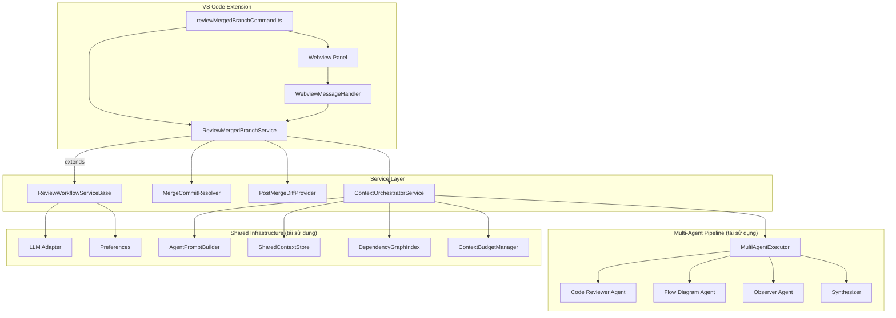
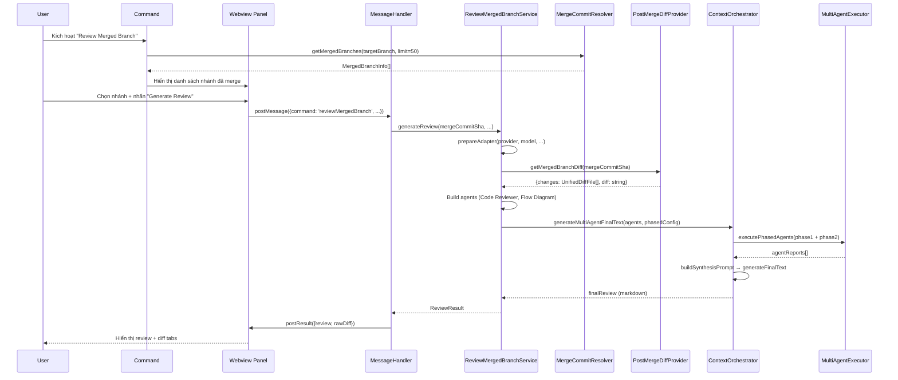
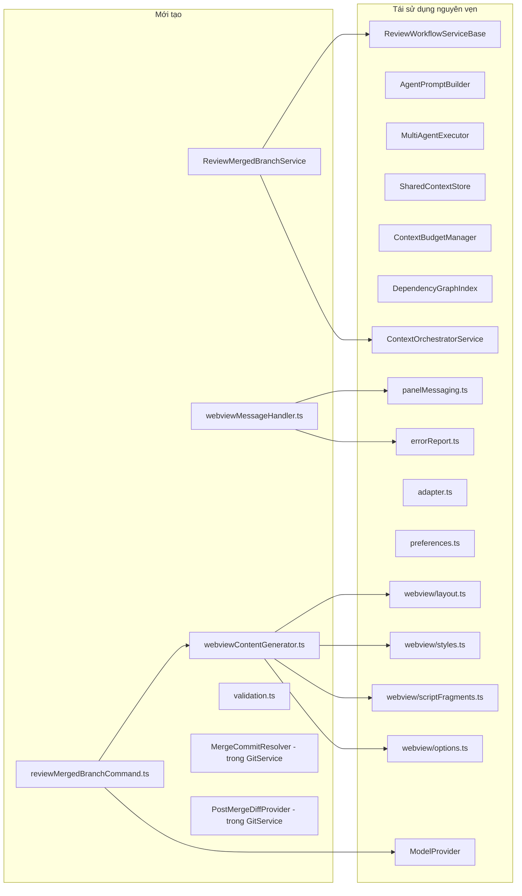
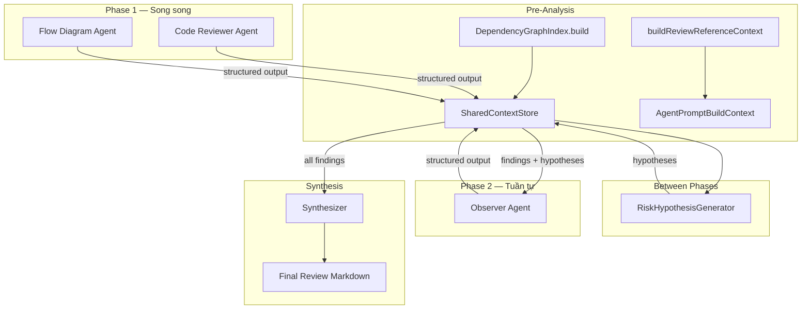
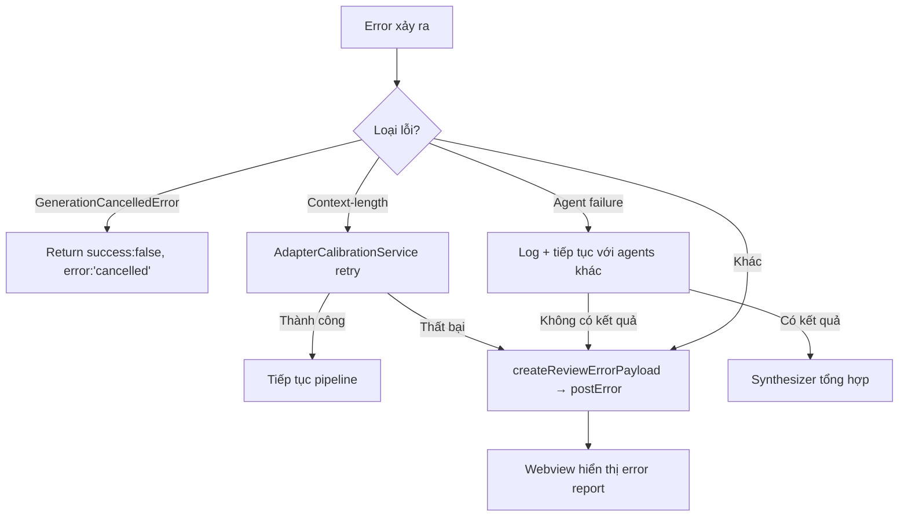

# Tài liệu Thiết kế: Review Merged Branch Agent Plan

## Tổng quan

Tính năng "Review Merged Branch" mở rộng hệ thống review hiện có của git-mew để hỗ trợ review các nhánh đã được merge vào nhánh chính. Thay vì so sánh hai nhánh trước khi merge (như Review Merge hiện tại), tính năng mới này cho phép người dùng chọn một nhánh đã merge từ lịch sử git, trích xuất diff từ merge commit, và chạy pipeline multi-agent review.

Thiết kế tuân theo nguyên tắc tái sử dụng tối đa kiến trúc hiện có:
- Kế thừa `ReviewWorkflowServiceBase` cho logic adapter, abort, và PlantUML repair
- Tái sử dụng toàn bộ multi-agent pipeline (AgentPromptBuilder, MultiAgentExecutor, SharedContextStore)
- Tái sử dụng shared webview components (layout, styles, script fragments)
- Tái sử dụng hệ thống LLM adapter và preferences

Điểm khác biệt chính so với Review Merge:
- **Đầu vào**: Diff từ merge commit (first-parent diff) thay vì diff giữa hai nhánh
- **UI chọn nhánh**: Danh sách nhánh đã merge (từ `git log --merges`) thay vì dropdown hai nhánh
- **Không có MR Description**: Chỉ có chức năng review (nhánh đã merge xong, không cần tạo MR description)

### Ghi chú quan trọng về Git API

GitService hiện tại sử dụng VS Code Git Extension API (`vscode.extensions.getExtension('vscode.git')`) thông qua `repository.diffBetween()` để lấy diff giữa hai branch. Tuy nhiên, API này chỉ hỗ trợ diff giữa hai branch refs, **không hỗ trợ diff giữa commit SHAs trực tiếp**.

Vì vậy, để lấy diff từ merge commit, ta cần sử dụng `child_process.execFile('git', ...)` hoặc `repository.exec(...)` (nếu có) để chạy git CLI commands trực tiếp. Cụ thể:
- `git log --merges --first-parent` → lấy danh sách merge commits
- `git diff <mergeCommit>^1..<mergeCommit>` → lấy diff từ merge commit
- `git diff --name-status <mergeCommit>^1..<mergeCommit>` → lấy danh sách file thay đổi

Tất cả các lệnh này đọc từ `.git/objects` — **không cần checkout, clone, hay pull về thư mục tmp**.

## Kiến trúc

### Tổng quan kiến trúc



### Luồng thực thi chính



## Thành phần và Giao diện

### 1. MergeCommitResolver (thêm vào GitService)

Module xác định merge commit từ lịch sử git. Được implement như methods mới trong `GitService` (cùng pattern với `getAllBranches()`, `getBranchDiffFiles()`).

**Lý do thêm vào GitService thay vì module riêng**: GitService đã quản lý toàn bộ git operations và có sẵn `getRepository()` để truy cập VS Code Git Extension API. Tuy nhiên, vì cần chạy git CLI trực tiếp (VS Code Git API không có method cho merge log), ta sẽ sử dụng `child_process.execFile` với đường dẫn git từ `repository.rootUri`.

```typescript
interface MergedBranchInfo {
    branchName: string;           // Tên nhánh đã merge (trích từ merge commit message)
    mergeCommitSha: string;       // SHA của merge commit
    mergeDate: Date;              // Thời gian merge
    mergeAuthor: string;          // Tác giả merge commit
    mergeMessage: string;         // Message của merge commit
}

// Thêm vào GitService
class GitService {
    // ... existing methods ...

    /**
     * Lấy danh sách nhánh đã merge vào targetBranch.
     * Chạy: git log --merges --first-parent --format="%H|%ai|%an|%s" <targetBranch> -n <limit>
     * Parse output thành MergedBranchInfo[].
     */
    public async getMergedBranches(targetBranch: string, limit: number = 50): Promise<MergedBranchInfo[]>;

    /**
     * Trích xuất tên nhánh từ merge commit message.
     * Hỗ trợ patterns:
     *   - "Merge branch 'feature/xyz'" → "feature/xyz"
     *   - "Merge branch 'feature/xyz' into main" → "feature/xyz"
     *   - "Merge pull request #123 from user/branch" → "user/branch"
     *   - "Merge remote-tracking branch 'origin/feature'" → "origin/feature"
     * Nếu không match pattern nào → dùng toàn bộ message làm branchName.
     */
    private parseBranchNameFromMergeMessage(message: string): string;

    /**
     * Chạy git CLI command trực tiếp.
     * Sử dụng child_process.execFile với cwd = repository.rootUri.fsPath
     */
    private async execGitCommand(args: string[]): Promise<string>;
}
```

**Chi tiết implementation `execGitCommand`:**
```typescript
private async execGitCommand(args: string[]): Promise<string> {
    const repository = this.getRepository();
    const cwd = repository.rootUri.fsPath;
    return new Promise((resolve, reject) => {
        execFile('git', args, { cwd, maxBuffer: 10 * 1024 * 1024 }, (error, stdout, stderr) => {
            if (error) { reject(new Error(`git ${args[0]} failed: ${stderr || error.message}`)); }
            else { resolve(stdout); }
        });
    });
}
```

**Chi tiết implementation `getMergedBranches`:**
```typescript
public async getMergedBranches(targetBranch: string, limit: number = 50): Promise<MergedBranchInfo[]> {
    const output = await this.execGitCommand([
        'log', '--merges', '--first-parent',
        `--format=%H|%ai|%an|%s`,
        targetBranch,
        `-n`, String(limit)
    ]);
    
    return output.trim().split('\n')
        .filter(line => line.trim())
        .map(line => {
            const [sha, date, author, ...messageParts] = line.split('|');
            const message = messageParts.join('|');
            return {
                mergeCommitSha: sha,
                mergeDate: new Date(date),
                mergeAuthor: author,
                mergeMessage: message,
                branchName: this.parseBranchNameFromMergeMessage(message),
            };
        });
    // Kết quả đã sắp xếp theo thời gian giảm dần (git log mặc định)
}
```

**Merge message parsing patterns:**
| Pattern | Regex | Ví dụ |
|---------|-------|-------|
| Standard merge | `Merge branch '(.+?)'` | `Merge branch 'feature/auth'` |
| Merge into target | `Merge branch '(.+?)' into .+` | `Merge branch 'fix/bug' into main` |
| Pull request | `Merge pull request #\d+ from (.+)` | `Merge pull request #42 from user/feature` |
| Remote tracking | `Merge remote-tracking branch '(.+?)'` | `Merge remote-tracking branch 'origin/dev'` |
| Fallback | Toàn bộ message | Bất kỳ format khác |

### 2. PostMergeDiffProvider (thêm vào GitService)

Module trích xuất diff từ merge commit bằng first-parent diff. Cũng được implement trong `GitService`.

```typescript
class GitService {
    // ... existing methods ...

    /**
     * Trích xuất diff của merge commit so với first parent.
     * 
     * Bước 1: Chạy `git diff --name-status <mergeCommit>^1..<mergeCommit>` 
     *         để lấy danh sách file thay đổi + status (A/M/D/R)
     * Bước 2: Với mỗi file, chạy `git diff <mergeCommit>^1..<mergeCommit> -- <filePath>`
     *         để lấy unified diff cho từng file
     * Bước 3: Parse thành UnifiedDiffFile[] (cùng format với getBranchDiffFiles)
     * Bước 4: Render thành chuỗi diff bằng renderBranchDiffFiles (tái sử dụng)
     * 
     * Trả về format tương thích với Multi_Agent_Pipeline.
     */
    public async getMergedBranchDiff(mergeCommitSha: string): Promise<{
        changes: UnifiedDiffFile[];
        diff: string;
    }>;
}
```

**Chi tiết implementation:**
```typescript
public async getMergedBranchDiff(mergeCommitSha: string): Promise<{
    changes: UnifiedDiffFile[];
    diff: string;
}> {
    const repository = this.getRepository();
    const workspaceRoot = repository.rootUri.fsPath;
    
    // Bước 1: Lấy danh sách file thay đổi
    const nameStatusOutput = await this.execGitCommand([
        'diff', '--name-status', `${mergeCommitSha}^1..${mergeCommitSha}`
    ]);
    
    const fileEntries = nameStatusOutput.trim().split('\n')
        .filter(line => line.trim())
        .map(line => {
            const [status, ...pathParts] = line.split('\t');
            // Handle rename: R100\told-path\tnew-path
            const filePath = pathParts[pathParts.length - 1];
            const originalPath = pathParts.length > 1 ? pathParts[0] : undefined;
            return { status: status.charAt(0), filePath, originalPath };
        });
    
    // Bước 2: Lấy diff cho từng file
    const changes: UnifiedDiffFile[] = [];
    for (const entry of fileEntries) {
        const fullPath = path.join(workspaceRoot, entry.filePath);
        let diff: string;
        let isBinary = false;
        
        try {
            const fileDiff = await this.execGitCommand([
                'diff', `${mergeCommitSha}^1..${mergeCommitSha}`, '--', entry.filePath
            ]);
            const sanitized = this.sanitizeDiffContent(fileDiff);
            isBinary = await this.isBinaryFile(sanitized, fullPath);
            diff = isBinary ? 'Binary file' : sanitized;
        } catch (error) {
            diff = `Error getting diff: ${error}`;
        }
        
        changes.push({
            filePath: fullPath,
            relativePath: entry.filePath,
            diff,
            status: this.mapGitStatusChar(entry.status), // A→5, M→6, D→7, R→3
            statusLabel: this.mapGitStatusLabel(entry.status),
            isDeleted: entry.status === 'D',
            isBinary,
            originalFilePath: entry.originalPath 
                ? path.join(workspaceRoot, entry.originalPath) 
                : undefined,
        });
    }
    
    // Bước 3: Render diff string
    const diff = this.renderBranchDiffFiles(changes); // tái sử dụng method hiện có
    
    return { changes, diff };
}

/**
 * Map git status character (A/M/D/R/C) sang GitStatus enum.
 * GitStatus enum values: INDEX_ADDED=5, MODIFIED=6, INDEX_DELETED=7, INDEX_RENAMED=3
 */
private mapGitStatusChar(statusChar: string): number;

/**
 * Map git status character sang label string.
 */
private mapGitStatusLabel(statusChar: string): string;
```

**Lưu ý quan trọng:**
- `renderBranchDiffFiles()` đã tồn tại trong GitService (line 599) — tái sử dụng nguyên vẹn
- `sanitizeDiffContent()` đã tồn tại (line 728) — tái sử dụng
- `isBinaryFile()` đã tồn tại (line 179) — tái sử dụng
- Cần thêm 2 helper methods mới: `mapGitStatusChar()` và `mapGitStatusLabel()` để map từ git CLI status chars sang GitStatus enum

### 3. ReviewMergedBranchService

Service chính kế thừa `ReviewWorkflowServiceBase`, tương tự `ReviewMergeService` nhưng sử dụng diff từ merge commit.

**Kế thừa từ ReviewWorkflowServiceBase (tái sử dụng nguyên vẹn):**
- `contextOrchestrator: ContextOrchestratorService` — quản lý multi-agent pipeline
- `prepareAdapter()` — khởi tạo LLM adapter, persist preferences, validate API key
- `withAbortController()` — quản lý abort/cancel
- `cancel()` — hủy generation
- `repairPlantUmlMarkdown()` — sửa PlantUML diagram lỗi

```typescript
class ReviewMergedBranchService extends ReviewWorkflowServiceBase {
    constructor(gitService: GitService, llmService: LLMService) {
        super(gitService, llmService);
    }

    /**
     * Tạo review cho nhánh đã merge.
     * 
     * Flow chi tiết (12 bước, tương tự ReviewMergeService.generateReview):
     * 
     * 1. prepareAdapter() → ILLMAdapter (validate API key, persist preferences)
     * 2. gitService.getMergedBranchDiff(mergeCommitSha) → {changes, diff}
     * 3. Load custom prompts:
     *    - gitService.getCustomReviewMergeSystemPrompt()
     *    - gitService.getCustomReviewMergeAgentPrompt()
     *    - gitService.getCustomReviewMergeRules()
     * 4. Build system message: SYSTEM_PROMPT_GENERATE_REVIEW_MERGE(language, custom...)
     * 5. Initialize pipeline components:
     *    - SharedContextStoreImpl()
     *    - TokenEstimatorService()
     *    - ContextBudgetManager(DEFAULT_BUDGET_CONFIG, tokenEstimator)
     *    - AgentPromptBuilder(budgetManager, tokenEstimator)
     * 6. Build DependencyGraphIndex:
     *    - DependencyGraphIndex(DEFAULT_GRAPH_CONFIG, gitService, mergeCommitSha)
     *    - graphIndex.build(changes) → dependencyGraph
     *    - sharedStore.setDependencyGraph(dependencyGraph)
     *    NOTE: compareBranch ở đây là mergeCommitSha (git ref cho tool đọc file)
     * 7. Calculate budgets:
     *    - budgetManager.allocateAgentBudgets(contextWindow, maxOutput, systemTokens, diffTokens)
     *    - budgetManager.enforceGlobalBudget(allocations, contextWindow)
     * 8. Build reference context:
     *    - gitService.buildReviewReferenceContext(changes, {strategy, model, ...})
     *    NOTE: Reference context cung cấp symbol definitions, related files cho agents
     * 9. Build AgentPromptBuildContext:
     *    {fullDiff, changedFiles, referenceContext, dependencyGraph, 
     *     sharedContextStore, language, taskInfo, customSystemPrompt, 
     *     customRules, customAgentInstructions, compareBranch: mergeCommitSha, gitService}
     * 10. Build agent prompts:
     *     - promptBuilder.buildCodeReviewerPrompt(buildContext, safeBudgets[0])
     *     - promptBuilder.buildFlowDiagramPrompt(buildContext, safeBudgets[1])
     * 11. Execute pipeline:
     *     contextOrchestrator.generateMultiAgentFinalText(
     *       adapter, agents, systemMessage, buildSynthesisPrompt, signal, request, phasedConfig
     *     )
     *     Bên trong pipeline (MultiAgentExecutor.executePhasedAgents):
     *       Phase 1: Code Reviewer + Flow Diagram chạy song song
     *       → Parse structured outputs → store vào SharedContextStore
     *       → RiskHypothesisGenerator.generate() tạo hypotheses
     *       Phase 2: Observer (build động từ SharedContextStore findings + hypotheses)
     *       → Observer self-audit
     *       → Combine all results
     *     Synthesizer: buildSynthesizerPrompt(structuredReports, diffSummary)
     *     → generateFinalText → final review markdown
     * 12. Return ReviewResult {success, review, diff, changes}
     */
    async generateReview(
        mergeCommitSha: string,
        provider: LLMProvider,
        model: string,
        language: string,
        strategy: ContextStrategy,
        taskInfo?: string,
        apiKey?: string,
        baseURL?: string,
        contextWindow?: number,
        maxOutputTokens?: number,
        onProgress?: (message: string) => void,
        onLog?: (message: string) => void,
        onLlmLog?: (entry: LlmRequestLogEntry) => void
    ): Promise<ReviewResult>;
}
```

**So sánh với ReviewMergeService.generateReview():**

| Bước | ReviewMergeService | ReviewMergedBranchService |
|------|-------------------|--------------------------|
| Diff source | `getBranchDiffPreview(base, compare)` | `getMergedBranchDiff(mergeCommitSha)` |
| compareBranch ref | Branch name (e.g. "feature/auth") | Merge commit SHA |
| Review prompt | `buildReviewPrompt(base, compare, diff)` | `buildMergedBranchReviewPrompt(mergeCommitSha, branchName, diff)` |
| Task spec | `buildMergeReviewTaskSpec(base, compare, ...)` | `buildMergedBranchReviewTaskSpec(mergeCommitSha, ...)` |
| Description | Có `generateDescription()` | Không có (nhánh đã merge) |
| Pipeline | Giống nhau — tái sử dụng 100% |
| Agents | Giống nhau — Code Reviewer, Flow Diagram, Observer |
| Synthesizer | Giống nhau — `buildSynthesizerPrompt()` |
| Error handling | Giống nhau — `handleGenerationError()` |

**Lưu ý về `compareBranch` parameter:**
Trong `AgentPromptBuildContext`, field `compareBranch` được dùng bởi `DependencyGraphIndex` và LLM tools (như `readFile`) để đọc file content từ đúng git ref. Với Review Merge, đây là tên branch. Với Review Merged Branch, đây là merge commit SHA — git hỗ trợ cả hai dạng ref.

### 4. Webview Panel Components

#### WebviewContentGenerator

Tạo HTML cho webview panel, tái sử dụng shared components.

```typescript
function generateMergedBranchWebviewContent(
    mergedBranches: MergedBranchInfo[],
    providers?: LLMProvider[],
    availableModels?: Record<string, string[]>,
    currentProvider?: LLMProvider,
    currentModel?: string,
    savedLanguage?: string,
    customModelSettings?: ReviewCustomModelSettings,
    customProviderConfig?: ReviewCustomProviderConfig
): string;
```

**Khác biệt so với Review Merge webview:**
- Thay vì 2 dropdown chọn base/compare branch → 1 danh sách nhánh đã merge có thể tìm kiếm
- Hiển thị thông tin: tên nhánh, ngày merge, tác giả
- Chỉ có nút "Generate Review" (không có "Generate Description" và "Generate Both")
- Tái sử dụng: `buildReviewShell`, `buildPanelSection`, `buildSharedStyles`, `buildSharedClientActions`, `buildTabbedResultMessageHandler`

#### WebviewMessageHandler

```typescript
interface ReviewMergedBranchMessage {
    command: 'reviewMergedBranch' | 'viewRawDiff' | 'cancel' | 'repairPlantUml';
    mergeCommitSha?: string;
    provider?: LLMProvider;
    model?: string;
    apiKey?: string;
    baseURL?: string;
    taskInfo?: string;
    language?: string;
    contextStrategy?: ContextStrategy;
    contextWindow?: number;
    maxOutputTokens?: number;
    // PlantUML repair fields
    content?: string;
    errorMessage?: string;
    target?: 'review';
    attempt?: number;
}

class WebviewMessageHandler {
    constructor(panel: WebviewPanel, service: ReviewMergedBranchService);
    handleMessage(message: ReviewMergedBranchMessage): Promise<void>;
}
```

### 5. Command Registration

```typescript
// src/commands/reviewMergedBranchCommand.ts
import * as vscode from 'vscode';
import { LLMService } from '../services/llm';
import { GitService } from '../services/utils/gitService';
import { generateMergedBranchWebviewContent } from './reviewMergedBranch/webviewContentGenerator';
import { ModelProvider } from './reviewMerge/modelProvider'; // tái sử dụng
import { ReviewMergedBranchService } from './reviewMergedBranch/reviewMergedBranchService';
import { WebviewMessageHandler } from './reviewMergedBranch/webviewMessageHandler';
import { loadReviewPreferences } from './reviewShared/preferences'; // tái sử dụng

export function registerReviewMergedBranchCommand(
    context: vscode.ExtensionContext,
    gitService: GitService,
    llmService: LLMService
): vscode.Disposable;
```

**Flow chi tiết (tương tự registerReviewMergeCommand):**
1. `gitService.getCurrentBranch()` → targetBranch (nhánh hiện tại)
2. `gitService.getMergedBranches(targetBranch, 50)` → MergedBranchInfo[]
3. Nếu danh sách rỗng → `vscode.window.showWarningMessage('Không tìm thấy nhánh đã merge...')`; return
4. `loadReviewPreferences(llmService)` → {currentProvider, currentModel, savedLanguage}
5. `ModelProvider.getAvailableModels(llmService)` → {providers, availableModels, customModelSettings, customProviderConfig}
6. `vscode.window.createWebviewPanel('reviewMergedBranch', 'Review Merged Branch', ...)` 
7. `panel.webview.html = generateMergedBranchWebviewContent(mergedBranches, providers, ...)`
8. Tạo `ReviewMergedBranchService(gitService, llmService)` + `WebviewMessageHandler(panel, service)`
9. `panel.webview.onDidReceiveMessage(message => messageHandler.handleMessage(message))`

**Đăng ký trong src/commands/index.ts:**
```typescript
import { registerReviewMergedBranchCommand } from './reviewMergedBranchCommand';

// Thêm vào mảng commands:
registerReviewMergedBranchCommand(context, gitService, llmService),
```

**Đăng ký trong package.json:**
```json
// contributes.commands — thêm:
{
    "command": "git-mew.review-merged-branch",
    "title": "git-mew: Review Merged Branch",
    "icon": "$(history)"
}

// contributes.menus.scm/title — thêm:
{
    "command": "git-mew.review-merged-branch",
    "when": "scmProvider == git",
    "group": "navigation"
}
```

### Sơ đồ thành phần và tái sử dụng




## Mô hình Dữ liệu

### MergedBranchInfo

```typescript
interface MergedBranchInfo {
    branchName: string;           // Tên nhánh đã merge
    mergeCommitSha: string;       // SHA đầy đủ của merge commit
    mergeDate: Date;              // Thời gian merge
    mergeAuthor: string;          // Tác giả merge commit
    mergeMessage: string;         // Commit message đầy đủ
}
```

### ReviewMergedBranchMessage (Webview → Extension)

```typescript
interface ReviewMergedBranchMessage {
    command: 'reviewMergedBranch' | 'viewRawDiff' | 'cancel' | 'repairPlantUml';
    mergeCommitSha?: string;
    provider?: LLMProvider;
    model?: string;
    apiKey?: string;
    baseURL?: string;
    taskInfo?: string;
    language?: string;
    contextStrategy?: ContextStrategy;
    contextWindow?: number;
    maxOutputTokens?: number;
    content?: string;
    errorMessage?: string;
    target?: 'review';
    attempt?: number;
}
```

### ReviewResult (tái sử dụng)

```typescript
interface ReviewResult {
    success: boolean;
    review?: string;
    diff?: string;
    changes?: UnifiedDiffFile[];
    error?: string;
}
```

### Dữ liệu tái sử dụng từ hệ thống hiện có

| Model | Module | Mô tả |
|-------|--------|--------|
| `UnifiedDiffFile` | `src/services/llm/contextTypes.ts` | Cấu trúc diff file chuẩn cho pipeline |
| `AgentPrompt` | `orchestratorTypes.ts` | Cấu hình agent (role, system, prompt, tools) |
| `AgentBudgetAllocation` | `orchestratorTypes.ts` | Phân bổ token budget cho agent |
| `AgentPromptBuildContext` | `orchestratorTypes.ts` | Context đầu vào để build prompt agent |
| `StructuredAgentReport` | `orchestratorTypes.ts` | Kết quả structured từ agent |
| `DependencyGraphData` | `orchestratorTypes.ts` | Đồ thị phụ thuộc file/symbol |
| `ReviewErrorPayload` | `reviewShared/types.ts` | Payload lỗi cho webview |
| `ReviewResultPayload` | `reviewShared/types.ts` | Payload kết quả cho webview |
| `ReviewCustomModelSettings` | `reviewShared/types.ts` | Cấu hình custom model |
| `LlmRequestLogEntry` | `contextTypes.ts` | Log entry cho LLM request |

### Cấu trúc thư mục mới

```
src/commands/reviewMergedBranch/
├── index.ts                      # Re-exports
├── reviewMergedBranchService.ts  # Service chính (extends ReviewWorkflowServiceBase)
├── webviewContentGenerator.ts    # Tạo HTML cho webview
├── webviewMessageHandler.ts      # Xử lý message từ webview
└── validation.ts                 # Validate input từ webview

src/commands/
├── reviewMergedBranchCommand.ts  # Đăng ký VS Code command
```

### Thay đổi trong file hiện có

| File | Thay đổi | Chi tiết |
|------|----------|----------|
| `package.json` | Thêm command + menu entry | Command `git-mew.review-merged-branch` với icon `$(history)`, menu entry trong `scm/title` |
| `src/commands/index.ts` | Import + đăng ký command | Thêm `registerReviewMergedBranchCommand` vào mảng commands |
| `src/services/utils/gitService.ts` | Thêm 5 methods mới | `getMergedBranches()`, `getMergedBranchDiff()`, `parseBranchNameFromMergeMessage()`, `execGitCommand()`, `mapGitStatusChar()`, `mapGitStatusLabel()` |

### Git Commands sử dụng

| Mục đích | Git Command | Ghi chú |
|----------|-------------|---------|
| Lấy danh sách merge commits | `git log --merges --first-parent --format="%H\|%ai\|%an\|%s" <targetBranch> -n 50` | Đọc từ git objects, không cần checkout |
| Lấy danh sách file thay đổi | `git diff --name-status <mergeCommit>^1..<mergeCommit>` | `^1` = first parent trên nhánh chính |
| Trích xuất diff cho từng file | `git diff <mergeCommit>^1..<mergeCommit> -- <filePath>` | Unified diff format |
| Đọc file từ merge commit | `git show <mergeCommit>:<filePath>` | Dùng bởi DependencyGraphIndex + LLM tools |

### Tái sử dụng chi tiết

| Module tái sử dụng | Từ file | Cách sử dụng |
|---------------------|---------|--------------|
| `ReviewWorkflowServiceBase` | `reviewShared/reviewWorkflowServiceBase.ts` | Base class cho service — prepareAdapter, withAbortController, cancel, repairPlantUml |
| `ContextOrchestratorService` | `services/llm/ContextOrchestratorService.ts` | `generateMultiAgentFinalText()` — orchestrate toàn bộ pipeline |
| `MultiAgentExecutor` | `orchestrator/MultiAgentExecutor.ts` | `executePhasedAgents()` — Phase 1 parallel + Phase 2 Observer |
| `AgentPromptBuilder` | `orchestrator/AgentPromptBuilder.ts` | `buildCodeReviewerPrompt()`, `buildFlowDiagramPrompt()`, `buildObserverPrompt()`, `buildSynthesizerPrompt()` |
| `SharedContextStoreImpl` | `orchestrator/SharedContextStore.ts` | Blackboard pattern — share findings, graph, hypotheses giữa agents |
| `ContextBudgetManager` | `orchestrator/ContextBudgetManager.ts` | `allocateAgentBudgets()`, `enforceGlobalBudget()` |
| `DependencyGraphIndex` | `orchestrator/DependencyGraphIndex.ts` | `build(changes)` — xây dựng đồ thị phụ thuộc từ VS Code index |
| `RiskHypothesisGenerator` | `orchestrator/RiskHypothesisGenerator.ts` | `generate()` — tạo risk hypotheses giữa Phase 1 và Phase 2 |
| `TokenEstimatorService` | `services/llm/TokenEstimatorService.ts` | Ước lượng token count |
| `ModelProvider` | `reviewMerge/modelProvider.ts` | `getAvailableModels()` — load danh sách models |
| `loadReviewPreferences` | `reviewShared/preferences.ts` | Load saved provider/model/language |
| `persistReviewPreferences` | `reviewShared/preferences.ts` | Save preferences (gọi trong prepareAdapter) |
| `createInitializedAdapter` | `reviewShared/adapter.ts` | Tạo LLM adapter instance |
| `buildReviewShell` | `reviewShared/webview/layout.ts` | HTML shell cho webview |
| `buildPanelSection` | `reviewShared/webview/layout.ts` | Section layout |
| `buildSharedStyles` | `reviewShared/webview/styles.ts` | CSS styles |
| `buildSharedClientActions` | `reviewShared/webview/scriptFragments.ts` | Client-side JS actions |
| `buildTabbedResultMessageHandler` | `reviewShared/webview/scriptFragments.ts` | Tab switching logic |
| `postResult`, `postError`, `postProgress` | `reviewShared/panelMessaging.ts` | Webview messaging helpers |
| `createReviewErrorPayload` | `reviewShared/errorReport.ts` | Error payload builder |
| `SYSTEM_PROMPT_GENERATE_REVIEW_MERGE` | `prompts/systemPromptGenerateReviewMerge.ts` | System prompt (tái sử dụng vì cùng logic review) |


## Correctness Properties

### Chi tiết Multi-Agent Pipeline (Phased Execution)

Pipeline review sử dụng mô hình phased execution với SharedContextStore (Blackboard pattern):



**Structured Output Schemas (từ orchestratorTypes.ts):**

| Agent | Output Schema | Dữ liệu chính |
|-------|--------------|----------------|
| Code Reviewer | `CodeReviewerOutput` | issues[] (file, severity, category, description, suggestion), affectedSymbols[], qualityVerdict |
| Flow Diagram | `FlowDiagramOutput` | diagrams[] (name, type, plantumlCode, description), affectedFlows[] |
| Observer | `ObserverOutput` | risks[] (description, severity, affectedArea), todoItems[], integrationConcerns[], hypothesisVerdicts[] |

**Budget Allocation (từ ContextBudgetManager):**
- Code Reviewer: ~40% budget (nhiều nhất vì phân tích chi tiết nhất)
- Flow Diagram: ~25% budget
- Observer: ~35% budget (cần đọc findings từ 2 agents khác + hypotheses)

**LLM Tools có sẵn cho agents:**
Các agent có thể gọi LLM tools (từ `src/llm-tools/tools/`) trong quá trình phân tích:
- `readFile` — đọc file content từ git ref (mergeCommitSha)
- `findReferences` — tìm references của symbol
- `getSymbolDefinition` — lấy definition của symbol
- `getDiagnostics` — lấy diagnostics cho file
- `searchCode` — tìm kiếm code
- `getRelatedFiles` — tìm file liên quan
- `queryContext` — query context từ workspace

Kết quả tool calls được cache trong SharedContextStore để tránh gọi lại.

---

*Một property là một đặc tính hoặc hành vi phải đúng trong mọi lần thực thi hợp lệ của hệ thống — về bản chất là một phát biểu hình thức về những gì hệ thống phải làm. Properties đóng vai trò cầu nối giữa đặc tả dễ đọc cho con người và đảm bảo tính đúng đắn có thể kiểm chứng bằng máy.*

### Property 1: Merge commit parsing trích xuất đầy đủ thông tin

*For any* chuỗi git log output hợp lệ chứa merge commits (format `SHA|date|author|message`), hàm parse SHALL trích xuất chính xác `branchName`, `mergeCommitSha`, `mergeDate`, và `mergeAuthor` cho mỗi entry, và `branchName` phải khớp với tên nhánh trong merge message.

**Validates: Requirements 1.1**

### Property 2: Diff parsing tạo UnifiedDiffFile[] hợp lệ

*For any* chuỗi git diff output hợp lệ, hàm parse SHALL tạo ra mảng `UnifiedDiffFile[]` trong đó mỗi phần tử có đầy đủ các trường bắt buộc (`filePath`, `relativePath`, `diff`, `statusLabel`) và chuỗi diff rendered không rỗng.

**Validates: Requirements 1.2, 1.5**

### Property 3: Danh sách nhánh đã merge được sắp xếp theo thời gian giảm dần

*For any* danh sách `MergedBranchInfo[]` trả về từ `getMergedBranches()`, với mọi cặp phần tử liên tiếp `(list[i], list[i+1])`, `list[i].mergeDate >= list[i+1].mergeDate` phải đúng.

**Validates: Requirements 2.1**

### Property 4: Danh sách nhánh đã merge có tối đa 50 phần tử

*For any* repository với số lượng merge commits tùy ý, `getMergedBranches(targetBranch, 50)` SHALL trả về mảng có `length <= 50`.

**Validates: Requirements 2.2**

### Property 5: Tìm kiếm nhánh lọc chính xác theo tên

*For any* danh sách `MergedBranchInfo[]` và chuỗi tìm kiếm `query`, kết quả lọc SHALL chỉ chứa các nhánh có `branchName` chứa `query` (case-insensitive), và mọi nhánh trong danh sách gốc có `branchName` chứa `query` đều phải xuất hiện trong kết quả.

**Validates: Requirements 2.4**

### Property 6: Rendered HTML chứa đầy đủ thông tin nhánh

*For any* `MergedBranchInfo` hợp lệ, HTML được render bởi webview content generator SHALL chứa `branchName`, chuỗi biểu diễn của `mergeDate`, và `mergeAuthor` trong nội dung output.

**Validates: Requirements 2.3**

### Property 7: Custom prompts được inject vào system message

*For any* chuỗi custom system prompt, custom rules, và custom agent instructions không rỗng, system message được xây dựng cho agent SHALL chứa nội dung của cả ba chuỗi đó.

**Validates: Requirements 8.4**

## Xử lý Lỗi

### Lỗi từ Git Operations

| Tình huống | Xử lý |
|------------|--------|
| Không tìm thấy merge commit | Trả về `ReviewResult { success: false, error: "Không tìm thấy merge commit cho nhánh '<name>'" }` |
| Git command thất bại | Catch error, trả về `ReviewResult { success: false, error }` |
| Repository không có merge commits | Hiển thị warning message trên VS Code, không mở webview |
| Merge commit SHA không hợp lệ | Validation trong `webviewMessageHandler` trước khi gọi service |

### Lỗi từ LLM Pipeline

| Tình huống | Xử lý | Module |
|------------|--------|--------|
| API key thiếu | `prepareAdapter()` trả về error message | `ReviewWorkflowServiceBase` |
| Context-length exceeded | `AdapterCalibrationService` auto-retry với truncated prompt | `AdapterCalibrationService` |
| Một agent thất bại | `MultiAgentExecutor` log lỗi, tiếp tục với agents còn lại | `MultiAgentExecutor` |
| Tất cả agents thất bại | Trả về error tổng hợp qua `postError()` | `WebviewMessageHandler` |
| User cancel | `AbortController.abort()` → `GenerationCancelledError` → return early | `ReviewWorkflowServiceBase` |
| PlantUML render thất bại | Webview gửi `repairPlantUml` message → service repair và gửi lại | `WebviewMessageHandler` |

### Error Propagation Flow



## Chiến lược Testing

### Dual Testing Approach

Tính năng này sử dụng kết hợp unit tests và property-based tests:

- **Unit tests**: Kiểm tra các ví dụ cụ thể, edge cases, và error conditions
- **Property-based tests**: Kiểm tra các thuộc tính phổ quát trên nhiều đầu vào ngẫu nhiên

### Property-Based Testing

**Thư viện**: [fast-check](https://github.com/dubzzz/fast-check) — thư viện property-based testing phổ biến nhất cho TypeScript/JavaScript.

**Cấu hình**:
- Mỗi property test chạy tối thiểu 100 iterations
- Mỗi test được tag với comment tham chiếu đến property trong design document
- Format tag: `Feature: review-merged-branch-agent-plan, Property {number}: {property_text}`

**Property tests cần implement**:

| Property | Mô tả | Generator |
|----------|--------|-----------|
| Property 1 | Merge commit parsing | Random git log strings với format `SHA\|date\|author\|Merge branch 'name'` |
| Property 2 | Diff parsing → UnifiedDiffFile[] | Random unified diff strings với file headers và hunks |
| Property 3 | Sort order giảm dần | Random arrays of `MergedBranchInfo` với dates ngẫu nhiên |
| Property 4 | Max 50 items | Random arrays với length từ 0 đến 200 |
| Property 5 | Search filter correctness | Random arrays + random query strings |
| Property 6 | HTML chứa thông tin đầy đủ | Random `MergedBranchInfo` objects |
| Property 7 | Custom prompt injection | Random non-empty strings cho system prompt, rules, agent instructions |

**Mỗi correctness property PHẢI được implement bởi MỘT property-based test duy nhất.**

### Unit Tests

Unit tests tập trung vào:

- **Edge cases từ requirements**:
  - Nhánh đã merge bị xóa khỏi remote (1.3)
  - Merge commit không tìm thấy (1.4)
  - Danh sách rỗng (2.5)
  - Cancel generation (6.1)
  
- **Integration points**:
  - Command registration trong package.json (7.1, 7.2, 7.4)
  - WebviewPanel tạo đúng tabs (4.2, 4.3)
  - Service khởi tạo đúng 3 agents (3.1)

- **Error conditions**:
  - Invalid merge commit SHA
  - Git command failures
  - API key missing

### Test File Structure

```
src/test/
├── reviewMergedBranch/
│   ├── mergeCommitResolver.test.ts      # Unit + Property tests cho parsing
│   ├── postMergeDiffProvider.test.ts     # Unit + Property tests cho diff parsing
│   ├── branchListSorting.test.ts         # Property tests cho sort + limit
│   ├── branchSearch.test.ts             # Property tests cho search filter
│   ├── webviewContent.test.ts           # Property tests cho HTML rendering
│   ├── systemPromptBuilder.test.ts      # Property tests cho custom prompt injection
│   └── validation.test.ts              # Unit tests cho input validation
```
