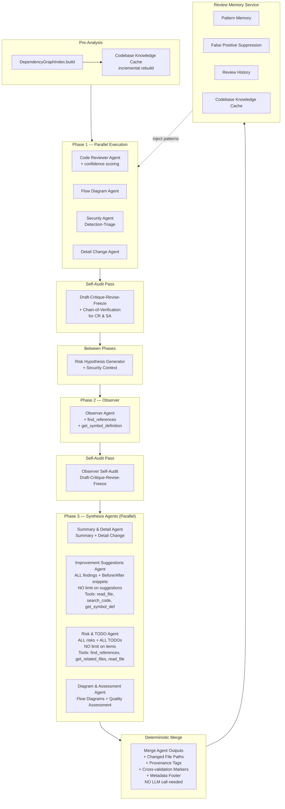
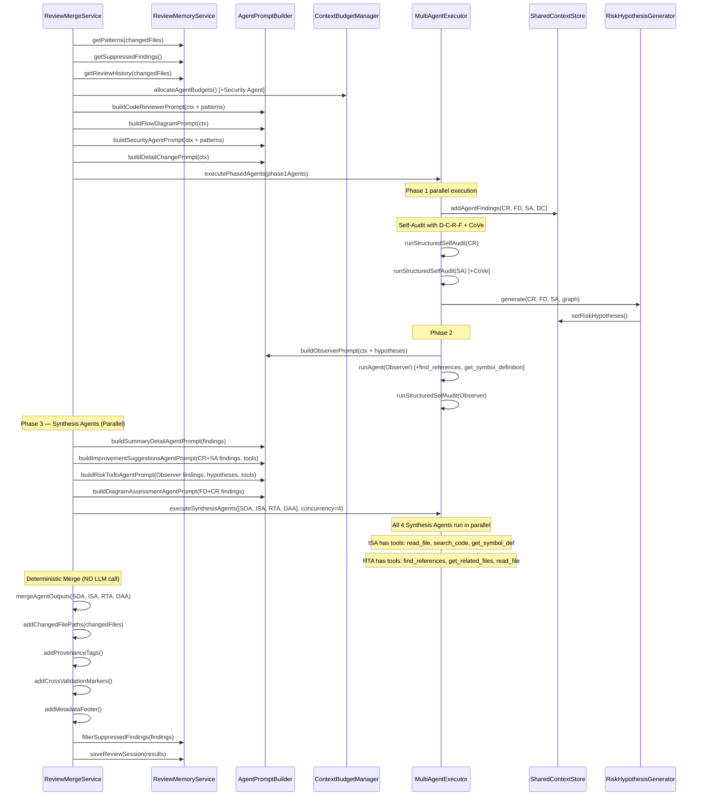

# Design Document — Review Quality Enhancement

## Overview

Tài liệu thiết kế này mô tả kiến trúc và chi tiết triển khai cho 7 requirements nâng cấp chất lượng hệ thống multi-agent code review của Git Mew VS Code extension. Hệ thống hiện tại sử dụng phased execution (Phase 1: Code Reviewer + Flow Diagram + Detail Change song song → Risk Hypothesis Generation → Phase 2: Observer) với SharedContextStore (Blackboard pattern) để chia sẻ context.

Các thay đổi chính:
1. **Observer Agent tool expansion** — Thêm `find_references` + `get_symbol_definition` tools
2. **Structured Self-Audit** — Draft-Critique-Revise-Freeze pattern + Chain-of-Verification
3. **Security Agent** — Agent Phase 1 mới với Detection-Triage model (OWASP/CWE)
4. **Review Memory Service** — Tiered memory (Primary/Secondary/Tertiary) persist qua workspaceState
5. **Structured Skeleton** — Pre-assembled markdown skeleton cho Synthesizer + verification layer
6. **Confidence Scoring** — Confidence scores cho findings + resolution rate tracking
7. **Risk Hypothesis Generator upgrade** — Tích hợp Security Agent findings
8. **Deep-Dive Multi-Agent Synthesis** — Chia Synthesis thành 4 Synthesis Agents chạy song song (Phase 3), mỗi agent focus vào 1-2 sections, không giới hạn output, tránh bottleneck max output tokens

Tất cả thay đổi được thiết kế để backward-compatible, không break existing review flow, và có thể triển khai incrementally.

**Thay đổi kiến trúc quan trọng nhất:** Synthesis phase chuyển từ 1 Synthesizer LLM call → 4 Synthesis Agents song song + deterministic merge. Điều này giải quyết vấn đề max output tokens bị giới hạn khi 1 agent phải viết toàn bộ report, đặc biệt cho Improvement Suggestions (cần Before/After snippets chi tiết) và Hidden Risks (cần phân tích sâu).

## Architecture

### High-Level Architecture — Phased Execution Flow (After Enhancement)



### Component Interaction Diagram



## Components and Interfaces

### 1. Observer Agent Tool Expansion (Requirement 1)

Thay đổi trong `AgentPromptBuilder.buildObserverPrompt()`:

```typescript
// Hiện tại Observer có: getDiagnosticsTool, getRelatedFilesTool, readFileTool, queryContextTool
// Thêm: findReferencesTool, getSymbolDefinitionTool

// AgentPromptBuilder.ts — buildObserverPrompt()
const tools = combineTools([
  findReferencesTool,        // NEW
  getSymbolDefinitionTool,   // NEW
  getDiagnosticsTool,
  getRelatedFilesTool,
  readFileTool,
  queryContextTool,
], ctx.additionalTools);
```

System prompt bổ sung cho Observer:
```typescript
const OBSERVER_TOOL_GUIDANCE = `
### Tool Usage Priority
1. Use \`find_references\` to verify integration concerns before reporting them.
2. Use \`get_symbol_definition\` to understand implementation details of affected symbols.
3. Only report integration risks that you have verified via tool calls.
4. Prefer tool-verified findings over inference-only findings.

### Output Completeness
- There is NO limit on the number of risks or TODO items. Be thorough.
- Each TODO item should include: action, rationale, expected outcome, priority.
- Each risk should include: description, affected areas, likelihood, impact, mitigation.`;
```

### 2. Structured Self-Audit (Requirement 2)

Thay đổi trong `MultiAgentExecutor`:

```typescript
// New interface for structured audit output
interface StructuredAuditResult {
  verdict: 'PASS' | 'NEEDS_REVISION';
  issues: Array<{
    severity: 'critical' | 'major' | 'minor';
    location: string;
    description: string;
  }>;
  additions: Array<unknown>;   // New findings discovered during audit
  removals: Array<{
    findingIndex: number;
    reason: string;             // e.g. "failed_verification"
  }>;
  verificationResults?: Array<{  // Only for CR & SA (CoVe)
    findingIndex: number;
    questions: string[];
    answers: string[];
    passed: boolean;
  }>;
}
```

Phương thức mới `runStructuredSelfAudit()` thay thế `runSelfAudit()` và `runObserverSelfAudit()`:

```typescript
// MultiAgentExecutor.ts
private async runStructuredSelfAudit(
  agent: AgentPrompt,
  adapter: ILLMAdapter,
  lastResponse: any,
  sharedStore: ISharedContextStore | undefined,
  diffSummary: string,
  signal?: AbortSignal,
  request?: ContextGenerationRequest
): Promise<any> {
  // 1. Build audit prompt with diff summary (truncated to 30% budget)
  // 2. Include previousAnalysis
  // 3. For Observer: include checklist from Phase 1 findings
  // 4. For CR & SA: include Chain-of-Verification instructions
  // 5. Request structured JSON output (StructuredAuditResult)
  // 6. Parse result, apply additions/removals to agent output
  // 7. Log audit results
}
```

Diff summary budget logic:
```typescript
// If diffSummary > 30% of audit token budget → use changedFilesSummary only
const auditBudget = adapter.getMaxOutputTokens();
const diffSummaryTokens = this.estimateTokens(diffSummary);
const effectiveDiffContext = diffSummaryTokens > auditBudget * 0.3
  ? buildChangedFilesSummary(changedFiles)  // file paths + line counts only
  : diffSummary;
```

### 3. Security Agent (Requirement 3)

Mới hoàn toàn — thêm vào Phase 1 parallel execution.

```typescript
// AgentPromptBuilder.ts — new method
buildSecurityAgentPrompt(
  ctx: AgentPromptBuildContext,
  budget: AgentBudgetAllocation,
): AgentPrompt {
  // System message: SECURITY_AGENT_INSTRUCTIONS
  // Tools: searchCodeTool, findReferencesTool, readFileTool, 
  //        getSymbolDefinitionTool, getDiagnosticsTool
  // Phase: 1, outputSchema: 'security-analyst'
  // selfAudit: true (with triage step), maxIterations: 3
}
```

Security Agent system prompt instructions:
```typescript
const SECURITY_AGENT_INSTRUCTIONS = `## Security Analyst Agent
You are a specialized Security Analyst using Detection-Triage methodology.

### Detection Phase
Analyze the diff for security vulnerabilities following OWASP Top 10:
- Injection (CWE-79 XSS, CWE-89 SQLi, CWE-78 OS Command, CWE-918 SSRF)
- Auth bypass (CWE-287, CWE-862, CWE-863)
- Secrets exposure (CWE-798, CWE-532)
- Unsafe deserialization (CWE-502)
- Path traversal (CWE-22)
- Input validation gaps (CWE-20)

### Taint Analysis
Trace data flow from untrusted sources to sensitive sinks:
- Sources: request params, user input, external APIs, environment variables
- Sinks: DB queries, file ops, command execution, response rendering

### Confidence Scoring
Assign confidence (0.0-1.0) per finding:
- +0.2 if complete taint flow traced (source → sink)
- +0.1 if CWE classification matches known pattern
- -0.2 if only pattern matching without context verification

### Triage (Self-Audit)
For findings with confidence < 0.6: use tools to gather more evidence or remove.

Output JSON matching SecurityAnalystOutput schema.
Return ONLY valid JSON.`;
```

### 4. Review Memory Service (Requirement 4)

Mới hoàn toàn — service persist qua `ExtensionContext.workspaceState`.

```typescript
// src/services/llm/ReviewMemoryService.ts

export class ReviewMemoryService {
  private static readonly KEY_PREFIX = 'gitmew.reviewMemory.';
  
  constructor(
    private readonly storage: vscode.Memento | InMemoryStorage
  ) {}

  // Pattern Memory
  async getPatterns(changedFileGlobs: string[]): Promise<PatternEntry[]>;
  async savePatterns(agentOutputs: StructuredAgentReport[]): Promise<void>;
  async decayPatterns(): Promise<void>;

  // False Positive Suppression
  async getSuppressedFindings(): Promise<SuppressedFinding[]>;
  async suppressFinding(finding: SuppressedFinding): Promise<void>;
  async isFindinSuppressed(finding: FindingSignature): Promise<boolean>;

  // Codebase Knowledge Cache
  async getCachedGraph(): Promise<DependencyGraphData | undefined>;
  async updateCachedGraph(graph: DependencyGraphData, changedFiles: string[]): Promise<void>;
  async invalidateCache(): Promise<void>;

  // Review History
  async getReviewHistory(limit?: number): Promise<ReviewSummary[]>;
  async saveReviewSummary(summary: ReviewSummary): Promise<void>;
  async getRelevantHistory(changedFiles: string[], limit: number): Promise<ReviewSummary[]>;

  // Resolution Tracking
  async recordResolution(findingId: string, action: ResolutionAction): Promise<void>;
  async getResolutionRate(): Promise<number>;
  async getAgentResolutionRates(): Promise<Record<string, number>>;

  // Management
  async clear(): Promise<void>;
  async getStats(): Promise<MemoryStats>;
  async validateAndRepair(): Promise<void>;
}
```

### 5. Deep-Dive Multi-Agent Synthesis (Requirements 5 + 8)

Thay thế hoàn toàn Synthesizer 1-LLM-call bằng 4 Synthesis Agents chạy song song + deterministic merge.

**Vấn đề cũ:** 1 Synthesizer agent phải viết toàn bộ report → bị giới hạn max output tokens → sections cuối (TODO, Hidden Risks) bị cắt ngắn.

**Giải pháp mới:** Mỗi section group có agent riêng, mỗi agent có full output token budget.

```typescript
// AgentPromptBuilder.ts — 4 new methods

// Agent 1: Summary + Detail Change
buildSummaryDetailAgentPrompt(
  ctx: SynthesisAgentContext,
  budget: AgentBudgetAllocation,
): AgentPrompt {
  // Input: all agent findings summary, detail change raw report
  // Output: markdown for "Summary of Changes" + "Detail Change" sections
  // No tools needed — pure text synthesis
  // maxIterations: 2, selfAudit: false
}

// Agent 2: Improvement Suggestions (LARGEST budget — needs Before/After snippets)
buildImprovementSuggestionsAgentPrompt(
  ctx: SynthesisAgentContext,
  budget: AgentBudgetAllocation,
): AgentPrompt {
  // Input: ALL Code Reviewer issues + ALL Security Agent findings
  //        + suppressed findings list + resolution stats
  // Output: markdown for "Improvement Suggestions" section
  //         NO LIMIT on number of suggestions
  //         Full card layout with Before/After code snippets
  //         Grouped by: ### Correctness, ### Security, ### Performance, etc.
  // Tools: readFileTool, searchCodeTool, getSymbolDefinitionTool
  //        (to read code and write accurate Before/After snippets)
  // maxIterations: 2, selfAudit: false
}

// Agent 3: Risk & TODO (needs tools to verify risks)
buildRiskTodoAgentPrompt(
  ctx: SynthesisAgentContext,
  budget: AgentBudgetAllocation,
): AgentPrompt {
  // Input: ALL Observer risks + hypothesis verdicts + security risks
  //        + dependency graph summary
  // Output: markdown for "Observer TODO List" + "Potential Hidden Risks"
  //         NO LIMIT on TODO items (remove old 4-item cap)
  //         Each TODO: action, rationale, expected outcome, priority
  //         Each Risk: description, affected areas, likelihood, impact, mitigation
  // Tools: findReferencesTool, getRelatedFilesTool, readFileTool
  //        (to verify risks and trace integration impact)
  // maxIterations: 2, selfAudit: false
}

// Agent 4: Diagram & Assessment
buildDiagramAssessmentAgentPrompt(
  ctx: SynthesisAgentContext,
  budget: AgentBudgetAllocation,
): AgentPrompt {
  // Input: Flow Diagram output + Code Reviewer quality verdict
  // Output: markdown for "Flow Diagram" + "Code Quality Assessment" sections
  //         Polish PlantUML diagrams, write assessment justification
  // No tools needed — pure text synthesis
  // maxIterations: 2, selfAudit: false
}
```

**Synthesis Agent Context:**
```typescript
interface SynthesisAgentContext {
  // Shared across all synthesis agents
  diffSummary: string;
  changedFiles: UnifiedDiffFile[];
  outputContract: string;  // REVIEW_OUTPUT_CONTRACT section format
  suppressedFindings: SuppressedFinding[];
  resolutionStats: ResolutionStats;
  
  // Agent-specific data (populated from SharedContextStore)
  codeReviewerFindings?: CodeReviewerOutput;
  securityFindings?: SecurityAnalystOutput;
  observerFindings?: ObserverOutput;
  flowDiagramFindings?: FlowDiagramOutput;
  detailChangeReport?: string;
  hypothesisVerdicts?: Array<{ hypothesisIndex: number; verdict: string; evidence: string }>;
  dependencyGraphSummary?: string;
}
```

**Deterministic Merge (NO LLM call):**
```typescript
// MultiAgentExecutor.ts or ReviewMergeService.ts
function mergeSynthesisOutputs(
  agentOutputs: Map<string, string>,  // role → markdown output
  changedFiles: UnifiedDiffFile[],
  crossValidatedFindings: string[],
  suppressedCount: number,
  reviewDuration: number,
): string {
  const sections: string[] = [];
  
  // 1. Changed File Paths (pre-built, no LLM needed)
  sections.push(buildChangedFilePathsSection(changedFiles));
  
  // 2-3. Summary + Detail Change (from Summary & Detail Agent)
  sections.push(agentOutputs.get('Summary & Detail') ?? 'None');
  
  // 4. Flow Diagram + 5. Code Quality Assessment (from Diagram & Assessment Agent)
  sections.push(agentOutputs.get('Diagram & Assessment') ?? 'None');
  
  // 6. Improvement Suggestions (from Improvement Suggestions Agent)
  sections.push(agentOutputs.get('Improvement Suggestions') ?? 'None');
  
  // 7. Observer TODO List + 8. Potential Hidden Risks (from Risk & TODO Agent)
  sections.push(agentOutputs.get('Risk & TODO') ?? 'None');
  
  // 9. Metadata footer (HTML comment)
  sections.push(buildMetadataFooter(crossValidatedFindings, suppressedCount, reviewDuration));
  
  return sections.join('\n\n');
}
```

**Budget allocation cho Synthesis Agents:**
```typescript
// ContextBudgetManager.ts
const SYNTHESIS_BUDGET_RATIOS = {
  'Summary & Detail': 0.15,
  'Improvement Suggestions': 0.40,  // LARGEST — needs Before/After snippets
  'Risk & TODO': 0.30,              // Second largest — needs deep risk analysis
  'Diagram & Assessment': 0.15,
};
```

**Key design decisions:**
- Improvement Suggestions Agent nhận 40% synthesis budget vì cần viết Before/After code snippets chi tiết cho mỗi finding
- Risk & TODO Agent nhận 30% vì cần đào sâu vào risks với tool calls
- Cả 2 agent này có tools để đọc code thực tế, không chỉ dựa vào diff
- Observer TODO List KHÔNG còn giới hạn 4 items — agent viết bao nhiêu cần thiết
- Improvement Suggestions KHÔNG giới hạn số lượng — viết chi tiết cho TẤT CẢ findings
- Merge step là deterministic (string concatenation) → không tốn thêm LLM call
- Nếu 1 synthesis agent fail → fallback về raw structured data cho section đó

### 6. Confidence Scoring (Requirement 6)

Thay đổi trong output schemas và Synthesizer:

```typescript
// orchestratorTypes.ts — updated interfaces
export interface CodeReviewerOutput {
  issues: Array<{
    // ... existing fields ...
    confidence: number;  // NEW: 0.0-1.0
  }>;
  // ...
}

export interface SecurityAnalystOutput {
  vulnerabilities: Array<{
    // ... existing fields ...
    confidence: number;  // 0.0-1.0
  }>;
  // ...
}

export interface ObserverOutput {
  risks: Array<{
    description: string;
    severity: 'high' | 'medium' | 'low';
    affectedArea: string;
    confidence: number;  // NEW: 0.0-1.0
    likelihood?: string;  // NEW: for deep-dive analysis
    impact?: string;      // NEW: for deep-dive analysis
    mitigation?: string;  // NEW: for deep-dive analysis
  }>;
  todoItems: Array<{
    action: string;
    parallelizable: boolean;
    rationale?: string;       // NEW: why this TODO matters
    expectedOutcome?: string; // NEW: what success looks like
    priority?: 'high' | 'medium' | 'low'; // NEW: prioritization
  }>;
  integrationConcerns: string[];
  hypothesisVerdicts?: Array<{
    hypothesisIndex: number;
    verdict: 'confirmed' | 'refuted' | 'inconclusive';
    evidence: string;
  }>;
  // NOTE: No limit on number of risks or todoItems
}
```

### 7. Risk Hypothesis Generator Upgrade (Requirement 7)

Thay đổi trong `RiskHypothesisGenerator`:

```typescript
// RiskHypothesisGenerator.ts — updated generate()
async generate(
  codeReviewerOutput: CodeReviewerOutput,
  flowDiagramOutput: FlowDiagramOutput,
  securityOutput: SecurityAnalystOutput | undefined,  // NEW
  dependencyGraph: DependencyGraphData,
  adapter: ILLMAdapter,
  signal?: AbortSignal,
): Promise<RiskHypothesis[]> {
  const heuristics = this.generateHeuristicHypotheses(
    codeReviewerOutput, flowDiagramOutput, securityOutput, dependencyGraph
  );
  // ... rest unchanged, MAX_HYPOTHESES = 10
}
```

New hypothesis interface field:
```typescript
export interface RiskHypothesis {
  // ... existing fields ...
  category: 'integration' | 'security' | 'correctness' | 'performance';  // NEW
}
```

## Data Models

### New Types (orchestratorTypes.ts)

```typescript
// ── Security Agent Output ──
export interface SecurityAnalystOutput {
  vulnerabilities: Array<{
    file: string;
    location: string;
    cweId: string;
    type: 'injection' | 'auth_bypass' | 'secrets_exposure' | 'unsafe_deserialization' 
        | 'path_traversal' | 'xss' | 'ssrf' | 'other';
    severity: 'critical' | 'high' | 'medium' | 'low';
    confidence: number;
    description: string;
    taintSource?: string;
    taintSink?: string;
    remediation: string;
  }>;
  authFlowConcerns: Array<{
    description: string;
    affectedEndpoints: string[];
    severity: 'critical' | 'high' | 'medium' | 'low';
  }>;
  inputValidationGaps: Array<{
    file: string;
    location: string;
    inputSource: string;
    missingValidation: string;
    severity: 'critical' | 'high' | 'medium' | 'low';
  }>;
  dataExposureRisks: Array<{
    file: string;
    location: string;
    dataType: string;
    exposureVector: string;
    severity: 'critical' | 'high' | 'medium' | 'low';
  }>;
}

// ── Structured Audit Result ──
export interface StructuredAuditResult {
  verdict: 'PASS' | 'NEEDS_REVISION';
  issues: Array<{
    severity: 'critical' | 'major' | 'minor';
    location: string;
    description: string;
  }>;
  additions: unknown[];
  removals: Array<{
    findingIndex: number;
    reason: string;
  }>;
  verificationResults?: Array<{
    findingIndex: number;
    questions: string[];
    answers: string[];
    passed: boolean;
  }>;
}

// ── Updated StructuredAgentReport union ──
export type StructuredAgentReport =
  | { role: 'Code Reviewer'; structured: CodeReviewerOutput; raw: string }
  | { role: 'Flow Diagram'; structured: FlowDiagramOutput; raw: string }
  | { role: 'Observer'; structured: ObserverOutput; raw: string }
  | { role: 'Security Analyst'; structured: SecurityAnalystOutput; raw: string };  // NEW

// ── Updated RiskHypothesis ──
export interface RiskHypothesis {
  question: string;
  affectedFiles: string[];
  evidenceNeeded: string;
  severityEstimate: 'high' | 'medium' | 'low';
  source: 'heuristic' | 'llm';
  category: 'integration' | 'security' | 'correctness' | 'performance';  // NEW
}
```

### Review Memory Types (new file: `src/services/llm/reviewMemoryTypes.ts`)

```typescript
export interface PatternEntry {
  id: string;
  description: string;
  category: 'correctness' | 'security' | 'performance' | 'maintainability' | 'testing';
  frequencyCount: number;
  firstSeen: number;       // timestamp
  lastSeen: number;        // timestamp
  filePatterns: string[];   // glob patterns
  averageSeverity: string;
  sourceAgents: string[];
}

export interface SuppressedFinding {
  filePattern: string;       // glob pattern
  issueCategory: string;
  descriptionHash: string;   // SHA-256 of normalized description
  dismissReason?: string;
  dismissedAt: number;       // timestamp
}

export interface FindingSignature {
  file: string;
  category: string;
  description: string;
}

export interface ReviewSummary {
  id: string;
  timestamp: number;
  baseBranch: string;
  compareBranch: string;
  changedFiles: string[];
  qualityVerdict: string;
  issueCounts: Record<string, number>;  // severity → count
  securityVulnCounts: Record<string, number>;  // type → count
  topFindings: Array<{ severity: string; description: string; file: string }>;
  resolutionRate?: number;
}

export type ResolutionAction = 'resolved' | 'dismissed' | 'acknowledged';

export interface ResolutionRecord {
  findingId: string;
  action: ResolutionAction;
  timestamp: number;
  reviewId: string;
}

export interface ResolutionStats {
  overallRate: number;
  byAgent: Record<string, number>;
  historicalDismissRates: Record<string, number>;  // category+pattern → dismiss rate
}

export interface MemoryStats {
  totalPatterns: number;
  totalSuppressedFindings: number;
  cacheHitRate: number;
  totalReviewsStored: number;
  averageResolutionRate: number;
}

// ── Budget Config Updates ──
export interface AgentBudgetRatios {
  'Code Reviewer': number;
  'Flow Diagram': number;
  'Observer': number;
  'Security Analyst': number;  // NEW — same ratio as Code Reviewer
}
```

### Updated Budget Configuration

```typescript
// ContextBudgetManager.ts — updated DEFAULT_BUDGET_CONFIG
export const DEFAULT_BUDGET_CONFIG: BudgetManagerConfig = {
  referenceContextRatio: 0.40,
  minReferenceTokens: 80_000,
  maxSymbolsFormula: (cw: number) => Math.min(Math.floor(cw / 2500), 120),
  maxFilesFormula: (cw: number) => Math.min(Math.floor(cw / 5000), 40),
  agentBudgetRatios: {
    'Code Reviewer': 0.30,    // was 0.40, reduced to accommodate Security Agent
    'Flow Diagram': 0.20,     // was 0.35, reduced proportionally
    'Observer': 0.20,         // was 0.25, reduced proportionally
    'Security Analyst': 0.30, // NEW — same as Code Reviewer
  },
  safetyThreshold: 0.85,
};
```

## Correctness Properties

*A property is a characteristic or behavior that should hold true across all valid executions of a system — essentially, a formal statement about what the system should do. Properties serve as the bridge between human-readable specifications and machine-verifiable correctness guarantees.*

### Property 1: Self-Audit prompt always includes diff context

*For any* agent output and any diff (represented as UnifiedDiffFile[]), the constructed self-audit prompt should always contain either the diff summary text or the changed files summary (file paths + line counts) — never be missing diff context entirely.

**Validates: Requirements 2.1, 2.2**

### Property 2: Self-Audit diff summary respects 30% token budget threshold

*For any* diff summary string and audit token budget, if the estimated tokens of the diff summary exceed 30% of the audit budget, the effective diff context in the audit prompt should be the changed files summary only (not the full diff summary). If within 30%, the full diff summary should be included.

**Validates: Requirements 2.3, 2.4**

### Property 3: NEEDS_REVISION audit merges additions and removes removals

*For any* agent output (as a list of findings) and any StructuredAuditResult with verdict "NEEDS_REVISION", the merged output should contain all original findings plus all additions, minus all findings referenced in removals[].

**Validates: Requirements 2.6**

### Property 4: PASS audit preserves agent output unchanged

*For any* agent output and any StructuredAuditResult with verdict "PASS", the final output should be identical to the original agent output — no additions, no removals applied.

**Validates: Requirements 2.7**

### Property 5: Failed Chain-of-Verification produces removal with correct reason

*For any* StructuredAuditResult where verificationResults contains an entry with passed === false, the corresponding finding (by findingIndex) should appear in removals[] with reason "failed_verification".

**Validates: Requirements 2.9**

### Property 6: Security findings confidence filter

*For any* SecurityAnalystOutput, only vulnerabilities with confidence >= 0.5 should appear in the structured skeleton output. Vulnerabilities with confidence < 0.5 should be excluded from the skeleton.

**Validates: Requirements 3.12, 3.11**

### Property 7: Security Agent budget allocation parity with Code Reviewer

*For any* context window size, the budget allocation ratio for "Security Analyst" should be approximately equal (within 5% tolerance) to the "Code Reviewer" allocation ratio.

**Validates: Requirements 3.14**

### Property 8: Security findings generate security-category hypotheses

*For any* SecurityAnalystOutput containing at least one vulnerability with a taintSource field, the generated risk hypotheses should include at least one hypothesis with category "security".

**Validates: Requirements 7.2, 7.6**

### Property 9: Cascading security impact hypothesis for high-consumer files

*For any* SecurityAnalystOutput vulnerability in a file that has >= 3 entries in dependencyGraph.fileDependencies[file].importedBy, the generated hypotheses should include a hypothesis about cascading security impact for that file.

**Validates: Requirements 7.3**

### Property 10: Pattern Memory capacity invariant

*For any* sequence of pattern save operations on PatternMemory, the total number of stored patterns should never exceed 50.

**Validates: Requirements 4.4**

### Property 11: Pattern Memory decay function

*For any* PatternEntry with lastSeen timestamp more than 30 days ago, after running decayPatterns(), its frequencyCount should be halved. Any pattern with frequencyCount < 1 after decay should be deleted from storage.

**Validates: Requirements 4.5**

### Property 12: Pattern injection limit and relevance

*For any* set of stored patterns and any set of changed file paths, the patterns injected into agent prompts should be at most 10, sorted by (frequencyCount × recency), and every injected pattern should have at least one filePattern that glob-matches at least one changed file.

**Validates: Requirements 4.6**

### Property 13: False Positive Suppression capacity with LRU eviction

*For any* sequence of suppressFinding() calls, the total stored suppressed findings should never exceed 200. When the 201st finding is added, the finding with the oldest dismissedAt timestamp should be evicted.

**Validates: Requirements 4.9**

### Property 14: Suppression matching logic

*For any* finding and any SuppressedFinding in the suppression list, the finding should be suppressed if and only if: (a) the finding's file matches the SuppressedFinding's filePattern via glob, AND (b) the finding's category exactly matches issueCategory, AND (c) either the description's SHA-256 hash matches descriptionHash OR the word overlap ratio between descriptions >= 0.7.

**Validates: Requirements 4.10**

### Property 15: Review History capacity invariant

*For any* sequence of saveReviewSummary() calls, the total stored review summaries should never exceed 20.

**Validates: Requirements 4.13**

### Property 16: Review history injection limits per agent

*For any* set of review histories and changed files, Observer should receive at most 3 relevant reviews, Code Reviewer at most 2, and Security Agent at most 2.

**Validates: Requirements 4.14**

### Property 17: Structured Skeleton contains all required sections

*For any* valid set of StructuredAgentReport[], the built skeleton should contain all 8 sections from REVIEW_OUTPUT_CONTRACT: Changed File Paths, Summary of Changes, Detail Change, Flow Diagram, Code Quality Assessment, Improvement Suggestions, Observer TODO List, Potential Hidden Risks.

**Validates: Requirements 5.1**

### Property 18: Skeleton pre-fills non-empty data and shows "None" for empty

*For any* set of StructuredAgentReport[], every non-empty structured data field (issues, diagrams, risks, todoItems, qualityVerdict, changedFiles) should appear in the corresponding skeleton section. Every section with no corresponding data should contain "None".

**Validates: Requirements 5.2, 5.4, 5.5, 5.6, 5.7, 5.8, 5.9, 5.10**

### Property 19: Cross-agent agreement detection

*For any* finding reported by both Code Reviewer (in issues[]) and Security Agent (in vulnerabilities[]) where the file matches and description word overlap ratio > 0.4, the skeleton should mark that finding as "[Cross-validated]" ([XV]).

**Validates: Requirements 5.12**

### Property 20: Provenance tags are correctly assigned

*For any* finding in the skeleton, it should carry exactly one provenance tag: [CR] if from Code Reviewer only, [SA] if from Security Analyst only, [OB] if from Observer only, [XV] if cross-validated by >= 2 agents.

**Validates: Requirements 5.13**

### Property 21: Findings sorted by severity DESC then confidence DESC

*For any* list of findings in the skeleton's Improvement Suggestions section, they should be sorted such that for any two adjacent findings, the first has severity >= the second (using order critical > major > minor > suggestion), and within the same severity, the first has confidence >= the second.

**Validates: Requirements 6.4**

### Property 22: Confidence display format

*For any* finding with a severity and confidence score, the display format should be "{emoji} {Severity} ({percentage}%)" where emoji maps to severity (🔴 critical, 🟠 high/major, 🟡 medium/minor, 🔵 suggestion/low) and percentage is Math.round(confidence * 100).

**Validates: Requirements 6.5**

### Property 23: Resolution rate calculation

*For any* set of resolution records for a review, the resolution_rate should equal (count of records with action "resolved" or "acknowledged") divided by total findings count. Per-agent rates should be calculated the same way filtered by agent.

**Validates: Requirements 6.7, 6.8**

### Property 24: Historical dismiss rate adjusts confidence

*For any* finding category + file pattern combination where the historical dismiss_rate exceeds 70%, the confidence score for similar findings in new reviews should be reduced by 0.15 (clamped to minimum 0.0).

**Validates: Requirements 6.10**

### Property 25: SecurityAnalystOutput parse round-trip

*For any* valid SecurityAnalystOutput object, serializing it to JSON and parsing it back via parseStructuredOutput() should produce an equivalent SecurityAnalystOutput with all fields preserved.

**Validates: Requirements 3.3**

### Property 26: Risk Hypothesis Generator summaries include security findings

*For any* SecurityAnalystOutput with at least one vulnerability, the output of buildSummaries() should contain a "Security Findings" section listing those vulnerabilities.

**Validates: Requirements 7.5**

### Property 27: Pattern extraction from agent outputs

*For any* CodeReviewerOutput with issues, saving patterns should create PatternEntry objects grouped by (category, file pattern), with correct frequency counts (incremented if pattern already exists).

**Validates: Requirements 4.3**

### Property 28: Memory stats accuracy

*For any* state of ReviewMemoryService (with N patterns, M suppressions, K reviews), getStats() should return totalPatterns === N, totalSuppressedFindings === M, totalReviewsStored === K.

**Validates: Requirements 4.17**

### Property 29: Synthesis agents produce all required sections

*For any* valid set of Phase 1 + Phase 2 agent outputs, the 4 Synthesis Agents combined should produce content for all 8 sections from REVIEW_OUTPUT_CONTRACT. The deterministic merge should assemble them in correct order.

**Validates: Requirements 8.2, 8.8**

### Property 30: Improvement Suggestions Agent includes ALL findings

*For any* CodeReviewerOutput with N issues and SecurityAnalystOutput with M vulnerabilities (confidence >= 0.5), the Improvement Suggestions Agent output should reference all N + M findings (minus suppressed ones). No finding should be silently dropped.

**Validates: Requirements 8.4**

### Property 31: Risk & TODO Agent has no item count limit

*For any* ObserverOutput with N todoItems and M risks, the Risk & TODO Agent output should include at least N TODO items and M risks. The agent MAY add additional items discovered during deep-dive analysis.

**Validates: Requirements 8.5, 8.14**

### Property 32: Synthesis Agent budget allocation — Improvement Suggestions gets largest share

*For any* total synthesis budget, the Improvement Suggestions Agent should receive approximately 40% (±5%), Risk & TODO Agent approximately 30% (±5%), and the remaining two agents approximately 15% each (±5%).

**Validates: Requirements 8.11**

### Property 33: Deterministic merge produces valid markdown without LLM call

*For any* set of 4 Synthesis Agent outputs (as strings), the merge function should produce a single markdown string containing all 4 outputs in REVIEW_OUTPUT_CONTRACT section order, plus Changed File Paths header and metadata footer. The merge function should be pure (no LLM calls, no async operations beyond string concatenation).

**Validates: Requirements 8.9**

### Property 34: Synthesis Agent failure fallback

*For any* Synthesis Agent that returns an error instead of output, the merge function should substitute the raw structured data (from SharedContextStore) for that agent's sections, formatted as markdown. The final report should never have missing sections.

**Validates: Requirements 8.13**

## Error Handling

### Agent Execution Failures
- Nếu Security Agent fail trong Phase 1, các agent khác vẫn tiếp tục. Security findings sẽ trống, Synthesizer sẽ bỏ qua "### Security" section. Đây là pattern hiện tại cho tất cả Phase 1 agents (xem `executePhasedAgents` — mỗi agent failure được catch riêng).
- Nếu self-audit fail (LLM error, parse error), fallback về agent output gốc không thay đổi. Log error.

### Self-Audit Parse Failures
- Nếu StructuredAuditResult JSON parse fail, treat as verdict "PASS" — giữ nguyên output gốc.
- Log parse error vào LLM log cho debugging.

### Review Memory Service Failures
- Nếu workspaceState không khả dụng → fallback sang `InMemoryStorage` (Map-based) + log warning.
- Nếu stored data corrupted (JSON parse fail) → auto-clear corrupted key + log warning.
- Nếu pattern/suppression save fail → log error, không block review flow.
- Memory operations KHÔNG ĐƯỢC throw — tất cả wrapped trong try/catch, review flow tiếp tục bình thường.

### Confidence Score Edge Cases
- Confidence < 0 → clamp to 0.0
- Confidence > 1 → clamp to 1.0
- Missing confidence field trong LLM output → default 0.5
- Historical adjustment giảm confidence dưới 0 → clamp to 0.0

### Risk Hypothesis Generator
- Nếu SecurityAnalystOutput undefined/null → skip security hypotheses, generate từ CR + FD như hiện tại.
- Nếu dependency graph unavailable → skip cross-reference hypotheses.

### Skeleton Builder
- Nếu một agent report missing → section tương ứng hiển thị "None".
- Nếu cross-validation logic fail → skip [XV] tags, keep individual provenance tags.

### Synthesis Agents (Phase 3)
- Nếu Improvement Suggestions Agent fail → fallback: render raw Code Reviewer issues + Security findings dưới dạng bullet list (từ structured data).
- Nếu Risk & TODO Agent fail → fallback: render raw Observer risks + todoItems dưới dạng bullet list.
- Nếu Summary & Detail Agent fail → fallback: sử dụng Detail Change raw report + auto-generated summary từ diff summary.
- Nếu Diagram & Assessment Agent fail → fallback: embed raw PlantUML blocks + quality verdict text.
- Merge step KHÔNG BAO GIỜ fail vì nó là deterministic string concatenation — nếu tất cả agents fail, report vẫn có Changed File Paths + raw structured data.

## Testing Strategy

### Property-Based Testing

Sử dụng `fast-check` library cho TypeScript property-based testing. Mỗi property test chạy tối thiểu 100 iterations.

**Applicable Properties:**
Tất cả 28 properties trong Correctness Properties section đều phù hợp cho PBT vì:
- Chúng test pure logic (sorting, filtering, merging, capacity constraints, formatting)
- Input space lớn (arbitrary strings, numbers, arrays of findings)
- Universal properties hold across all valid inputs
- Cost-effective (in-memory operations, no external dependencies)

**Test Configuration:**
```typescript
import fc from 'fast-check';

// Minimum 100 iterations per property
const PBT_CONFIG = { numRuns: 100 };

// Custom arbitraries for domain types
const arbSeverity = fc.constantFrom('critical', 'major', 'minor', 'suggestion');
const arbConfidence = fc.float({ min: 0, max: 1, noNaN: true });
const arbFinding = fc.record({
  file: fc.string({ minLength: 1 }),
  location: fc.string({ minLength: 1 }),
  severity: arbSeverity,
  category: fc.constantFrom('correctness', 'security', 'performance', 'maintainability', 'testing'),
  description: fc.string({ minLength: 1 }),
  suggestion: fc.string({ minLength: 1 }),
  confidence: arbConfidence,
});
```

**Tag Format:** Mỗi test được tag với comment:
```typescript
// Feature: review-quality-enhancement, Property 1: Self-Audit prompt always includes diff context
```

### Unit Tests (Example-Based)

Unit tests cho các acceptance criteria không phù hợp PBT:

- **Requirement 1**: Observer tool presence (1.1, 1.2, 1.5, 1.6) — verify buildObserverPrompt() returns correct tools and system prompt
- **Requirement 2**: Audit prompt structure (2.5, 2.8, 2.10) — verify prompt contains structured JSON instructions, CoVe instructions, logging
- **Requirement 3**: Security Agent configuration (3.1, 3.2, 3.7, 3.8, 3.9, 3.10, 3.13) — verify buildSecurityAgentPrompt() returns correct config
- **Requirement 4**: Memory service smoke tests (4.2, 4.12, 4.15, 4.16, 4.18) — verify subsystem existence, cache invalidation, fallback
- **Requirement 5**: Synthesizer instructions (5.3, 5.11) — verify prompt content
- **Requirement 6**: Schema checks (6.1, 6.2, 6.3, 6.6, 6.9, 6.11) — verify type definitions, resolution recording, warning threshold
- **Requirement 7**: Generator config (7.1, 7.4) — verify method signature, MAX_HYPOTHESES = 10

### Integration Tests

- Phase 1 parallel execution with Security Agent (3.5, 3.6) — mock adapter, verify all 4 agents execute
- SharedContextStore stores security findings (3.6) — verify findings accessible after Phase 1
- Review Memory persistence (4.1, 4.11) — verify workspaceState read/write cycle
- End-to-end review flow with all enhancements — verify final report contains all sections

### Test File Organization

```
src/
  services/llm/orchestrator/
    __tests__/
      AgentPromptBuilder.test.ts        — Properties 1-2, 6-7, 17-22, 30, 32, unit tests for Req 1, 3, 5, 8
      MultiAgentExecutor.test.ts        — Properties 3-5, 29, 33-34, integration tests for Req 2, 8
      RiskHypothesisGenerator.test.ts   — Properties 8-9, 26, unit tests for Req 7
      SharedContextStore.test.ts        — Property 25, integration tests
      StructuredSkeleton.test.ts        — Properties 17-22, unit tests for Req 5
      SynthesisAgents.test.ts           — Properties 29-34, unit tests for Req 8
      DeterministicMerge.test.ts        — Property 33-34, unit tests for merge function
  services/llm/
    __tests__/
      ReviewMemoryService.test.ts       — Properties 10-16, 23-24, 27-28, unit tests for Req 4, 6
```

