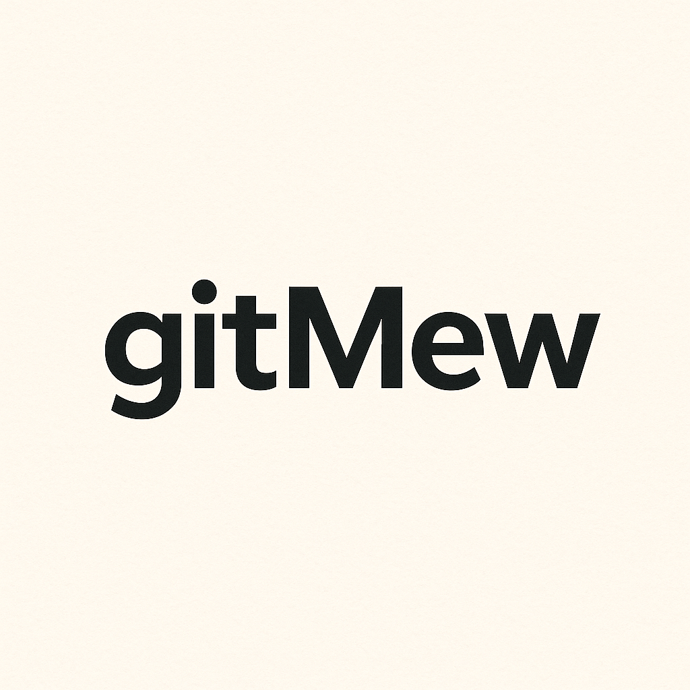

# Git Mew 🐱

Your AI kitty for Git chaos - Generate intelligent commit messages using AI.

## Features

Git Mew helps you write better commit messages by analyzing your staged changes and generating meaningful, conventional commit messages using AI.

### Key Features

- 🤖 **AI-Powered Commit Messages**: Automatically generate commit messages based on your staged changes
- 🎯 **Multiple LLM Providers**: Support for OpenAI, Claude, and Gemini
- ⚡ **Quick Access**: Generate commit messages directly from the Source Control panel
- 🎨 **Conventional Commits**: Follows conventional commit format for better changelog generation
- 🔧 **Customizable**: Configure your preferred AI model and provider

### How to Use

1. Stage your changes in Git
2. Click the sparkle icon (✨) in the Source Control panel, or run the command `git-mew: Generate Commit Message`
3. Git Mew will analyze your changes and generate a commit message
4. Review and commit!

## Requirements

- Visual Studio Code 1.104.0 or higher
- Git installed and configured
- API key for your chosen LLM provider (OpenAI, Claude, or Gemini)

## Setup

1. Install the extension
2. Run the command `git-mew: Setup Model` to configure your AI provider
3. Select your preferred LLM provider (OpenAI, Claude, or Gemini)
4. Enter your API key when prompted
5. Choose your preferred model

## Extension Settings

This extension contributes the following settings:

* `git-mew.llmProvider`: Select the LLM provider (openai, claude, or gemini)
* `git-mew.llmModel.openai`: OpenAI model to use (e.g., gpt-4, gpt-3.5-turbo)
* `git-mew.llmModel.claude`: Claude model to use (e.g., claude-3-opus, claude-3-sonnet)
* `git-mew.llmModel.gemini`: Gemini model to use (e.g., gemini-pro)

## Supported LLM Providers

### OpenAI
- GPT-4
- GPT-3.5 Turbo
- And other OpenAI models

### Anthropic Claude
- Claude 3 Opus
- Claude 3 Sonnet
- Claude 3 Haiku

### Google Gemini
- Gemini Pro
- And other Gemini models

## Privacy & Security

- Your API keys are stored securely in VS Code's secret storage
- Your code is only sent to the AI provider you choose
- No data is collected or stored by Git Mew

## Known Issues

- Large diffs may take longer to process
- Some binary file changes may not be analyzed properly

## Release Notes

### 0.0.1

Initial release of Git Mew:
- AI-powered commit message generation
- Support for OpenAI, Claude, and Gemini
- Conventional commit format
- Source Control panel integration

## Contributing

Found a bug or have a feature request? Please open an issue on our [GitHub repository](https://github.com/git-mew/git-mew).

## License

See LICENSE file for details.

---

**Enjoy using Git Mew! 🐱✨**
