# Git Mew - Review Flow Diagrams (Chi tiết)

## 1. Tổng quan kiến trúc - Tất cả Review Types

```mermaid
graph TB
    subgraph "Entry Points (VS Code Commands)"
        CMD1["git-mew.review-merge"]
        CMD2["git-mew.review-staged-changes"]
        CMD3["git-mew.review-merged-branch"]
        CMD4["git-mew.review-selected-commits"]
        CMD5["Review Panel (Sidebar)"]
    end

    subgraph "Command Layer"
        RC1["reviewMergeCommand.ts"]
        RC2["reviewStagedChangesCommand.ts"]
        RC3["reviewMergedBranchCommand.ts"]
        RC4["reviewSelectedCommitsCommand.ts"]
        RC5["reviewPanelProvider.ts"]
    end

    subgraph "Webview Layer"
        WV1["reviewMerge/webviewContentGenerator.ts"]
        WV2["reviewStagedChanges/webviewContentGenerator.ts"]
        WV3["reviewMergedBranch/webviewContentGenerator.ts"]
        WV4["reviewSelectedCommits/webviewContentGenerator.ts"]
    end

    subgraph "Message Handler Layer"
        MH1["reviewMerge/webviewMessageHandler.ts"]
        MH2["reviewStagedChanges/webviewMessageHandler.ts"]
        MH3["reviewMergedBranch/webviewMessageHandler.ts"]
        MH4["reviewSelectedCommits/webviewMessageHandler.ts"]
    end

    subgraph "Service Layer"
        SV1["ReviewMergeService"]
        SV2["ReviewStagedChangesService"]
        SV3["ReviewMergedBranchService"]
        SV4["ReviewSelectedCommitsService"]
        BASE["ReviewWorkflowServiceBase"]
    end

    subgraph "Shared Infrastructure"
        ADAPT["adapter.ts"]
        PREF["preferences.ts"]
        PANEL["panelMessaging.ts"]
        ERR["errorReport.ts"]
        VALID["validation.ts"]
    end

    CMD1 --> RC1
    CMD2 --> RC2
    CMD3 --> RC3
    CMD4 --> RC4
    CMD5 --> RC5

    RC1 --> WV1 & MH1
    RC2 --> WV2 & MH2
    RC3 --> WV3 & MH3
    RC4 --> WV4 & MH4
    RC5 -->|"executeCommand"| CMD1 & CMD2 & CMD3

    MH1 --> SV1
    MH2 --> SV2
    MH3 --> SV3
    MH4 --> SV4

    SV1 --> BASE
    SV2 --> BASE
    SV3 --> BASE
    SV4 --> BASE

    BASE --> ADAPT & PREF
    MH1 & MH2 & MH3 & MH4 --> PANEL & ERR & VALID
```

---

## 2. Command Registration Flow (Chi tiết)

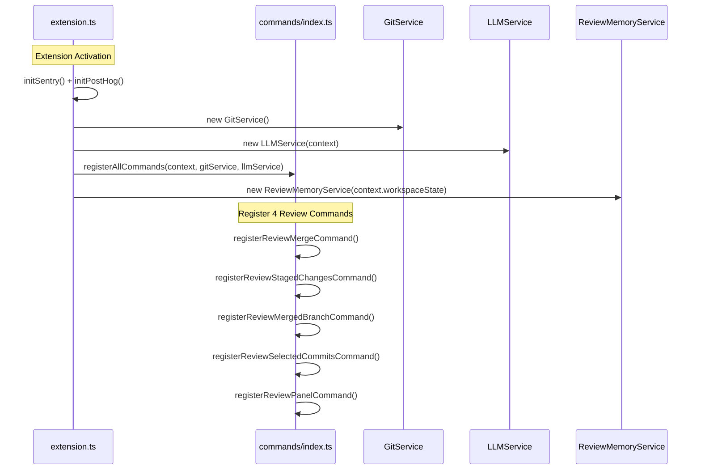

---

## 3. Review Merge - Flow Chi tiết

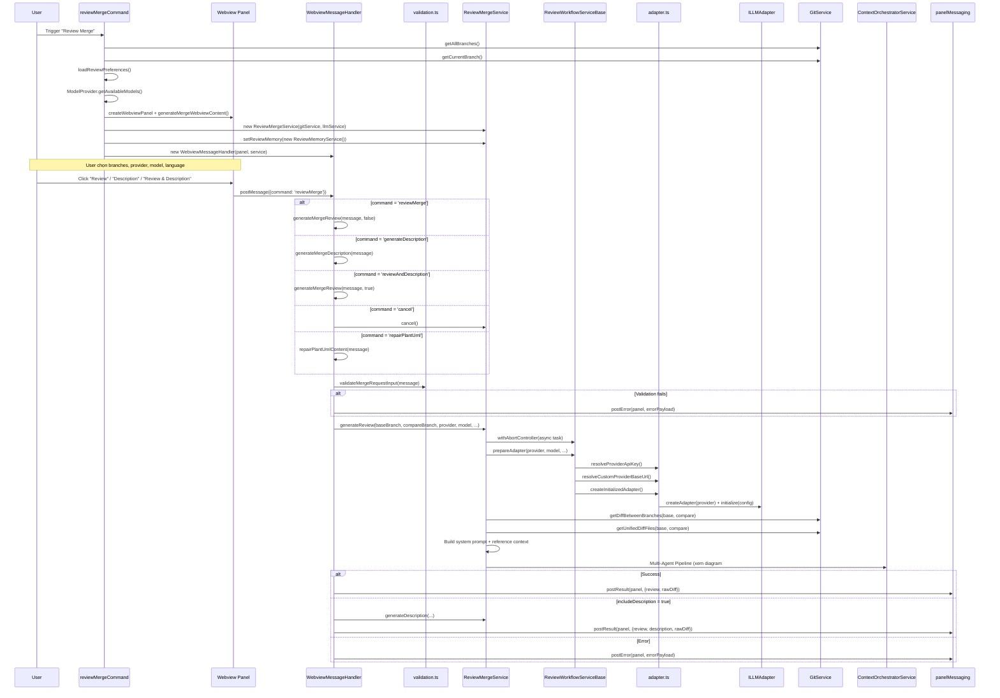

### 3.1 Review Merge - Message Commands

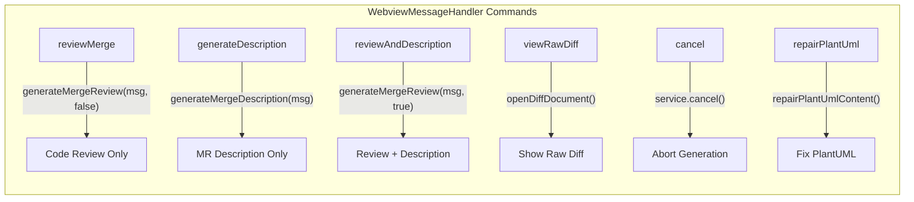

---

## 4. Review Staged Changes - Flow Chi tiết

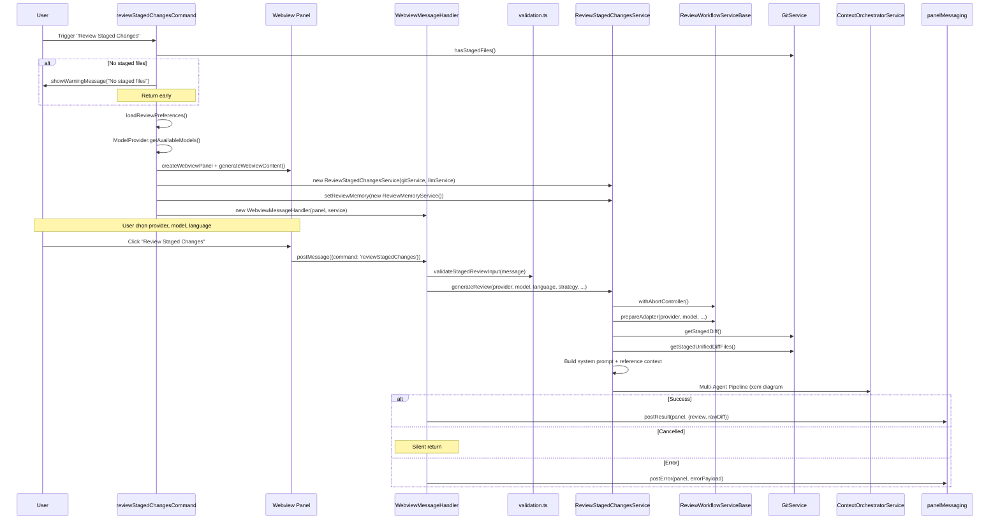

---

## 5. Review Merged Branch - Flow Chi tiết

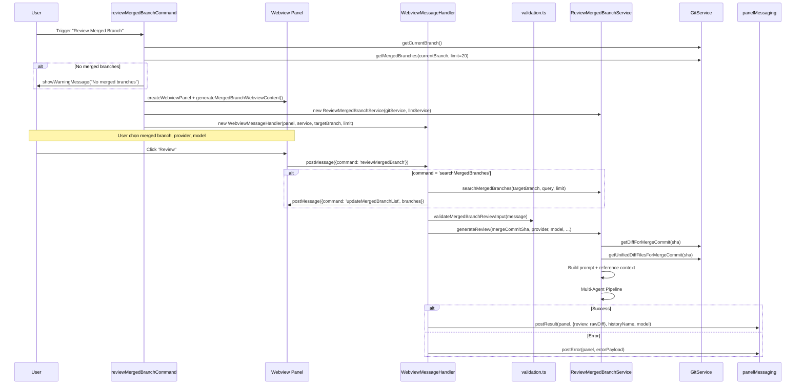

---

## 6. Review Selected Commits - Flow Chi tiết

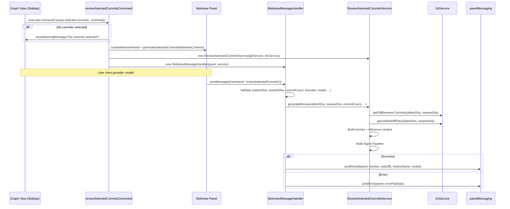

---

## 7. Multi-Agent Review Pipeline (Core Engine) - Chi tiết nhất

Đây là pipeline chung cho Review Merge và Review Staged Changes (có multi-agent đầy đủ).

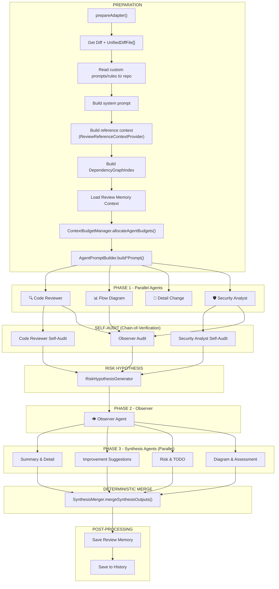

---

## 8. Phase 1 Agents - Chi tiết từng Agent

### 8.1 Code Reviewer Agent

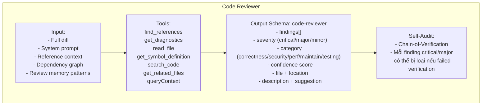

### 8.2 Flow Diagram Agent

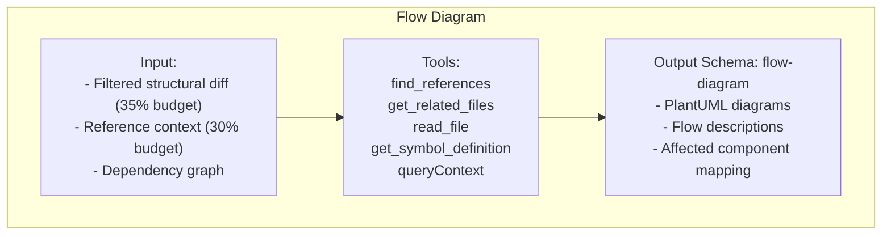

### 8.3 Detail Change Agent

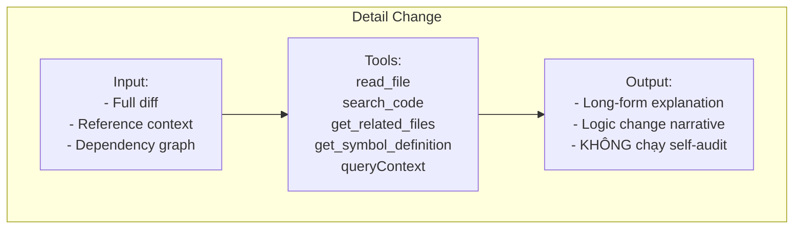

### 8.4 Security Analyst Agent

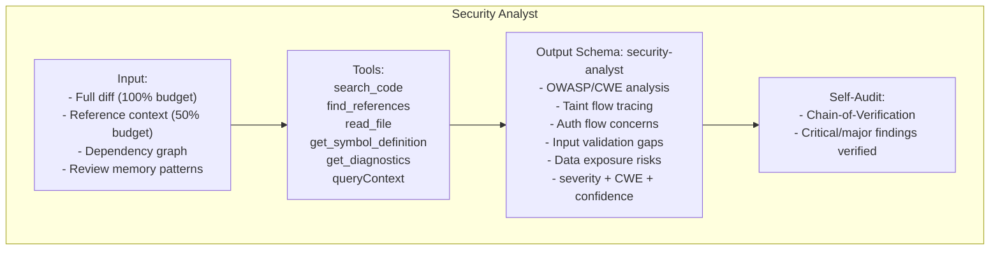

---

## 9. Self-Audit & Chain-of-Verification

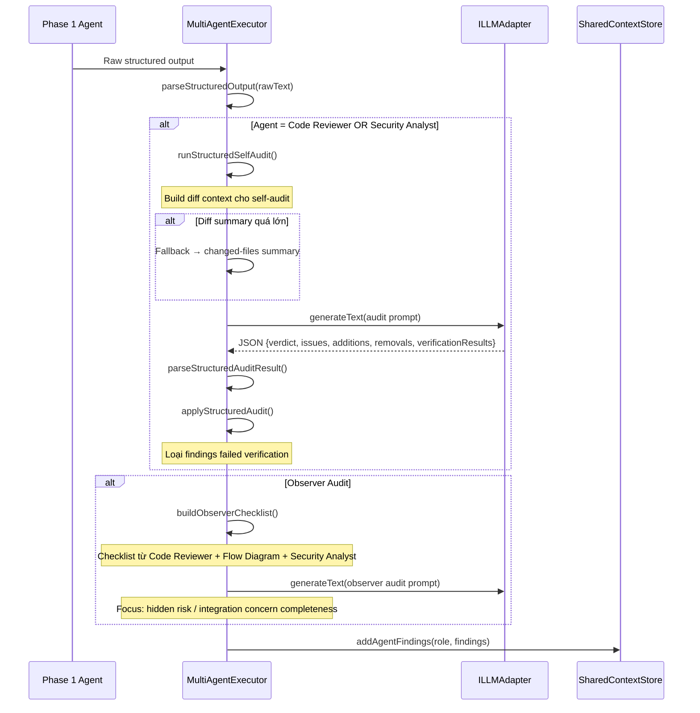

---

## 10. Risk Hypothesis Generation

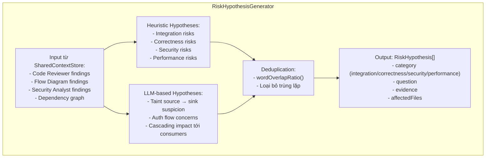

---

## 11. Phase 2 - Observer Agent

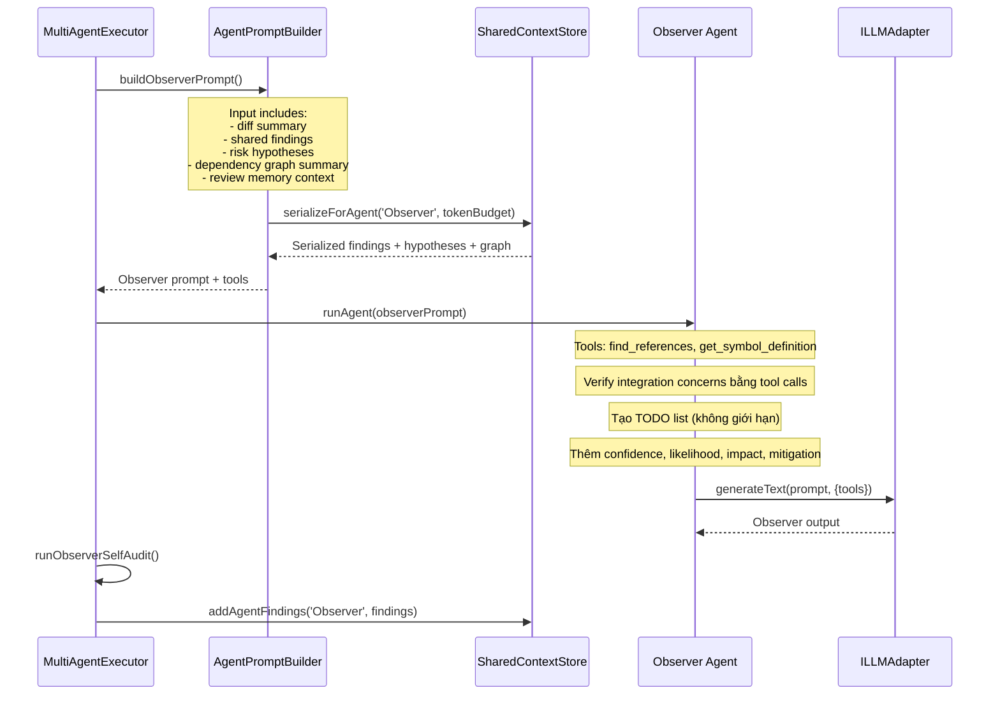

---

## 12. Phase 3 - Synthesis Agents (Parallel)

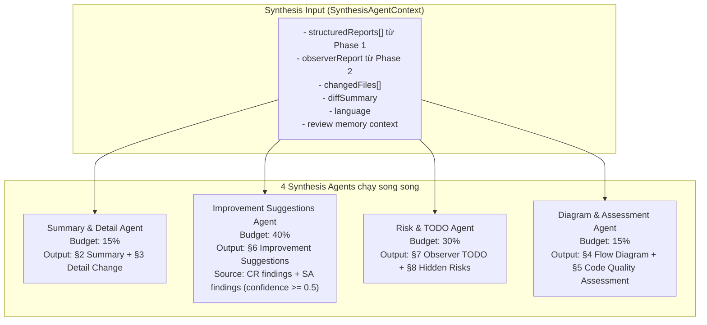

---

## 13. Deterministic Merge (SynthesisMerger)

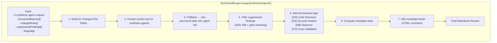

---

## 14. SharedContextStore (Blackboard Pattern)

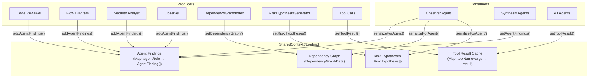

---

## 15. ContextBudgetManager - Token Allocation

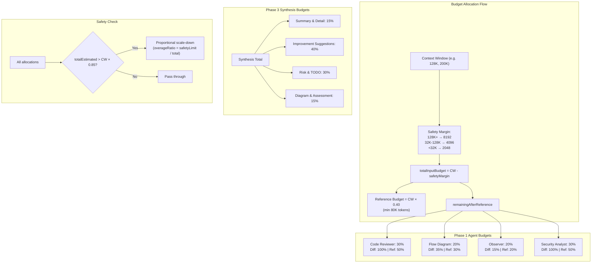

---

## 16. Review Memory Service

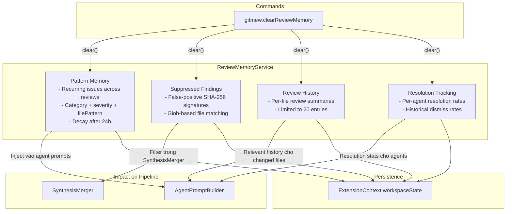

---

## 17. Reference Context Provider

```mermaid
graph TB
    subgraph "ReviewReferenceContextProvider"
        INPUT["Input: UnifiedDiffFile[]"]

        EXTRACT["extractCandidateSymbolsFromDiff()"]
        DECIDE["shouldAutoExpandReferenceContext()"]

        EXTRACT --> DECIDE

        DECIDE -->|"Auto-expand"| EXPAND["buildExpandedSymbolContext()<br/>- VS Code DocumentSymbol API<br/>- Find definitions<br/>- Find references<br/>- Token budget aware"]

        DECIDE -->|"Legacy"| LEGACY["buildLegacyReferenceContext()<br/>- findRelatedFiles()<br/>- extractRelevantLines()"]

        EXPAND --> OUTPUT["Reference Context String<br/>(within token budget)"]
        LEGACY --> OUTPUT
    end

    subgraph "Token Cap"
        CAP["computeReferenceExpansionTokenCap(contextWindow)"]
        CAP --> EXPAND
    end
```

---

## 18. DependencyGraphIndex

```mermaid
graph TB
    subgraph "DependencyGraphIndex.build(changedFiles)"
        SCAN["scanImports() cho mỗi file"]
        SYM["extractSymbols() cho mỗi file"]
        REF["findSymbolReferences()"]
        CRIT["computeCriticalPaths()"]
        ORDER["orderFilesAlongDeps()"]

        SCAN --> SYM --> REF --> CRIT --> ORDER

        OUTPUT["DependencyGraphData:<br/>- nodes (file → imports, exports, symbols)<br/>- edges (file → file dependencies)<br/>- criticalPaths<br/>- orderedFiles"]
    end

    subgraph "Usage"
        OUTPUT -->|"setDependencyGraph()"| STORE["SharedContextStore"]
        OUTPUT -->|"serializeForPrompt()"| PROMPT["Agent Prompts"]
        OUTPUT -->|"Input for"| RISK["RiskHypothesisGenerator"]
    end
```

---

## 19. MR Description Generation Flow (Review Merge Only)

```mermaid
sequenceDiagram
    participant MH as WebviewMessageHandler
    participant Svc as ReviewMergeService
    participant Orch as ContextOrchestratorService
    participant Exec as MultiAgentExecutor
    participant LLM as ILLMAdapter

    MH->>Svc: generateDescription(baseBranch, compareBranch, ...)

    Note over Svc: Sử dụng DESCRIPTION_BUDGET_CONFIG<br/>(2 agents thay vì 4)

    Svc->>Orch: generateMultiAgentDescription()
    Orch->>Exec: executeDescriptionAgents()

    par Description Agents (Parallel)
        Exec->>LLM: Change Analyzer Agent<br/>(budget: 55%, diff: 100%, ref: 35%)
        Exec->>LLM: Context Investigator Agent<br/>(budget: 45%, diff: 25%, ref: 65%)
    end

    Exec-->>Orch: ChangeAnalyzerOutput + ContextInvestigatorOutput
    Orch->>Orch: buildDescriptionSynthesizerPrompt()
    Orch->>LLM: Synthesize final MR description
    LLM-->>Orch: Final description markdown
    Orch-->>Svc: description string
    Svc-->>MH: DescriptionResult
```

---

## 20. PlantUML Repair Flow

```mermaid
sequenceDiagram
    participant WV as Webview
    participant MH as WebviewMessageHandler
    participant Base as ReviewWorkflowServiceBase
    participant LLM as ILLMAdapter
    participant Panel as panelMessaging

    WV->>MH: postMessage({command: 'repairPlantUml', content, errorMessage, target, attempt})
    MH->>MH: Validate repair input
    MH->>Base: repairPlantUmlMarkdown(provider, model, content, renderError, ...)

    Base->>Base: prepareAdapter()
    Base->>LLM: generateText(repairPrompt, {systemMessage: SYSTEM_PROMPT_REPAIR_PLANTUML})
    LLM-->>Base: Corrected markdown

    Base-->>MH: {success: true, content: correctedMarkdown}
    MH->>Panel: postPlantUmlRepairResult(panel, target, content, attempt)

    Note over Panel: Nếu target = 'review':<br/>Update history file với repaired content
```

---

## 21. Panel Messaging & History Auto-Save

```mermaid
graph TB
    subgraph "panelMessaging.ts"
        PROGRESS["postProgress(panel, message)"]
        LOG["postLog(panel, message)"]
        LLMLOG["postLlmLog(panel, entry)"]
        ERROR["postError(panel, errorPayload)"]
        RESULT["postResult(panel, payload, historyName, model)"]
        REPAIR["postPlantUmlRepairResult(panel, target, content, attempt)"]
    end

    subgraph "Auto-Save Flow"
        RESULT -->|"payload.review exists"| SAVE["saveReviewHistory(review, finalName)"]
        SAVE --> CALLBACK["onHistorySavedCallback()"]
        CALLBACK --> REFRESH["HistoriesProvider auto-refresh"]
    end

    subgraph "History Update"
        REPAIR -->|"target = 'review'"| UPDATE["updateHistoryFile(historyPath, content)"]
    end

    subgraph "Race Condition Guard"
        GEN["panelSaveGeneration (WeakMap)"]
        RESULT --> GEN
        GEN -->|"Only latest gen"| SAVE
    end
```

---

## 22. LLM Adapter Layer

```mermaid
graph TB
    subgraph "ILLMAdapter Interface"
        INIT["initialize(config)"]
        GEN["generateText(prompt, options)"]
        READY["isReady()"]
        MODEL["getModel()"]
        PROVIDER["getProvider()"]
        CW["getContextWindow()"]
        MOT["getMaxOutputTokens()"]
        TEST["testConnection()"]
    end

    subgraph "Implementations"
        OAI["OpenAIAdapter"]
        CLA["ClaudeAdapter"]
        GEM["GeminiAdapter"]
        OLL["OllamaAdapter"]
        CUS["CustomAdapter"]
    end

    subgraph "Factory"
        FAC["createAdapter(provider)"]
        FAC --> OAI & CLA & GEM & OLL & CUS
    end

    subgraph "Config"
        CFG["LLMAdapterConfig:<br/>- apiKey<br/>- model<br/>- baseURL<br/>- maxTokens<br/>- temperature<br/>- contextWindow<br/>- maxOutputTokens"]
    end

    CFG --> INIT
    INIT --> GEN
```

---

## 23. Error Handling Flow

```mermaid
graph TB
    subgraph "Error Sources"
        VAL["Validation Error"]
        LLM["LLM API Error"]
        GIT["Git Operation Error"]
        CANCEL["User Cancellation"]
        PARSE["Parse Error (JSON/PlantUML)"]
    end

    subgraph "Error Processing"
        CREATE["createReviewErrorPayload(error, context, options)"]
        PAYLOAD["ReviewErrorPayload:<br/>- title<br/>- summary<br/>- rawError<br/>- operation<br/>- timestamp<br/>- provider/model<br/>- hint"]
    end

    subgraph "Error Display"
        POST["postError(panel, payload)"]
        MSG["vscode.window.showErrorMessage()"]
        SENTRY["captureError() → Sentry"]
    end

    VAL & LLM & GIT & PARSE --> CREATE --> PAYLOAD --> POST
    LLM & GIT --> MSG
    LLM & GIT --> SENTRY
    CANCEL -->|"Silent return"| NONE["No error displayed"]
```

---

## 24. So sánh 4 Review Types

```mermaid
graph TB
    subgraph "Feature Matrix"
        direction LR

        subgraph "Review Merge"
            RM1["✅ Multi-Agent Pipeline (4 agents)"]
            RM2["✅ MR Description Generation"]
            RM3["✅ Review + Description combo"]
            RM4["✅ Review Memory"]
            RM5["✅ PlantUML Repair"]
            RM6["✅ Dependency Graph"]
            RM7["Input: Branch diff"]
        end

        subgraph "Review Staged"
            RS1["✅ Multi-Agent Pipeline (4 agents)"]
            RS2["❌ No Description"]
            RS3["✅ Review Memory"]
            RS4["✅ PlantUML Repair"]
            RS5["✅ Dependency Graph"]
            RS6["Input: Staged diff"]
        end

        subgraph "Review Merged Branch"
            RB1["✅ Multi-Agent Pipeline"]
            RB2["❌ No Description"]
            RB3["✅ PlantUML Repair"]
            RB4["✅ Branch Search"]
            RB5["Input: Merge commit SHA"]
        end

        subgraph "Review Selected Commits"
            RC1["✅ Multi-Agent Pipeline"]
            RC2["❌ No Description"]
            RC3["✅ PlantUML Repair"]
            RC4["Input: Commit range (oldest→newest)"]
            RC5["Trigger: Graph View"]
        end
    end
```
